[MAC]: #mac-ac-coupled-audio-mixer

# COLD MAC: A Technical Map

COLD MAC is a swiss army knife or a centerpiece, a jack of *all* trades or a master of *one*, depending how you patch it.  It can be the hub around which an entire patch revolves, or the basic utilities you need in the moment.  It is a tool for mixing, processing, reconfiguring, slicing, transforming, and generating voltages at control and audiorates, for macroscopic control of an entire patch or microscopic control over a single wave.  Whether using its discrete functional blocks as independent entities or weaving them into a self-patched web, COLD MAC is sure to find a home in any patch!

## Techniques

##### Linear

[Inversion](#signal-duplication-and-inversion)  
[Addition and Subtraction](#addition-and-subtraction)  
[Panning](#panning-and-vca-functionality)  
[Crossfading](#crossfading-and-swapping)  
[VCA](#panning-and-vca-functionality)  
[Mixer](#mac-ac-coupled-audio-mixer)  
[Dry/Wet Control](#drywet-control-and-feedback)  
[Pre-*FADE*r Aux Send](#pre-fader-aux-sendreturn-loop)  
[Quad Panner](#quadraphonic-panning-and-vector-mixing) / [Vector Mixer](#quadraphonic-panning-and-vector-mixing)

##### Logic

[Or](#orand-analog-minmax-and-digital-logic) / [And](#orand-analog-minmax-and-digital-logic) / [Not](#extended-logic) / [Nor](#extended-logic) / [Nand](#extended-logic) / [Xor](#extended-logic)  
[Min](#orand-analog-minmax-and-digital-logic) / [Max](#orand-analog-minmax-and-digital-logic)  
[Halfwave Rectification](#halfwave-rectification)  
[Logical Mixing](#logical-mixing)  
[Logical Crossfading](#logical-crossfading)  
[Signal Splitting/Routing](#control-signal-splitting)  
[Bernoulli Gates and Event Probability](#bernoulli-gates-and-event-probability)

##### Dynamics

[Envelope Following](#envelope-following)  
[Compression](#dynamics-control-compression-and-expansion)  
[Expansion](#dynamics-control-compression-and-expansion)  
[Side-chaining](#dynamics-control-compression-and-expansion)

##### Other

[Waveshaping & Timbre Control](#extended-waveshaping)  
[Fullwave Rectification](#slope-fullwave-rectification)  
[Slew Limiting / Portamento](#follow-envelope-follower-and-slew-limiting)  
[Integration](#location-integrator)  
[Phase-Related LFOs](#phase-related-lfos)  
[Mid/Side Processing](#mid-side-processing-and-width-control)  
[Sequence Harmonizer](#phase-related-LFOs)

## Table of Contents

1. [Specifications](#specifications)
2. [Overview](#overview)
3. [Block Diagrams](#block-diagram)
4. [SURVEY: Macro Control](#survey-macro-control)
5. [LEFT/RIGHT/FADE: Crossfader/Panner](#leftrightfade-crossfader-panner)
6. [OR/AND: Analog Min/Max and Digital Logic](#orand-analog-minmax-and-digital-logic)
7. [SLOPE: Fullwave Rectification](#slope-fullwave-rectification)
8. [FOLLOW: Envelope Follower and Slew Limiting](#follow-envelope-follower-and-slew-limiting)
9. [CREASE: Waveslicer](#crease-waveslicer)
10. [LOCATION: Integrator](#location-integrator)
11. [MAC: AC-Coupled Audio Mixer](#mac-ac-coupled-audio-mixer)
12. [Phase-Related LFOs](#phase-related-lfos)
13. [Dynamics Control: Compression and Expansion](#dynamics-control-compression-and-expansion)
14. [Extended Waveshaping](#extended-waveshaping)
15. [Feedback Sounds](#feedback-sounds)
16. [Mid-Side Processing](#mid-side-processing-and-width-control)
17. [Bernoulli Gates and Event Probability](#bernoulli-gates-and-event-probability)
18. [Quadraphonic Panning and Vector Mixing](#quadraphonic-panning-and-vector-mixing)
19. [Extended Logic](#extended-logic)
20. [Further Reading](#further-reading)
21. [Warranty](#warranty)

## Specifications

- 8HP
-  30mm depth
-  65mA @ +12V
-  62mA @ -12V

## Overview

COLD MAC is made up of six DC-coupled, analog voltage processing blocks and an AC-coupled audio mixer.  These blocks can be patch-programmed in a modular fashion to build CV and audio processing networks.  The *SURVEY* control is connected (or 'normalled') to a number of inputs, enabling a single macro-control of all 8 outputs.  Breaking these normals by inserting a cable enables each block to function independently.  

The graphs on the panel next to each output jack represent the transfer function of each block when nothing is patched into that block.  Input *SURVEY* voltage is on the X-axis.  *SURVEY*=0V at the horizontal center of the icon.  Output voltage is on the Y-axis.  The height of the diagonal line indicates the output voltage for any given *SURVEY* voltage.  So, as *SURVEY* sweeps from -5V to +5V, the graphs show the output voltage of each block when nothing is patched.  Note that the *LEFT* output graphic is a copy of *SURVEY*, so this is the 'reference' function to compare against.  You can view larger copies of these transfer functions [here](https://www.desmos.com/calculator/pisne2xhbz).

### Normals

All jacks which are normalled are indicated on the panel by curved lines entering the jack from the top left.  Inserting a cable into the jack will 'break the normal', i.e. disconnect the default connection going into that jack. The *SURVEY* voltage (sum of the *SURVEY* knob and CV) is normalled into several jacks, each indicated by an *`S`* above the jack.  The *SURVEY* voltage will feed these jacks, provided the jacks are unpatched. -5V is normalled into *LEFT*, indicated by a negative sign above the jack, while +5V is normalled into *RIGHT*, indicated by a positive sign above the jack.  When two jacks are connected by a curved line, the upper jack is normalled into the lower jack: inserting a cable into the upper jack will feed the signal into both jacks, provided the lower jack is unpatched.  

|                   Normals                    |
| :------------------------------------------: |
|               -5V into *LEFT*                |
|               +5V into *RIGHT*               |
| *SURVEY* into *FADE*, *OR2*, *AND2*, *SLOPE* |
|              *OR1* into *AND1*               |
|            *SLOPE* into *CREASE*             |

### Naming Conventions

All input jacks will be referred to by their label (e.g. *LEFT*, *RIGHT*, *FADE*, *OFFSET*, etc.).  The *OR* and *AND* input jacks will be called *OR1*/*OR2* and *AND1*/*AND2*.  *OR1* and *AND1* will be the inputs in the left-most column, while *OR2* and *AND2* will be the corresponding jacks in the middle column.

The output of the *MAC* audio mixer, envelope follower and integrator will be referred to using their panel labels (*MAC*, *FOLLOW*, *LOCATION*, respectively).  The outputs in the right-most column labeled only by transfer function graphs will be referred to by their associated input jack's name and '*(OUT)*': *LEFT(OUT)*, *RIGHT(OUT)*, *OR(OUT)*, *AND(OUT)*, *SLOPE(OUT)*, *CREASE(OUT)*.

## Block Diagrams

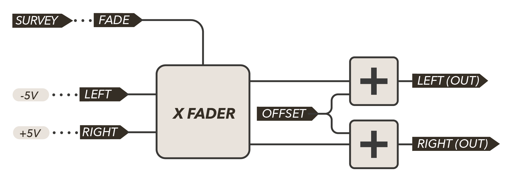

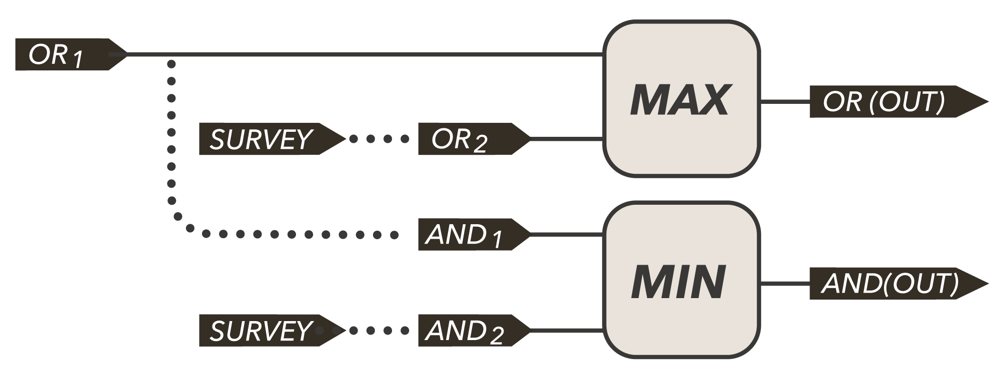

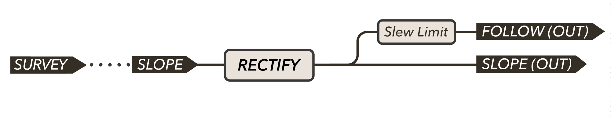

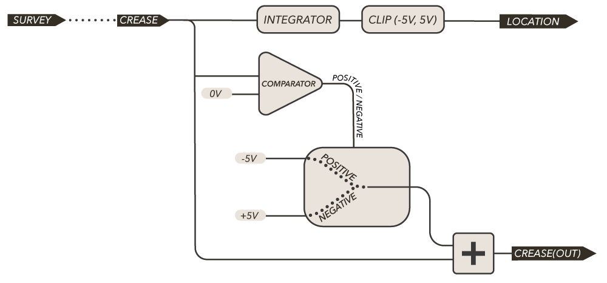

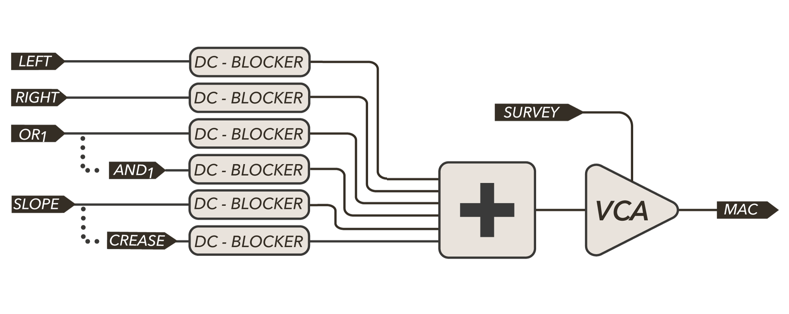

## SURVEY: Macro Control

The *SURVEY* knob sweeps from -5V to +5V.  The value of the *SURVEY* CV input is added to the value of the knob.  This CV input is DC-coupled and capable of handling audio-rate modulation!

The summed *SURVEY* value is then normalled into these jacks:

- *LEFT/RIGHT* Crossfader Block: *FADE* Input
- *OR/AND*: *OR2* Input (which is normalled to *AND2* Input)
- *SLOPE/CREASE*: *SLOPE* Input (which is normalled to *CREASE* Input)

This normalling acts as if there is a phantom patch cable which patches *SURVEY* into each of the above jacks.  Patching a dummy cable into any of these jacks breaks the corresponding normal, and the functional block will no longer be affected by the *SURVEY* control.

The summed *SURVEY* value is also used as the *MAC* Audio Mixer's volume control, with -5V corresponding to the silence, and +5V corresponding to the max volume.  

## LEFT/RIGHT/FADE: Crossfader/Panner

The *FADE* block is used to control the routing of two inputs to two outputs by panning the inputs between the outputs.  An optional *OFFSET* voltage can be added to both outputs.  This block can be used to mix up to three audio or CV signals, pan an input to two destinations, crossfade two inputs to one destination, swap two inputs between two outputs, perform addition/subtraction/inversion, bias an audio signal for wavefolding, act as a VCA and...

*FADE* is the crossfade/pan/level control.  With nothing patched to this jack, the *SURVEY* voltage will control *FADE*.  When *FADE* is -5V, the *LEFT* input is directly passed to the *LEFT(OUT)* jack and the *RIGHT* input is directly passed to the *RIGHT(OUT)* jack.  When *FADE* is 0V, both inputs appear at both outputs equally at half of their amplitude (-6dB).  When *FADE* reaches +5V, the two inputs have swapped sides: the *LEFT* input appears at the *RIGHT(OUT)* jack and the *RIGHT* input appears at the *LEFT(OUT)* jack. 

The *OFFSET* input is added to each of the two outputs equally, regardless of the *FADE* level.

This [demo](https://www.desmos.com/calculator/xhmmsal2x2) will help give you a feel for how the panning and crossfading works!  It demonstrates three sine waves at different frequencies plugged into *LEFT*, *RIGHT* and *OFFSET*.  The slider labeled  `F_ade` controls *FADE*.  `L_on`, `R_on` and `O_on` act as switches which will connect or disconnect the sine waves into *LEFT*, *RIGHT* and *OFFSET* (respectively) so that you can see the difference between panning and crossfading!  When set to 0, it is as if 0V is patched to the corresponding input.  When set to 1, it is as if the corresponding sine wave is patched in.  

For the mathematically inclined, the crossfader block can be expressed by the following transfer functions (*FADE* has been mapped from [-5V,+5V] to [0,1] to simplify the equation): 

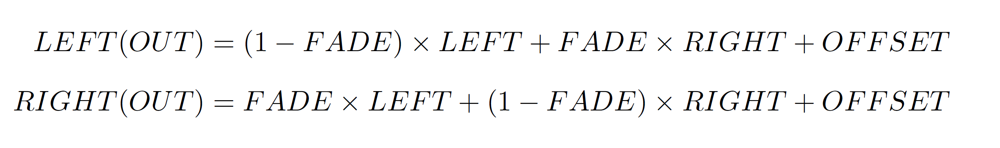

It may be helpful for some to conceptualize this crossfading action as sending each input through two VCAs controlled by signals with opposite polarities.  This can be illustrated by the following diagram.

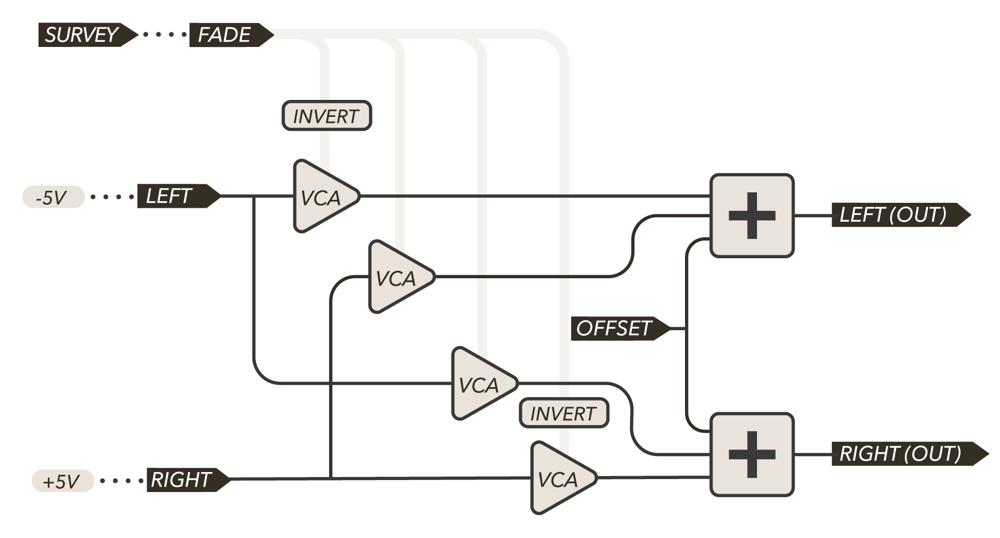

#### Crossfading and Swapping

*LEFT(OUT)* or *RIGHT(OUT)* can be used on their own to create a crossfade between the two input sources.

When the *FADE* voltage is *-5V*, *LEFT(OUT)* will pass a copy of the *LEFT* input. As *FADE* increases, the *LEFT(OUT)* signal will crossfade from the *LEFT* to *RIGHT* inputs.  At 0V into *FADE*, *LEFT(OUT)* will be a balanced mix of the *LEFT* and *RIGHT* inputs at half their amplitude (-6dB).  Once *FADE* reaches +5V, the crossfade is completed and *LEFT(OUT)* passes a copy of the *RIGHT* input.

The same procedure applies to the *RIGHT(OUT)* with the polarity of the *FADE* voltage reversed.

Try using the crossfader to slowly blend between two different audio sources (for instance a dry/wet mix), or to morph between two different modulation sources (for instance two LFOs at the same frequency but with different shapes, or between a stepped random and a smoothed random source).

Using both outputs simultaneously creates two outputs with crossfades inverted relative to the other.  This enables swapping two sources back and forth between two destinations.

#### Signal Duplication and Inversion

*LEFT* is normalled to a -5V reference and *RIGHT* is normalled to a +5V reference.  If nothing is patched to *LEFT*, *RIGHT*, and *OFFSET*, then *LEFT(OUT)* will present a copy of the *FADE* input.  *RIGHT(OUT)* will be an inverted copy of the *FADE* input.

With nothing patched to the *FADE* input, the *LEFT(OUT)* and *RIGHT(OUT)* respectively become duplicated and inverted copies of *SURVEY*, due to the normalling of *SURVEY* into *FADE*.  This is indicated by the transfer function icon next to the output jack.

#### Addition and Subtraction

With nothing patched to *LEFT* and *RIGHT*, patching an additional signal into OFFSET simply adds to both of these, resulting in the following outputs:

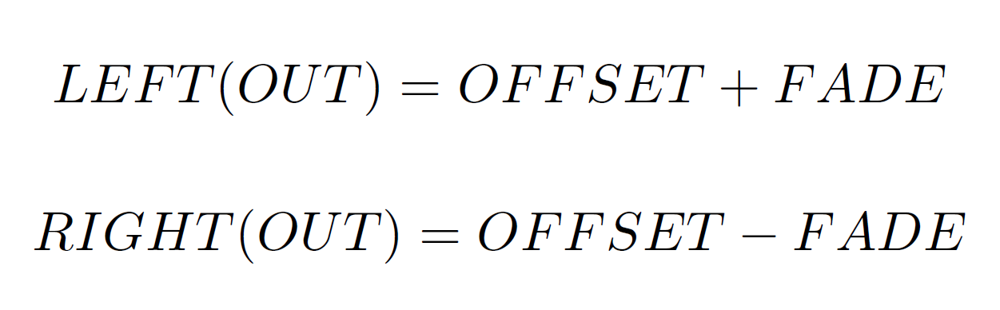

This property will be explored in some of the extended techniques described at the end of this document.

#### Panning and VCA Functionality

Using one input along with both outputs enables traditional panning controlled by *FADE*.  Setting *FADE* to +/-5V will hard pan the input signal to one side.  0V will place the input signal in the middle of *LEFT*/*RIGHT* at half its amplitude (-6dB).  

If a signal is patched to *LEFT* and nothing is patched to *RIGHT*, sweeping *FADE* will fade the *LEFT* signal out of *LEFT(OUT)*; however, it will also fade the +5V signal normalled to *RIGHT* into the *LEFT(OUT)* output signal, this means an unwanted DC-offset will be introduced at *LEFT(OUT)*.  Similarly, the DC-offset will be faded out of RIGHT(OUT) as the input signal at *LEFT* fades into *RIGHT(OUT)*.  To eliminate this offset from the output jacks, patch a dummy cable into *RIGHT* (leave the other end of the cable unpatched).  This [demo](<https://www.desmos.com/calculator/0pujcbwebk>) demonstrates using a dummy cable to eliminate the DC offset when panning (`r_dummy` will connect a dummy cable to the right input when set to `1`). 

- At -5V into *FADE*, the signal will be panned hard to *LEFT(OUT)*, with nothing at *RIGHT(OUT)*.
- At 0V into *FADE*, the signal will be panned equally between the two outputs at half amplitude.  
- At +5V into *FADE*, the signal will be panned hard *RIGHT(OUT)*.  

An equivalent panner or pair of VCAs is created by patching the signal to be panned into *RIGHT* and dummy-cabling *LEFT*.  The only difference is the polarity of the *FADE* control. 

*NB: The LEFT to RIGHT(OUT) path and the RIGHT to LEFT(OUT) will not entirely close for high frequency signals.*

#### Dry/Wet Control and Feedback

The crossfader can be used to mix between a dry signal and a wet (i.e. processed signal) by multing the dry signal to *LEFT* and the processing chain.  The processing chain's output (wet signal) should be fed into *RIGHT*.  However, even if you do not have a mult or stackable, the following patch can be used to achieve the same effect!

> Input Signal > *LEFT*
>
> *RIGHT(OUT)* > to processing
>
> from processing > *RIGHT*
>
> *LEFT(OUT)* > Output Signal
>
> *SURVEY/FADE* act as the dry-wet crossfade control.

When *FADE* is at  -5V, the dry signal passes directly from *LEFT* to *LEFT(OUT)*.  When *FADE* is at +5V, the dry signal is sent to *RIGHT(OUT)* where it then goes to the processing chain.  It returns from the processing chain at *RIGHT*, which is then passed to the final output at *LEFT(OUT)*.  

When *FADE* is between the two extremes, there will be a feedback loop from *RIGHT(OUT)* to the processing chain to *RIGHT* and back to *RIGHT(OUT)*.  If necessary, try using the *[FOLLOW](#envelope-following)* to tame the feedback!

#### Pre-FADEr Aux Send/Return Loop

The panning functionality can be paired with the *[MAC]* mixer to set up a pre-fader send/return loop without the need for additional VCAs or stackable cables!

> Input Signal > *LEFT*
>
> Dummy Cable > *RIGHT*
>
> Dummy Cable (or dry level CV) > *FADE*
>
> *MAC* > Send
>
> Return > *OFFSET*
>
> *LEFT(OUT)* > Output Signal
>
> *SURVEY* controls Aux Send level (pre-FADE)
>
> *FADE* controls dry signal level

You will want to make sure *FADE* has been decoupled by *SURVEY* by either using a dummy cable or using *CV* to control the level of the dry signal.  *SURVEY* will control the level of the input signal sent to the processing chain (pre-*FADE*) via the *MAC* mixer.  The processed signal returns and is added back in via *OFFSET*.  Additional signal can be added to the send loop via the other inputs in the left row.  

## OR/AND: Analog Min/Max and Digital Logic

*OR* implements analog minimum while *AND* implements analog maximum.  The first input of the *OR* block is normalled into the first input of the *AND* block to easily find the min and max of the same signal.  *SURVEY* is normalled into the second input of both blocks to set the comparison level for both functions together. 

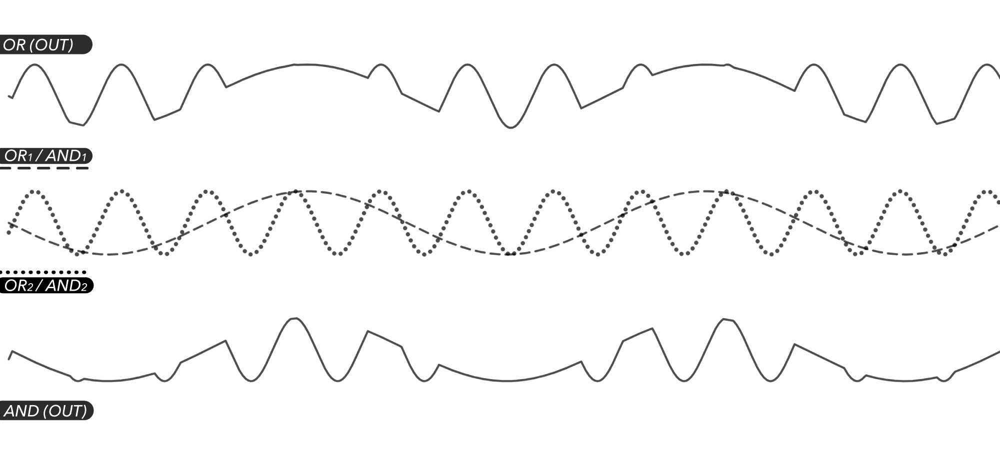

You can visually explore it by using this [demo](<https://www.desmos.com/calculator/lonea16dbw>), which shows the two outputs when sine waves with varying frequencies are used as inputs.  The sliders labeled "*f1*" and "*f2*" control the frequencies of the sine waves, while "spread" is used to visually compare the input waves and the output waves.

### OR: Analog Maximum / Boolean OR

*OR(OUT)* will always output the greater of the two *OR* inputs, *OR1* and *OR2*.  This can be defined:

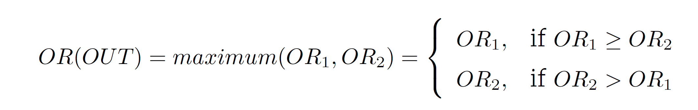

With 0V patched into the one of the inputs, *OR(OUT)* will be the halfwave rectified version of the other input.

When using binary (Boolean or two-state) signals like gates, this acts as the Boolean logic OR operator.  The output will be high whenever *either* of the two inputs are high.  For instance, when two rhythmic gate streams are patched to the *OR* inputs, *OR(OUT)* will output a gate whenever either of the two input gates hits. 

| OR1  | OR2  | OR(OUT) = OR1 \| OR2 |
| ---- | ---- | -------------------- |
| LOW  | LOW  | LOW                  |
| LOW  | HIGH | HIGH                 |
| HIGH | LOW  | HIGH                 |
| HIGH | HIGH | HIGH                 |

*NB: the `HIGH` output voltage will be the same as the input gates' `HIGH` voltage.*

### AND: Analog Minimum / Boolean AND

*AND(OUT)* will always output the lesser of the two *AND* inputs, *AND1* and *AND2*.  This can be defined:

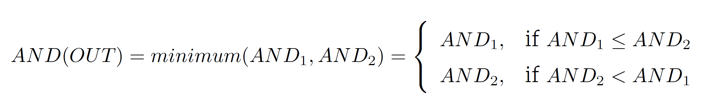

When using binary (Boolean or two-state) signals like gates, this acts as the Boolean logic AND operator.  The output will only be high when *both* of the two inputs are high.  For instance, when two rhythmic gate streams are patched to the *AND* inputs, *AND(OUT)* will only output a gate when both of the input gates hit simultaneously. 

| AND1 | AND2 | AND(OUT) = AND1 & AND2 |
| ---- | ---- | ---------------------- |
| LOW  | LOW  | LOW                    |
| LOW  | HIGH | LOW                    |
| HIGH | LOW  | LOW                    |
| HIGH | HIGH | HIGH                   |

Other Boolean logic operators can be implemented via combination with the OR block and the Crossfader block acting as logical NOT.  See the section on [Extended Logic](#extended-logic).

### Control Signal Splitting

Because of the normalled connections, it is convenient to create a CV splitter which sends CV values above a threshold to one destination while CV values below the threshold are sent to another destination.  With nothing patched, this is what happens to the *SURVEY* knob coming out of *AND(OUT)* and *OR(OUT)*.

*SURVEY* is normalled into both *OR2* and *AND2*.  When nothing is patched to *OR1* or *AND1*, both jacks are held at 0V.  As such, *OR(OUT)* will output *SURVEY* when *SURVEY* is greater than 0V, otherwise it will output 0V.  Similarly, *AND(OUT)* will output *SURVEY* if *SURVEY* is less than 0V, otherwise it will output 0V.  Patch these two signals to two separate parameters in your synthesizer to control both parameters from the same source while only ever affecting one at a time!  If you want both parameters to be swept from 0 to +5V, you might patch *AND(OUT)* to *FADE* instead of the second parameter; then patch *RIGHT(OUT)* to the second parameter.  Now, the negative *AND(OUT)* signal will be inverted so that it goes from 0V to +5V instead of 0V to -5V.

To split an external CV source between two outputs, patch it to *OR1* (it will cascade to *AND1* due to normalling).  *SURVEY* will now set the threshold comparison level at *OR2* and *AND2*.  When the input signal is greater than *SURVEY*, it will come out of *OR1*.  When it is less than *SURVEY* it will come out of *OR2*.  If you would like the control-splitting block to be independent of the SURVEY control, mult a threshold control signal into both *OR2* and *AND2*.  

### Halfwave Rectification

By patching a signal into *OR1* (and thus AND1 via the normalled connection as well), the *SURVEY* knob (via normalling into *OR2* and *AND2*) becomes a threshold control for halfwave rectification - the "positive" half of the wave will appear at OR1, while the "negative" half of the wave will appear at AND1 (where "positive" is taken to mean exceeding the threshold and "negative" is taken to mean falling below the threshold).  This technique can be useful when an input expects unipolar modulation or gates. 

When used with audio, slicing the audio signal has the effect of adding harmonics due to the flat edges created.  Adjusting the slicing threshold will affect both the timbre and the amplitude of the heard sound.  If the input audio is a square wave, these blocks can act as simple VCAs with opposite polarities.  Try a variety of sound sources and see how adjusting the threshold affects the timbre and loudness.

If the threshold is set to 0V, adding *AND(OUT)* and *OR(OUT)* back together will recreate the original signal.  However if *AND(OUT)* and *OR(OUT)* are processed independently, interesting spectral effects will occur.  Try filtering or distorting the "top" and "bottom" of the waves before recombining!

### Logical Mixing

Patching two separate audio signals to *OR1* & *OR2* or *AND1* & *AND2* provides a unique way of mixing two audio signals with an additional harmonic distortion effect.  The output will always track one of the two signals (the greater signal for *OR*, the lesser signal for *AND*), however two audio rate signals will constantly cross over each other, switching which one is the greater and which one is the lesser very frequently, resulting in the output switching between  the two signals very rapidly.  The effect is a kind of cross between halfwave rectification and using the signals to amplitude modulate each other.

The best way to understand it sonically is of course to try it out!

You can visually explore it by using this [demo](<https://www.desmos.com/calculator/lonea16dbw>), which shows the two outputs when sine waves with varying frequencies are used as inputs.  The sliders labeled "*f1*" and "*f2*" control the frequencies of the sine waves, while "spread" is used to visually compare the input waves and the output waves.

### Logical Crossfading

*OR(OUT)* and *AND(OUT)* can be combined to create spectrally enriched crossfades between two audio inputs.

Patch one audio input to *OR1* and the other to *AND1*.  Patch *AND(OUT)* and *OR(OUT)* to a unity mixer/summing utility (e.g. patch into *FADE* and *OFFSET* then listen to *LEFT(OUT)*).  *SURVEY* will control the "crossfade" between the two input signals (via *OR2* and *AND2*).

When *SURVEY* is at -5V, *OR(OUT)* will be a copy of *OR1*, as *OR1* is greater than *SURVEY*.  Meanwhile, *AND(OUT)* will be -5V, as *SURVEY* is less than *AND1*.  The sum of *OR(OUT)* and *AND(OUT)* will then be *OR1* with a -5V offset.

Increasing *SURVEY* will allow more of *AND1* to pass through to *AND(OUT)* and less of *OR2* to pass through to *OR(OUT)*.  When *SURVEY* reaches 5V, the sum of *OR(OUT)* and *AND(OUT)* will be *AND1* with a DC offset. Use this online [demo](https://www.desmos.com/calculator/kaym5uhcqo) to explore the waveforms generated by logically crossfading two sine waves with varying frequencies ("*f1*" and "*f2*" sliders control frequency).

This can be used for crossfades with spectrally rich centerpoints. Using an audio-rate signal to control *SURVEY* provides a new twist on the 'AM' sound.

## SLOPE: Fullwave Rectification

*SLOPE(OUT)* is a fullwave-rectified version of the *SLOPE* input: all negative voltages are inverted, while positive voltages are left unchanged.  Mathematically, the output is the absolute value of the input.

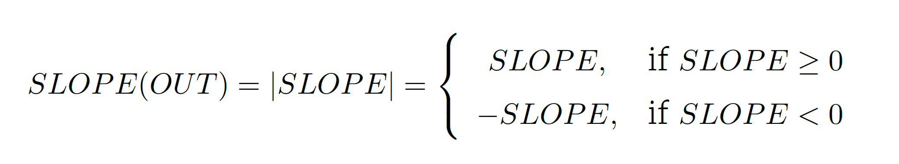

You can use [this demo](<https://www.desmos.com/calculator/u3borbtnns>) to see fullwave rectification in action!  Here, a bipolar sine wave is used.  Notice how it is reflected above the x-axis whenever it goes negative.  Try using the "*spread*" slider to see how *SLOPE(OUT)* matches and differs from the *SLOPE* input.

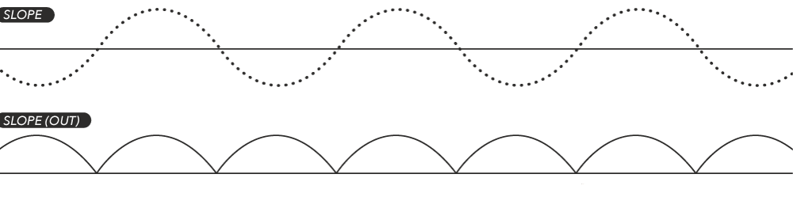

Fullwave rectification is useful when only positive voltages are desired, e.g. for control of MANGROVE's *FM INDEX*.

Beyond CV conditioning, *SLOPE* can be used as a timbral effect on an audio signal, adding harmonics.  This technique is at the core of the classic Hendrix 'Octavia' sound!  With many waveforms, it acts as a frequency doubler.  eg. sawtooth and triangle waves will be converted to triangle waves at double the frequency.  Try using it with simple sound sources like sine waves as well as harmonically rich sources.

Biasing an audio signal (i.e. adding a constant DC offset to it) before sending it through *SLOPE* will provide additional control over the timbral effect of fullwave rectification.  Try sweeping the DC offset to hear the changing timbre.  The simplest approach is to patch a sound source to *SURVEY*, and listen to *SLOPE*.  The *SURVEY* knob controls DC bias.  Alternatively, patch a sound source to *OFFSET*, and patch *LEFT(OUT)* to *SLOPE* - now you can CV the bias via *SURVEY*.  [This demo](<https://www.desmos.com/calculator/od8lony0ac>) shows the effect of biasing a signal before processing it through *SLOPE*. Notice how the symmetry of the two halves changes - this is what transforms the timbre...  You are on your way to west-coast synthesis!

## FOLLOW: Envelope Follower and Slew Limiting

The *FOLLOW* block takes the output of the *SLOPE* fullwave rectifier and passes it through a slew limiter.  The slew limiter's time-constant is held constant for traditional envelope following duties.

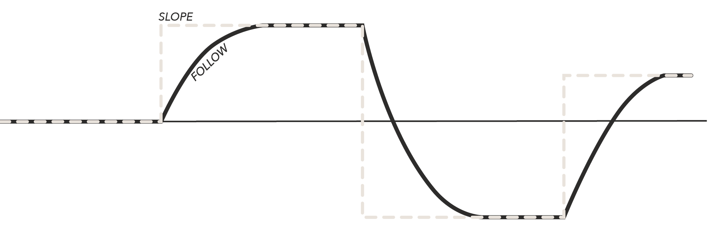

Whenever the input voltage changes, the output will slew to the absolute value of the input voltage (i.e. if it is negative, it will slew to the positive voltage with the same magnitude).  

It is as if the output is laggy version of the input: it *FOLLOWs* the input as best it can and catches up to the input whenever the input remains constant.

Fun fact: It is the same envelope follower from the [ARP2600](http://www.vintagesynth.com/arp/arp.php)!

Some use cases for CV inputs to *SLOPE* include adding portamento/glide to pitch or modulation sequences, smoothing out random sequences into undulating waves, converting triggers/gates to AR/ASR envelope, creating side-chain control voltage or a signal for taming feedback. 

### Envelope Following

*FOLLOW* is primarily designed for use as an [envelope follower](<https://learningmodular.com/glossary/envelope-follower/).  An envelope follower generates a control voltage which tracks the loudness of an input audio signal: the louder the input, the higher the control voltage.  Patch an audio signal to the *SLOPE* input to get started. The output will be a contour which tracks the volume of the the input *SLOPE* signal over time.  The louder the input, the farther *FOLLOW* moves from 0V.  It's like a control voltage VU meter!

This phenomenon allows you to use the loudness of one signal to control synthesis parameters anywhere in your system.  

This is especially effective when using an external acoustic signal that has been patched into your system via a pre-amplifying module.  *FOLLOW* converts events in the real world, like striking a drum head, into events in your synthesizer.

You can also try feeding the envelope follower back into the signal-being-followed's processing path for feedback.  In this way it can be useful for taming feedback by sending an inverted copy to attenuate a feedback-amount.

When paired with a video synthesis system, this is a great processing block for audio-visualization techniques - for instance, making the colorization change whenever a kick drum occurs.

## CREASE: Waveslicer

The *CREASE* block performs a form of wavefolding on the *CREASE* input; it is not a fold in the same sense as the classic Buchla and Serge wavefolders, but similarly it can be used for harmonic effects.  Negative voltages are shifted up by +5V, while positive voltages are shifted down by -5V.  This can be mathematically expressed as:

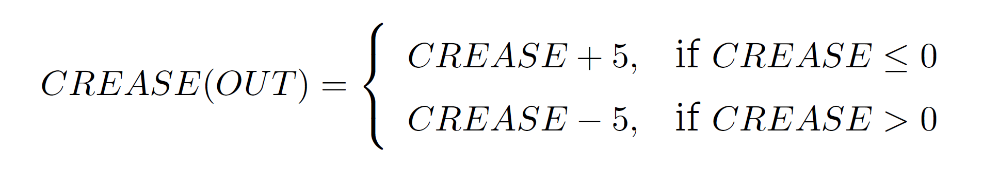

Or, more succinctly:

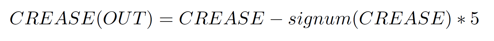

*NB: Due to the implementation of this circuit, the amount added won't be precisely +/- 5V*.

### CV Processing

*CREASE* can be used to re-arrange your input modulation.  All modulation will still move in the same direction, but the range of the modulation will be shifted depending on whether the input modulation is positive or negative.  It also introduces dramatic discontinuities in the modulation as the input crosses 0V.

### Audio Processing

When used with audio signals, *CREASE* adds harmonics to your input audio by introducing sharp discontinuities in the waveform.  Contrary to most distortions, *CREASE* is most aggressive with quieter sounds, decreasing added harmonics as volume increases.

1. Patch the same audio source (start with a sine wave) to the *LEFT* input of COLD MAC's crossfader section as well as to the *CREASE* input.
2. Patch *CREASE(OUT)* to the *RIGHT* input of the crossfader section.
3. Patch one of either *LEFT(OUT)* or *RIGHT(OUT)* to your synthesizer's audio output.
4. Sweep *FADE* (e.g. by turning *SURVEY* with nothing patched into *FADE*), and hear the final output crossfade between the original sound source and the wavefolded sound source.  Try patching an LFO or envelope to *FADE*!

Additional timbral control over the *CREASE* block can be added by biasing the audio signal (i.e. adding a DC offset to it) before sending it in to *CREASE*.  As the bias voltage changes and the audio signal is translated up and down, the point where the audio signal crosses over 0V will change.  This has a great timbral effect.  When the bias voltage exceeds +/- 5V, the audio signal will always be above or below 0V, resulting in no wavefolding at all!

1. Set *SURVEY* to 0V (knob at noon, no CV).
2. Patch an audio source to the crossfader block's *OFFSET* input.
3. Leave *LEFT*, *RIGHT* and *FADE* unpatched.
4. Patch *LEFT(OUT)* to *CREASE* (LEFT(OUT) will be the sum of *FADE* and *OFFSET*).
5. Patch *CREASE(OUT)* to your synthesizer's audio output.
6. Sweep the *SURVEY* knob slowly to hear the effect of changing the bias via *FADE*.
7. Patch an LFO or envelope to *FADE* to break the normal and give control of biasing to your CV source.

You can also use [this demo](https://www.desmos.com/calculator/xjr14zgosl) to see the effect of biasing a signal before processing it through the various inputs!

### Phase-Shifted Phasors

Patching a sawtooth or ramp wave into the *CREASE* input will result in a 180-degree phase-shifted copy of the input at the output.  Beware (or exploit!) the 'glitch' that occurs in the middle of the shifted phasor.

## LOCATION: Integrator

The *CREASE* input jack controls the *LOCATION* output.  *LOCATION* outputs a voltage with a rate of change proportional to the input voltage.  In mathematical or electrical terms, the output voltage is the *integral* of the input voltage.  The output signal is clipped at max/min of +/- 5V.

The sign of the input voltage determines the direction in which the output voltage moves: positive inputs make the output voltage rise, negative inputs make the output voltage fall. 0V stops the output voltage at the current *LOCATION*.

The magnitude of the input determines how fast the voltage moves.  The farther away from 0V, the faster the output voltage will move.

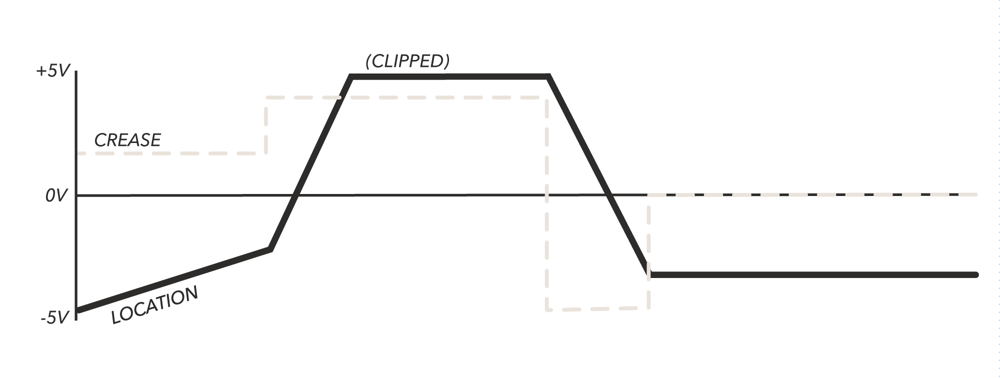

Imagine an ant moving along a string.  The string is marked with numbers to indicate its location.  A tag labeled "0V" is hanging from from the midpoint of the string.  Each end of the string is attached to a wall to stop the ant from moving beyond the boundaries; one wall is labeled "+5V", the other "-5V".  There are additional tags hanging from the string indicating various *LOCATIONs* (e.g. "-4V", "-3V", "-2V"...)

The input voltage determines the speed (velocity) of the ant: which direction it is walking, and how fast it is walking in that direction.  The output voltage is the *LOCATION* of the ant along the line!

If the input voltage stays positive for long enough, the ant will eventually hit the +5V wall and stay there as this ant can't climb walls.  If the input voltage stays negative for long enough, the ant will eventually bump into the -5V wall and stay there.

If the input voltage is 0V, the ant's velocity is 0, and so it simply stays in place; the output voltage does not change from its current value.

##### Creating Gestures

*LOCATION* can be used especially effectively to create smooth *gestures* which affect an entire patch.  Try patching *LOCATION* to multiple parameters around your synthesizer (including self-patching it to COLD MAC).  With nothing patched to *CREASE*, *LOCATION* will be controlled by *SURVEY*.  Try changing *SURVEY* from positive to negative to create a slow animation across your entire patch. Set the *SURVEY* knob to noon to freeze the gesture in an intermediate state.  The speed of the gesture will depend on how positive or negative you set *SURVEY*, so dramatic transitions can be executed by quickly changing it from CW to CCW (or vice versa).

## MAC: AC-Coupled Audio Mixer

*MAC* is a utility for mixing audio signals patched to the 6 jacks on the left side of the module (*LEFT*, *RIGHT*, *OR1*, *AND1*, *SLOPE*, *CREASE*).

*MAC* creates an even sum of all inputs and then passes this sum through a VCA.  The SURVEY voltage controls this VCA: -5V is fully closed, while +5V is fully open.

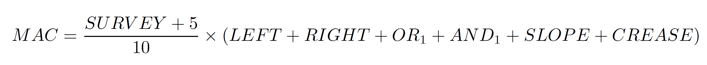

Because the *MAC* summing circuit is AC-coupled, any CV (i.e. slowly moving voltages) at the *MAC* inputs will be blocked from entering the *MAC* mix.  This allows you to use some of the inputs for audio mixing through the *MAC* output, while using other inputs for CV processing using COLD MAC's standard utility blocks.  For instance, you might patch audio signals to *SLOPE* and *CREASE* to mix into *MAC* while patching CV signals to *LEFT* and *RIGHT* to process using the crossfader.  The CV signals would be blocked from entering the *MAC* mix.   

*OR1* is normalled into *AND1*. So, if *AND1* is unpatched, any audio signal patched into *OR1* will also be patched into *AND1* and be added into the *MAC* mix twice.  As such, it will be subjected to 2x gain relative to the other inputs.  For *OR1* to be mixed at the same level as the other inputs, patch a dummy cable (or another audio signal) to *AND1* to prevent the *OR1* signal from being added in twice.  The same 2x-gain effect occurs with *SLOPE* and *CREASE*, since *SLOPE* is normalled into *CREASE*.  

When you want to avoid this effect, patch your audio signals for the *MAC* mix into *AND1* or *CREASE* before *OR1* or *SLOPE* (respectively).  However, you may also wish to exploit this effect!  For instance, it can be very useful for quiet sound sources (e.g. sine waves) or for a sound which you want to sit higher in the mix (e.g. a kick drum). 

## Phase-Related LFOs

COLD MAC can be used to turn a single LFO into 8 related LFOs with different shapes, phases, or even frequencies derived from the parameters of the input LFO.  Patch a source LFO into *SURVEY* while leaving all other inputs unpatched.  Set the *SURVEY* knob to noon.  Each output will apply the transfer function indicated on the panel to the *SURVEY* voltage, generating 8 related LFOs, one for each output. 

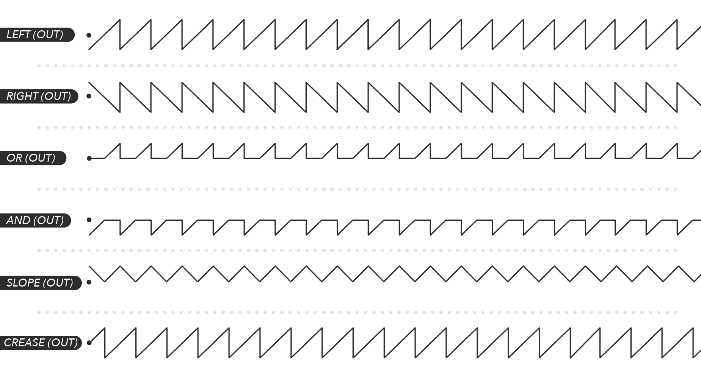

Use this [link](https://www.desmos.com/calculator/xjr14zgosl) to explore what the 6 primary output LFOs would look like (*FOLLOW* and *LOCATION* are excluded from the demo).  Use the "*waveform*" slider to select one of 3 input waveforms patched to *SURVEY*(sawtooth, triangle, sine).  When nothing is patched to the crossfader block, *LEFT(OUT)* becomes a copy of *SURVEY*, so you can see the input waveform at *LEFT(OUT)*.  Use the "*spread*" slider to spread out the waveforms so that you can see them individually or overlaid on top of each other.

The *FOLLOW* and *LOCATION* LFO shapes will depend not only on the shape of the input LFO but also the frequency of the input LFO. 

Adjusting *SURVEY* will bias the input LFO (offset it up or down) before it is processed by each block.  For most of the blocks, this will have the effect of changing the symmetry.  You can see this effect in the linked demo by adjusting the "*bias*" slider.  

More complex waveshapes can be generated by modulating parameters of the input LFO or by using more alternative LFO waveshapes.  Sending a sample+held LFO or random voltage into *SURVEY* is also a great way to get six related staircase sequences!  Try patching them through quantizers for evolving harmonization.

## Dynamics Control: Compression and Expansion

*FOLLOW*'s loudness contour output can be used to implement dynamics control techniques like [compression, expansion, side-chaining and ducking](https://en.wikipedia.org/wiki/Dynamic_range_compression).

### Primer

Imagine playing your favorite record through a stereo system, but you don't want it to get too loud.  Whenever the record gets louder than a certain *threshold*, you turn the volume down.  Once the record is quieter than the threshold, you turn the volume back to its original level.  *Compression* is the process of automating this gain control.  The amount the volume changes when the threshold is crossed is called the *ratio* (*ratio = input/output*). Turning the volume down above the threshold is *downward* compression: the dynamic range is made smaller by making the loud sounds quieter.  The dynamic range can also be made smaller by making the quiet sounds below the threshold louder.  This is known as *upward* compression. 

*Expansion* is the process of increasing dynamic range: either making loud sounds above the threshold louder, or quiet sounds below the threshold even quieter.  

*Side-chaining* means using the loudness of one signal (the "side-chain") to affect the loudness of another signal.  This technique is commonly used in electronic music to create a pulsing space that follows the kick drum.

*FOLLOW* outputs a CV contour which tracks the loudness of the *SLOPE* input signal; this contour can be used to construct a compressor when paired with COLD MAC's VCA functionality and CV processing utilities.

### Expansion/Noise Gate

First, unpatch all inputs.  Patch the audio signal you want to expand into *SLOPE*.  Patch *FOLLOW* to *SURVEY*.  Set the *SURVEY* knob around 9 or 10 o'clock.  Use *MAC* as the final audio output.  As the input signal gets louder, *FOLLOW* will get larger.  This will turn *SURVEY* up and increase the volume of the input being sent to the *MAC* output.  This is known as a "noise gate" because it allows loud sounds to pass through by turning the gain up while leaving the gain very low when the input is quiet.  This can be useful for making input sounds more "staccato" or for processing an external signal from a microphone which may be picking up unwanted ambient noise at a low level.

Adding in other signals to the *MAC* mix via the left column input jacks will subject them to the same expansion using the original *SLOPE* input as the control signal (a.k.a. side-chain control).  This can be especially effective when you want to use an external instrument like a guitar to "pluck" or "gate" several elements in your mix.  

### Compression

The only change necessary from the patch above is to invert the *FOLLOW* envelope by patching it to *FADE* first; *RIGHT(OUT)* will now be an inverted copy of *FOLLOW* and should be connected to *SURVEY*.  Set *SURVEY*  between noon and 3 o'clock. Now, as the *SLOPE* input gets louder, *FOLLOW* becomes more *negative* after it passes through the inverter.  This will close the *MAC* mix instead of opening it.  

*NB: Make sure LEFT and RIGHT are unpatched so that the FADE inverter works correctly.*

### Adjusting the Ratio

To adjust the ratio, or the amount the sound changes based off the loudness of the input, patch the *FOLLOW* signal through an attenuator. Patching it through an attenuverter will allow you to switch between compression and expansion.  

### *FADE*: Compression, Expansion, and Sidechaining

The *FADE* block can also be used simultaneously for both compression and expansion.  Patch the signal to process to both *LEFT* and *SLOPE*.  Alternatively, patch the signal to process to *LEFT* and the side-chain control signal (like a kick drum) to *SLOPE*.  

Patch a dummy cable to *RIGHT*. Patch the *FOLLOW* output to *SURVEY*, and leave *FADE* unpatched.  Set *SURVEY* around noon.  Use *LEFT(OUT)* as the audio output.  

Now, as the *SLOPE* signal gets louder, *FOLLOW* will increase.  Since it is patched to *SURVEY* and *FADE* is unpatched, *FADE* will increase as well.  As *FADE* increases, the *LEFT* signal will get quieter at *LEFT(OUT)* (compressed) and louder at *RIGHT(OUT)* (expanded).  *SURVEY* sets the default volume (or makeup gain) when the *SLOPE* input is silent.  If you are looking to side-chain a sound to a kick drum, patch the sound to *LEFT*, the kick to *SLOPE*, and take the output from *LEFT(OUT)*.

If you are sidechaining, you may wish to to mult the side-chain control signal into *OFFSET* in order to mix it with the sidechained signal feeding *LEFT*.

### *OR*/*AND*: Threshold Control

The logic blocks can be used to add a threshold control.  Patch the *FOLLOW* output to *OR1* and leave *AND1* unpatched (*OR1* will remain normalled into *AND1*).  Now, *SURVEY* will set the threshold via *OR2*/*AND2*.  When the *SLOPE* input signal is louder than the threshold, *FOLLOW* will come out of *OR(OUT)*.  When it is quieter, *FOLLOW* will come out of *AND(OUT)*.  If you are looking to make loud sounds quieter (downward compression) or loud sounds louder (upward compression), use *OR(OUT)* as your gain control.  If you are looking to make quiet sounds louder (upward compression) or quiet sounds quieter (downward expansion), use *AND(OUT)* as your gain control.  You will likely want to offset and attenuvert the signal before sending it to the VCA control input.  These will adjust makeup gain and ratio respectively.  

If you wish to use *SURVEY* to offset your gain control and control the *FADE* or *MAC* VCA (as in the previous examples), set the threshold at *OR2*/*AND2* using an external CV offset rather than the normalled *SURVEY* control.

## Extended Waveshaping

Complex wavefolding networks are possible by self-patching COLD MAC.  

Here are some key techniques which can be combined in a modular fashion to create more new timbres.  Try using LFOs, envelopes, staircase random sequences, and even audiorate modulation to control any of the CV parameters detailed below.

Although the language below references audio rate input signals for folding, try using control rate signals to slice into new modulation shapes. Try sending these complex modulations to a sample+hold/quantizer to create harmonizing and evolving pitch sequences from elementary input sources.

### Blending

Although this does not change the quality of the wavefolding, blending is a simple way of adjusting the intensity of the harmonic distortion.  

Use the crossfading block to blend between a wavefolding sound and the dry sound!  For instance:

> Audio Input > *LEFT* & *CREASE* (multed)
>
> *CREASE(OUT)* > *RIGHT*
>
> *LEFT(OUT)* > Audio Output
>
> Blend CV > *SURVEY*/*FADE*

Since wavefolded sounds often lose the fundamental, it can be useful to mult the audio input to *OFFSET* so that it is still present in *LEFT(OUT)* alongside the folded version when *FADE* is at +5V.

### Series

Connecting multiple waveshaping blocks in series (one feeding the next) can create rich new waveforms.  Here's an example which combines *SLOPE* and *CREASE*:

>  Audio Input > *CREASE*
>
> *CREASE(OUT)* > *SLOPE*
>
> *SLOPE(OUT)* > Audio Output

### Parallel

Patch two waveshaping blocks in parallel and mix their outputs together - or use one of the outputs to modify the waveshaping of the other!

This patch simply takes the sum of *AND* and *CREASE* processing the same input.  *SURVEY* will affect the nature of the *AND* block wavehsaping.

>Audio Input > *CREASE* & *AND1*
>
>*AND(OUT)* > *OFFSET*
>
>*CREASE(OUT)* > *FADE*
>
>*LEFT(OUT)*  > Audio Output
>
>*LEFT*, *RIGHT*, and *AND2* must remain unpatched. 
>
>*SURVEY* adjusts timbre.

### Biasing

Biasing the signal will alter the effect of wavefolding as it changes where a signal lies in relationship to the various folding thresholds. 

Use the crossfading block to bias (add a constant voltage) to a signal before sending it to a wavefolding network!  For instance:

> Audio Input > *OFFSET*
>
> *LEFT(OUT)* > *SLOPE*
>
> *SLOPE*(OUT) > Audio Output
>
> Bias CV > *SURVEY*/*FADE* controls biasing
>
> *LEFT* and *RIGHT* must remain unpatched.

The *FADE* block can be used to combine crossfading and biasing as well by setting up a [dry/wet loop](#drywet-control-and-feedback):

> Audio Input > *LEFT*
>
> *RIGHT(OUT)* > *SLOPE*
>
> *SLOPE(OUT)* > *RIGHT*
>
> *LEFT(OUT)* > Audio Output
>
> Bias CV > *OFFSET*
>
> Blend CV > *SURVEY*/*FADE*

Here, when *FADE* is at -5V, the audio output is just the audio input + the bias CV as *LEFT* passes directly to *LEFT(OUT)*.  When *FADE* is at +5V though, *LEFT* is first first routed through the crossfader block to *RIGHT(OUT)* and mixed with the bias CV before being sent to *SLOPE*.  *SLOPE(OUT)* then return the folded signal to *SLOPE*, which gets routed to the final audio output at *SLOPE(OUT)*.

This patch demonstrates using one parallel waveshaped signal to bias the other waveshaping path.

> Audio Input > *FADE* and *AND1*
>
> *AND(OUT)* > *OFFSET*
>
> *LEFT(OUT)* > *CREASE*
>
> *CREASE(OUT)* > Audio Output

### SURVEY Macros

*SURVEY* can be used to control multiple waveshaping parameters simultaneously, like biasing and blending:

> Audio Input > *LEFT*
>
> *RIGHT(OUT)* > *SLOPE*
>
> *SLOPE(OUT)* > *RIGHT*
>
> *LEFT(OUT)* > Audio Output
>
> OR(OUT) > *OFFSET*
>
> *OR1*, *OR2*, and *FADE* must remain unpatched.

*SURVEY* will affect both the blending (via *FADE*) and biasing (via *OR(OUT)* > *OFFSET*).  From -5V to 0V, *SURVEY* will blend from the clean sound to an even mix of the clean and folded sounds.  *OR(OUT)* will be stuck at 0V since *OR1* is unpatched, so no biasing occurs.  As *SURVEY* sweeps from 0V to +5V, it completes the crossfade to the wavefolded sound.  However since *SURVEY* is now greater than *OR1*, *OR(OUT)* will track *SURVEY* and begin biasing the signal as it passes through the wavefolding loop.  This has the effect of transforming the nature of the fold as the blending progresses, resulting in a multi-dimensional timbral change with just a single knob.  

The following patch extends the above macro by introducing the *AND* block in series.

> Audio Input > *LEFT*
>
> *RIGHT(OUT)* > *SLOPE*
>
> *SLOPE(OUT)* > *AND1*
>
> *AND(OUT)* > *RIGHT*
>
> *LEFT(OUT)* > Audio Output
>
> OR(OUT) > *OFFSET*
>
> *OR1*, *OR2*, *AND2*, and *FADE* must remain unpatched.

Now, in addition to controlling biasing and blending, *SURVEY* also will change the wavefolding by setting a comparison threshold for the *AND* block.  You should also try overwriting *SURVEY*'s normals with different LFOs, envelopes, and sequences to hear what happens when the parameters are controlled independently!

## Feedback Sounds

Self-patching COLD MAC can lead to many unexpected feedback results.  *FOLLOW* can be used to track the loudness of feedback; pairing this contour with *FADE* can help keep feedback manageable.

### VCO

> LEFT > CREASE (yes, input to input!)
>
> CREASE(OUT) > RIGHT
>
> LEFT(OUT) > Audio Output (Square Wave)
>
> MAC > Audio Output (Sine Wave)

SURVEY or FADE controls frequency of oscillation.

Try using a stackable mult to connect LEFT & CREASE together.  Patch a cable into one end of one of the stackables - try touching the end of the cable to change the timbre of the sound.

Try patching CREASE into other inputs, or MAC/RIGHT/LEFT into other inputs simultaneously and the timbre of the VCO will change.

Good luck explaining why this one works! 

## Mid-Side Processing and Width Control

*[Mid-Side Processing](https://theproaudiofiles.com/mid-side-processing/)* is a technique that allows you to re-organize how you process sounds in a stereo field.  Rather than processing the left and right sides of the field separately, sounds in the middle of the field are placed in one channel and sounds on the outside of the field are placed in the other channel.  This allows the user to apply processing to sounds depending on how far they are from the middle.  For instance, it allows the user to apply delay to sounds that exist at the edges of the stereo field while compressing sounds in the center of the field.  One particularly effective use of M/S processing is to convert a mono effect into a pseudo-stereo effect by creating a sense of space: by applying the mono effect to the Side signal and adjusting the gain of the side (before or after processing, depending on the use case) allows the mono effect to appear more strongly at the edges of the stereo field and less intensely for sounds in the middle of the field, giving a sense of *width*.

The Mid signal is created ("encoded") by summing (mixing) the Left and Right signals:

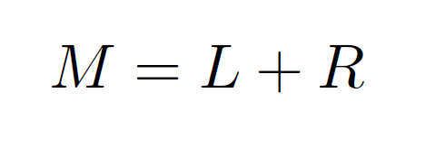

The Side signal is created ("encoded") by taking the difference of the Left and Right signals. If a sound is in the middle, it appears equally in both L & R, and thus will be cancelled out when creating the Side signal:

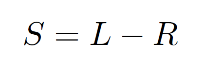

To recover ("decode") the Left channel, add the (post-processed) Mid and Side signals:

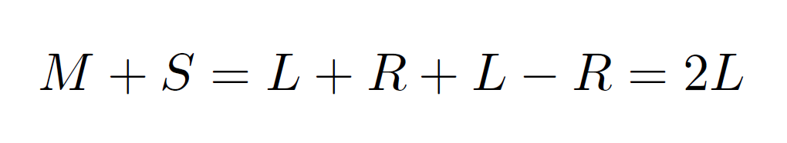

To recover ("decode") the Right channel, subtract the (post-processed) Mid and Side signals:

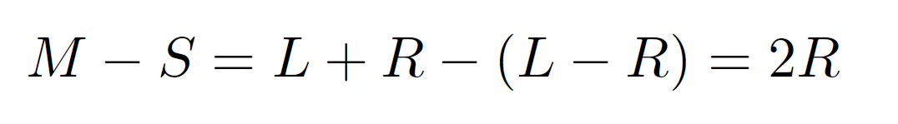

Both the L & R signals have been perfectly recovered without any loss of information! Notice that the gain of the Left and Right signals has doubled.  Setting different attenuations/boosts for the Mid and Side signal will result in different stereo width perceptions.

To realize a full M/S processor requires two COLD MACs, however it can also be done with just one COLD MAC plus another external summing/inverting utility.

CM1 refers to the first COLD MAC, while CM2 refers to the second COLD MAC.

##### Encoding:

With nothing patched to CM1's *LEFT* and *RIGHT* inputs, *LEFT(OUT)* will be *OFFSET+FADE* while *RIGHT(OUT)* will be *OFFSET-FADE*.  This is used to encode the L/R signals to M/S by assigning the L signal to OFFSET and the R signal to FADE.

> Left channel > CM1.*OFFSET*
>
> Right channel > CM1.*FADE*
>
> CM1.*LEFT(OUT)* = Mid = Left + Right
>
> CM1.*RIGHT(OUT)* = Side = Left - Right

##### Processing:

Send CM1.*LEFT(OUT)* and CM1.*RIGHT(OUT)* to your independent Mid and Side processing chains respectively.  For instance, perhaps you want sounds at the edges of your stereo field to have reverb added while sounds in the middle should have delay added.  These will then be recombined to recover the resultant Left and Right channels.

##### Adding Width Control:

If you want to use COLD MAC to control the sense of space, patch the Mid or Side signal to one of the four unused inputs and take the output from *MAC*.  *SURVEY* will now control your Mid or Side gain, depending on which signal you chose. 

When used with the *SIDE* signal, *SURVEY* becomes a stereo width control as it adjusts the MAC gain.  You might choose to do this before processing the M/S signal or after.  -5V corresponds to no width, while +5V corresponds to full-width.

You can also patch your pre- or post-processed Side signal to any other VCA for stereo-width control.

##### Decoding:

> Mid > CM2.*OFFSET*
>
> Side > CM2.*FADE*
>
> CM2.*LEFT(OUT)* = Left channel output
>
> CM2.*RIGHT(OUT)* = Right channel output

You can also implement the decoding with mixers and inverters if you do not have another COLD MAC.  Use the previously outlined method for stereo-width control by patching your side signal through the *MAC* VCA (either pre- or post-processing).  

##### Decoding variation: 

This method allows you to free the other COLD MAC inputs and lets you control stereo width using the *FADE* input of the second COLD MAC.  It does however require an additional inverter... perhaps from a third COLD MAC!

> Mid  > CM2.*OFFSET*
>
> Side > CM2.*LEFT*
>
> Side > Inverter > CM2.*RIGHT*
>
> Stereo Width CV > *FADE* (or *SURVEY*, normalled into *FADE*)
>
> CM2.*LEFT(OUT)* = Left channel output
>
> CM2.*RIGHT(OUT)* = Right channel output

The side signal will cancel with its inverted copy when the Stereo Width CV into *FADE* is 0V, while full stereo width will occur with a CV of -5V or +5V.  This method will result in phase cancellation when summed to mono, so be careful if you are playing out or your track is being summed to mono without your knowledge!

## Bernoulli Gates and Event Probability 

COLD MAC can be combined with a noise source to create a pair of complementary events.  A [Bernoulli trial](https://en.wikipedia.org/wiki/Bernoulli_trial) is a test which has exactly two possible outcomes, like flipping a coin.  A probability *p* determines the likelihood that one outcome will occur, while *1-p* determines the probability that the other outcome will occur.  The events never occur simultaneously, but one of the two events always occurs, so they are "complementary". 

In the modular synthesis context, a "Bernoulli gate" determines which of two synthesis events will occur based off a probability control voltage.  Examples of possible events including advancing different sequencers, striking drum modules, and exciting envelope generators.  By changing the probability, you can slowly morph from one event dominating to the other.  This can be useful for creating evolving [hocketing](https://en.wikipedia.org/wiki/Hocket) patterns or stochastic variation within a patch.

This patch uses the crossfader block to calculate the difference between a randomly generated voltage and a probability CV threshold.  If the random value is greater than the threshold, the difference will be positive.  If the random value is less than the threshold, the difference will be negative.  This difference is patched into both logic blocks with a comparison voltage set to 0V; when the random value is greater than the threshold, a positive voltage will come out of *OR(OUT)*, otherwise, 0V will come out.  When the random value is less than the threshold, a negative voltage will come out of *AND(OUT)*, otherwise, 0V. *AND(OUT)* is patched to *SLOPE* for rectification.    

So, whenever the random voltage updates, one of the two outputs will output a positive voltage while the other outputs 0V.  *SURVEY*/*FADE* controls the probability balance between which output will be positive and which will be 0V.   While a positive voltage is sent into *SURVEY*/*FADE*, the balance is weighted towards *SLOPE(OUT)* being positive, while a negative voltage into *SURVEY/FADE* will weight the balance towards *OR(OUT)*.

Patch:

> Noise source (e.g. a S+H white noise sequence) > *OFFSET*
>
> *RIGHT(OUT)* > *OR2* & *AND2* (stackable)
>
> *OR(OUT)* > Gate input of Envelope Generator 1 or Sequencer 1
>
> *AND(OUT)* > *SLOPE*
>
> *SLOPE(OUT)* > Gate input of Envelope Generator 2 or Sequencer 2
>
> *SURVEY* (or *FADE*) controls probability balance.
>
> *NB: If you do not have a stackable, you can patch RIGHT(OUT) to OR1 and use a cable to patch OR2 and AND2 together, breaking the normal from SURVEY.*

You may wish to offset the two outputs by a small positive voltage (just less than the target input's gate/trigger threshold sensitivity).  This will ensure that whenever the random voltage crosses the probability threshold, the final output voltage is high enough to cross the target's sensitivity threshold.

If you are using a sample & hold source, it may help to multiply the two outputs (*OR(OUT)* & *SLOPE(OUT*)) by multed copies of your clock source.  This will force both outputs to go to the low state between every clock pulse.  This is important for being able to retrigger AR envelope generators, but is unnecessary for ASR generators. 

If you are using a white noise source (as opposed to sample & hold), you will want envelopes with instant attack, and gate-sensitive ASR envelopes or retriggerable AR envelopes.

## Quadraphonic Panning and Vector Mixing

### Panner

This panner allows you to pan a signal between 4 destinations positioned at the corners of a square, according to a cartesian `<x,y>` location in the 2-D plane.  It requires 3 COLD MACs.

This is useful for spatializing sound in a quadraphonic speaker setup, but it is not limited to this interpretation of the 4 outputs.  Maybe the destinations are not speakers in real space, but rather four different processing chains. 

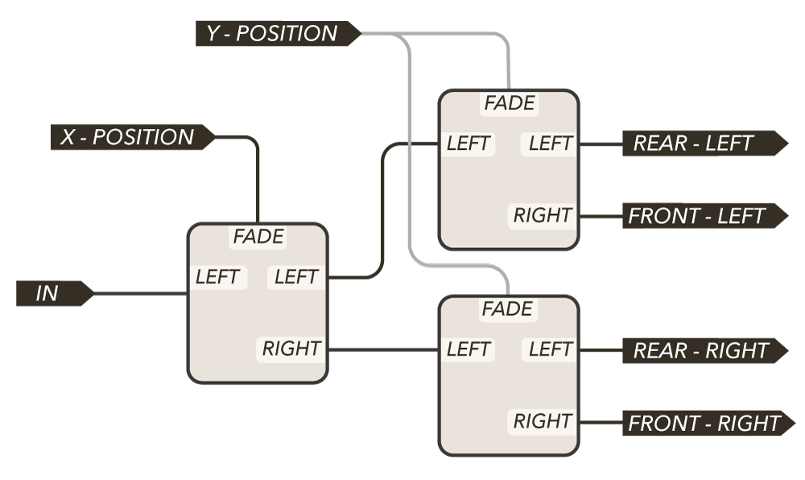

COLDMAC1 pans the signal forward/backward.  COLDMAC2&3 works together to pan the signal left/right while maintaining the forward/rear balance.  You will want to use a dummy cable for the *RIGHT* inputs on each COLD MAC to eliminate DC offsets.

When `<x,y>` is `<-5V,-5V>`, the signal should be panned hard left and hard rear - i.e. almost entirely out of the Rear Left speaker.  Similarly, `<+5V,+5V>` corresponds to the Front Right.

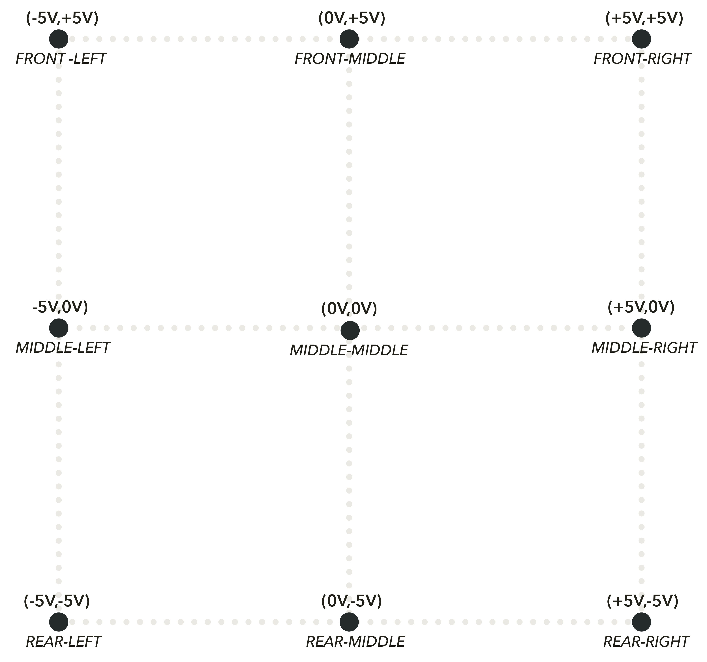

### Vector Mixer

Alternatively, you can flip the three COLD MAC's to create a monophonic mix of four signals arranged in 2D space - a vector mixer like the Prophet VS.

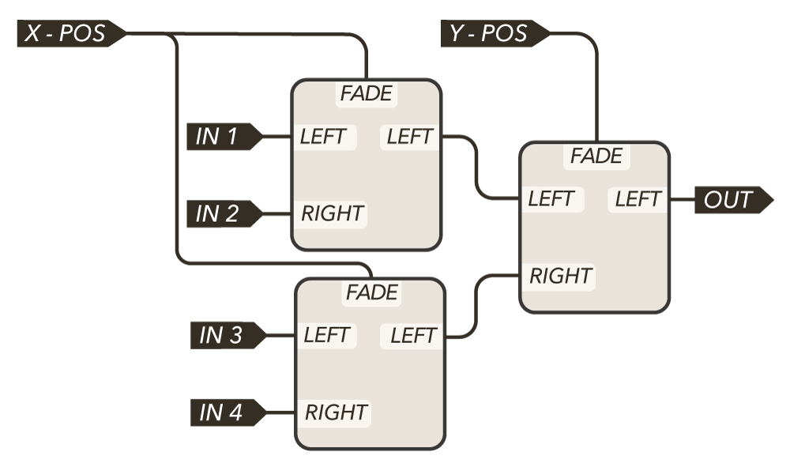

COLDMAC1 & COLDMAC2 select the weighting of the inputs along one axis, while COLDMAC3 selects the weighting of the inputs along the other axis. 

This is useful for additive synthesis and harmonic oscillator (e.g. tuned sine wave) techniques as well as evolving pads and chords.  It can also be useful for creating new timbres by blending together four different elementary waveshapes in different amounts but at the same frequency. Other use-cases of the vector mixer include sending variable amounts of four sound sources to an FX processing chain, or blending between different CV modulation sources for a single destination parameter. 

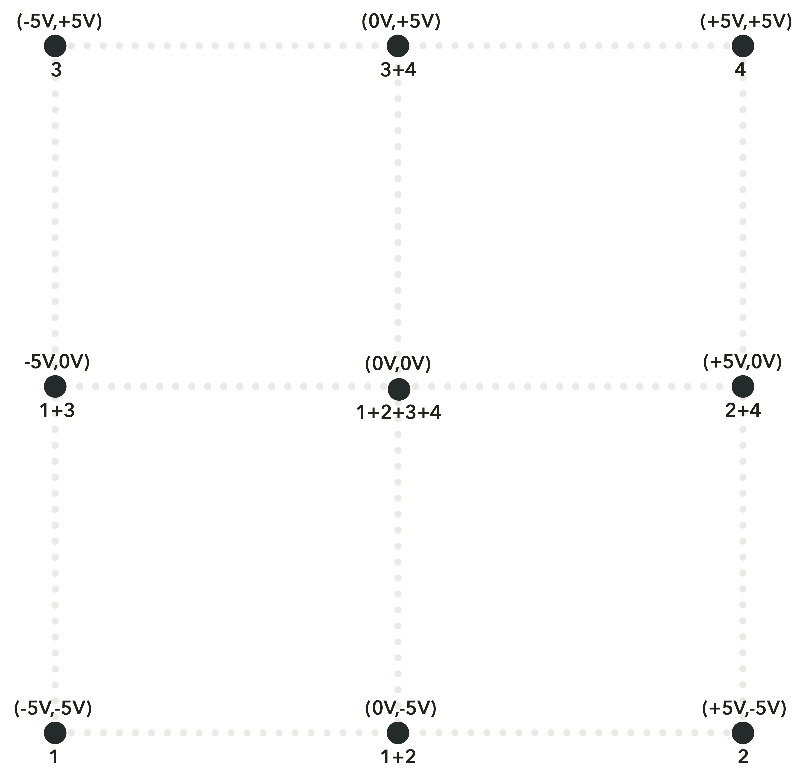

## Extended Logic

*AND* and *OR*  are useful for gate logic.  They can be used to "filter" & combine gate patterns and create accenting gates.  You cannot create "new" gates though, only filtering or accenting gates which already occur.  By adding in the crossfader block, you can create *new* gates where none previously occurred.  This can be used to create [hocketing](https://en.wikipedia.org/wiki/Hocket) patterns as well unique, hybridized digital rhythms.  Try using JUST FRIENDS as a clock divider (or generator) with variable pulse width and combining different divisions with the following logic blocks!  [These](https://www.youtube.com/watch?v=DulDZSsMUpY) [videos](https://www.youtube.com/watch?v=NudTHG_mINc) [will](https://www.youtube.com/watch?v=B6Bg-4lpVsA) give a great idea of just some of the possibilities available with logic!

### NOT Operator

The *NOT* operator logically inverts all gates: HIGH goes to LOW and LOW goes to HIGH.

With nothing patched to *LEFT* or *RIGHT*, patch a +5V signal to *OFFSET*.  This creates the following transfer function for *FADE*:

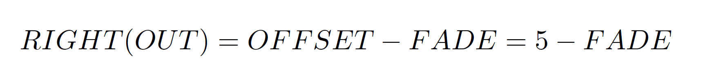

When *FADE* is 0V, *RIGHT(OUT)* is +5V, and when *FADE* is +5V, *RIGHT(OUT)* = 0V.  This then is logical inversion, or the Boolean *NOT* operator.  When a GATE is now patched to *FADE*, *RIGHT(OUT)* will be the result of applying the *NOT* operator to the GATE input.  

| GATE=FADE | RIGHT(OUT) = !FADE |
| --------- | ------------------ |
| 0V        | +5V                |
| +5V       | 0V                 |

If you do not have a +5V reference at hand, you can turn *SURVEY* fully CCW or CW and patch *SLOPE(OUT)* to *OFFSET*.

*NB: If 2.5V is sufficiently high for your gate input sensitivities, then you can place a dummy cable into RIGHT instead of sending a +5V offset into OFFSET.  When the FADE gate is at 0V, RIGHT(OUT) will be 2.5V, and when the FADE gate is at +5V, RIGHT(OUT) will be 0V.*

### NAND Operator

The *NAND* operator outputs a gate as long as both inputs are not simultaneously high - in other words as long as the result of applying the *AND* operator to both inputs is not true: A !& B = !(A & B)

This combines the *AND* section the [*NOT* patch](#not-operator) to hybridize two gate patterns into a third, new pattern.

GATE1 and GATE2 are patched to *AND1* and *AND2*.  *AND(OUT)* is used as the gate source for the *NOT* patch, which will now output GATE1 *NAND* GATE2.

Since any Boolean expression can be built with a sufficient number of *NAND* operators, you could build an entire digital computer capable of executing programs and storing data in RAM using COLD MACs.  Let us know if you would like to do this, and perhaps we could provide you with a few of the hundreds of millions of needed COLD MACs for free.  

| GATE1 | GATE2 | RIGHT(OUT) = GATE1 !& GATE2 |
| ----- | ----- | --------------------------- |
| 0V    | 0V    | +5V                         |
| 0V    | +5V   | +5V                         |
| +5V   | 0V    | +5V                         |
| +5V   | +5V   | 0V                          |

### NOR Operator

The NOR operator only outputs a gate if both inputs are low - in other words as long as the result of applying the OR operator to both inputs is not true: A !| B = !(A|B)

This combines the *OR* section with the [*NOT* patch](#not-operator) to create a new gate pattern out of two component gate patterns.

GATE1 and GATE2 are patched to *OR1* and *OR2*.  *OR(OUT)* is used as the gate source for the *NOT* patch, which will now output GATE1 *NOR* GATE2

| GATE1 | GATE2 | RIGHT(OUT) = GATE1 !\| GATE2 |
| ----- | ----- | ---------------------------- |
| 0V    | 0V    | +5V                          |
| 0V    | +5V   | 0V                           |
| +5V   | 0V    | 0V                           |
| +5V   | +5V   | 0V                           |

### XOR Operator

The XOR operator only outputs a gate if exactly one of the two inputs are high, but not both. A XOR B is equivalent to the following expression: (A|B) & !(A & B) = (A|B) & (A !& B)

> GATE1 > *OR1*, *AND1* (normalled, no mult needed)
>
> GATE2 > *OR2*, *AND2* (mult/stackable needed, or patch to SURVEY CV with SURVEY knob at 0V)
>
> *AND(OUT)* > *FADE*
>
> *OR(OUT)* > *OFFSET*
>
> *RIGHT(OUT)* = *OFFSET*-*FADE* = GATE1 *XOR* GATE2

Whenever both gates are 0V, *FADE* and *OFFSET* are 0V since both *AND(OUT)* and *OR(OUT)* are 0V.  This results in *RIGHT(OUT)* = *OFFSET*-*FADE* = 0V.  

When one of the two gates is +5V, *OR(OUT)* and *OFFSET* will be +5V but *AND(OUT)* and *FADE* will still be 0V, resulting in *RIGHT(OUT)* = *OFFSET*-*FADE* = +5V.  

When both gates are +5V, *OR(OUT)* and *OFFSET* will be +5V, but so will *AND(OUT)* and *FADE*, resulting in *RIGHT(OUT)* = *OFFSET*-*FADE* = 0V.

| GATE1 | GATE2 | RIGHT(OUT) = GATE1 XOR GATE2 |
| ----- | ----- | ---------------------------- |
| 0V    | 0V    | 0V                           |
| 0V    | +5V   | +5V                          |
| +5V   | 0V    | +5V                          |
| +5V   | +5V   | 0V                           |

## Further Reading
For an alternate take on COLD MAC, we strongly recommend Martin Doudoroff's [Patching Cold Mac](http://doudoroff.com/cold-mac/) guide, along with a great [YouTube tutorial](https://www.youtube.com/watch?v=A72eYNfxxRU). A number of ideas in this Map borrow from Martin's work!

## Warranty

No matter if you just bought your first module, or found a grimey old relic, we're committed to keeping it running in top form.

Formally, Whimsical Raps warrants each product to be free of defects in materials or construction for a period of one year from the date of original purchase (proof of purchase required). Malfunction caused by abuse of the product, or any other cause that we determine to be the user's fault, will not be covered by this warranty.

Formalities aside, if you've got an issue we absolutely want to help sort it out. Send us an [email](mailto:service@whimsicalraps.com) and let us know how we can help. Our service fees are only our direct costs, and we typically ask you to pay shipping one-way. Here's to keeping synths out of landfill!

