[making modulation: control rate techniques]: #making-modulation-control-rate-techniques

[triggered ar envelopes]: #transientshape-triggered-ar-envelopes
[14]:  #transientshape-triggered-ar-envelopes
[trigger skipping]: #transientshape-trigger-skipping
[clock division]: #transientshape-clock-division-rhythm-modulator-and-accent-generator
[rhythm modulator and accent generator]: #transientshape-clock-division-rhythm-modulator-and-accent-generator
[precise duration sequencing]: #transientshape-precise-duration-sequencing

[gated asr envelopes]: #sustainshape-gated-asr-envelopes
[15]:  #sustainshape-gated-asr-envelopes
[gate delay]: #sustainshape-gate-delay
[vactrol memory]: #sustainshape-vactrol-memory
[gate-to-cv-sequence converter]: #sustainshape-gate-to-sequence-converter
[gate-to-sequence converter]: #sustainshape-gate-to-sequence-converter

[looping envelopes & temporally-related lfos]: #cycleshape-temporally-related-lfos
[16]:  #cycleshape-temporally-related-lfos
[temporally related lfos]: #cycleshape-temporally-related-lfos
[synchronizing lfos]: #cycleshape-synchronizing-lfos
[quadrature/phase-shifted lfos]: #cycleshape-quadraturephase-shifted-lfos
[quadrature lfos]: #cycleshape-quadraturephase-shifted-lfos
[phasing patterns, polyrhythm generator, clock division/multiplication generator]: #cycleshape-phasing-lfos-and-polyrhythmic-patterns
[phasing lfos and polyrhythmic patterns]: #cycleshape-phasing-lfos-and-polyrhythmic-patterns
[staircase sequences and chaotic waveforms]: #cycleshape-staircase-sequences-and-chaotic-waveforms
[staircase sequences and chaotic waveform generator]: #cycleshape-staircase-sequences-and-chaotic-waveforms

[making sound audio rate techniques]: #making-sound-audio-rate-techniques

[impulse-train vcos]: #transientsound-impulse-train-vcos
[17]: #transientsound-impulse-train-vcos
[pitch division and subharmonics generator]: #transientsound-pitch-division-and-subharmonics-generator

[trapezoid vcos and pwm tracking]: #sustainsound-trapezoid-vcos-and-pwm-tracking
[18]: #sustainsound-trapezoid-vcos-and-pwm-tracking

[waveshaped vcos]: #cyclesound-waveshaped-vcos
[19]: #cyclesound-waveshaped-vcos
[sync sounds]: #cyclesound-sync-sounds
[additive synthesis and harmonic oscillator]: #cyclesound-additive-synthesis-and-harmonic-oscillator
[chord generator]: #cyclesound-chord-generator

[run modes]: #run-modes
[shift]: #shift-transientshape-ar-envelopes-w-retrigger-control
[1]: #shift-transientshape-ar-envelopes-w-retrigger-control
[strata]: #strata-sustainshape-arsr-envelopes-and-slew-limiting
[2]: #strata-sustainshape-arsr-envelopes-and-slew-limiting
[volley]: #volley-cycleshape-modulation-bursts
[3]: #volley-cycleshape-modulation-bursts
[spill]: #spill-transientsound-impulse-trains-subharmonics-and-sync-chaos
[4]: #spill-transientsound-impulse-trains-subharmonics-and-sync-chaos
[plume]: #plume-sustainsound-lowpass-gated-vcos-and-polyphonic-synthesis
[5]: #plume-sustainsound-lowpass-gated-vcos-and-polyphonic-synthesis
[floom]: #floom-cyclesound-2-operator-fm-vcos-and-noise-generator
[6]: #floom-cyclesound-2-operator-fm-vcos-and-noise-generator

[slope timing]: #slope-timing
[7]: #slope-timing

[slope shaping]: #slope-shaping
[8]: #slope-shaping

[range switch]: #the-range-switch-timebase-levels-mix-fm
[9]: #the-range-switch-timebase-levels-mix-fm

[shape range]: #shape
[sound range]: #sound

[mode switch]: #the-mode-switch-and-trigger-inputs
[10]: #the-mode-switch-and-trigger-inputs

[transient mode]: #transient-mode-triggered-ar-slopes
[11]: #transient-mode-triggered-ar-slopes

[sustain mode]: #sustain-mode-gated-asr-slopes
[12]: #sustain-mode-gated-asr-slopes

[cycle mode]: #cycle-mode-looping-slopes-w-phase-reset
[13]: #cycle-mode-looping-slopes-w-phase-reset

[TRIGGER Input Normalling]: #trigger-input-normalling
[20]: #trigger-input-normalling

[mode maps]: #mode-maps

# JUST FRIENDS: A Technical Map

JUST FRIENDS generates six correlated slopes with a shared set of parameters.  Slopes may be configured to be AR/ASR/ARSR envelopes with related durations, quadrature & tempo-synced LFOs, polyrhythmic clocks or LFOs, PWM gates and VCOs, a staircase waveform generator, a slew limiter, overtone/undertone/justly intoned waveshaped VCOs, an additive synthesis harmonic oscillator, a subharmonics generator, tuned but timbrally distinct impulse-train VCOs, internal-LPG-processed oscillators, an internal FM synthesizer, a noise generator, and more!  

## Mode Maps

### Standard Modes

|             | *sound*                                                      | *shape*                                                      |
| ----------- | ------------------------------------------------------------ | ------------------------------------------------------------ |
| *transient* | [Impulse-Train VCOs], [Pitch Division and Subharmonics Generator] | [Triggered AR Envelopes], [Trigger Skipping], [Clock Division], [Rhythm Modulator and Accent Generator] |
|             |                                                              |                                                              |
| *sustain*   | [Trapezoid VCOs and PWM Tracking]                            | [Gated ASR Envelopes], [Gate Delay], [Vactrol Memory], [Gate-to-CV-Sequence Converter] |
|             |                                                              |                                                              |
| *cycle*     | [Waveshaped VCOs], [Sync Sounds],  [Additive Synthesis and Harmonic Oscillator], [Chord Generator] | [Looping Envelopes & Temporally-related LFOs], [Quadrature LFOs], [Phasing Patterns, Polyrhythm Generator, Clock Division/Multiplication Generator], [Staircase Sequences and Chaotic Waveform Generator] |

### *RUN* Modes

|             | *sound*                                                  | *shape*                                                      |
| ----------- | -------------------------------------------------------- | ------------------------------------------------------------ |
| *transient* | [Impulse-Trains, Subharmonics, and Sync Chaos (*SPILL*)][4]                            | [AR Envelopes w/ Retrigger Control (*SHIFT*)][1]            |
|             |                                                          |                                                              |
| *sustain*   | [Lowpass-Gated VCOs & Polyphonic Synthesis (*PLUME*)][5] | [ARSR Envelopes w/ Sustain Level Control, Slew Limiting (*STRATA*)][2] |
|             |                                                          |                                                              |
| *cycle*     | [2-Operator FM Synthesis & Noise Generator (*FLOOM*)][6] | [Envelope and Gate Burst Generator (*VOLLEY*)][3]           |

## Table of Contents

1. [Specifications](#specifications)
2. [Overview and Block Diagram](#overview-and-block-diagram)
4. [Slope Timing][7]
   - [TIME & IDENTITY](#time--identity)
   - [INTONE & the 'N's](#intone)
5. [Slope Shaping][8]
   - [RAMP](#ramp)
   - [CURVE](#curve)
6. [*range* switch][9]
   - *[shape range]*
   - *[sound range]*
6. [*mode* switch and TRIGGER Inputs][10]
   - *[transient mode]*
   - *[sustain mode]*
   - *[cycle mode]*
   - [TRIGGER Input Normalling](#trigger-input-normalling)
7. [Frequency Modulation](#frequency-modulation)
8. [Making Modulation: Control-rate Techniques](#making-modulation-control-rate-techniques)
9. [Making Sound: Audio-rate Techniques](#making-sound-audio-rate-techniques)
10. [*RUN* Modes](#run-modes)
11. [Firmware Update](#firmware-update)
12. [Calibration & Factory Reset](#calibration-and-factory-reset)
13. [Warranty](#warranty)

## Specifications

- 14HP
- 30mm depth
-  96mA @ +12V
- 30mA @ -12V

## Overview and Block Diagram

JUST FRIENDS is made up of 6 slope generators with shared parameters.  The generators are named *IDENTITY* (a.k.a. *1N*), *2N*, *3N*, *4N*, *5N*, and *6N*.  The name "slope generator" is used here instead of "envelope generator" or "impulse generator" in order to remain agnostic as to the use-case: the slopes' use in a modular synthesis context is determined by the rate at which the slopes are excited, whether they are triggered, gated, or looping, and the speed of each slope.  

The [*mode* switch][10] determines how the slopes are excited via the *TRIGGER* (*IDENTITY*,...,*6N*) inputs: 

- *[transient mode]*: triggered AR slopes
- *[sustain mode]*: gated ASR slopes
- *[cycle mode]*: looping slopes w/ phase reset

The [*range* switch][9] determines the range of speeds (a.k.a. timebase) for the slopes: 

- *[shape range]*: minutes to milliseconds (control voltage rate) 
- *[sound range]*: milliseconds to microseconds (audio-rate, aka Hz to kHz)

The various combinations of these two switches enable distinct use-cases.  The *[mode maps]* at the start of this document outline some of the possibilities.

All 6 slope generators share the same interface:

query 'slope's index'

- [*TRIGGER*][10] inputs (*IDENTITY,...,6N*) excite slopes according to the *mode* switch.
- [*TIME* & *INTONE*][7] together determine each slope's speed according to the slope's index and the *range* switch.
- *[RAMP]* sets the balance of rise-time and fall-time (like *BARREL* on MANGROVE) for each slope while leaving the total speed of the slope unaffected.  

- *[CURVE]* applies waveshaping to bend the linear slopes into various curvatures.  

All slopes share the same *RAMP* & *CURVE* settings, while the speeds of the slopes are linked proportionally via *TIME* & *INTONE*.  This combination of *TIME* & *INTONE* is central to JF's architecture as it ties the 6 slope generators together: *TIME* determines the speed of the *IDENTITY* slope generator, and *INTONE* determines the ratio of each subsequent slope generator's speed to *IDENTITY*'s speed.  

The next sections explain these controls in more detail, but you can jump to the *[mode maps]* to explore specific synthesis techniques instead!

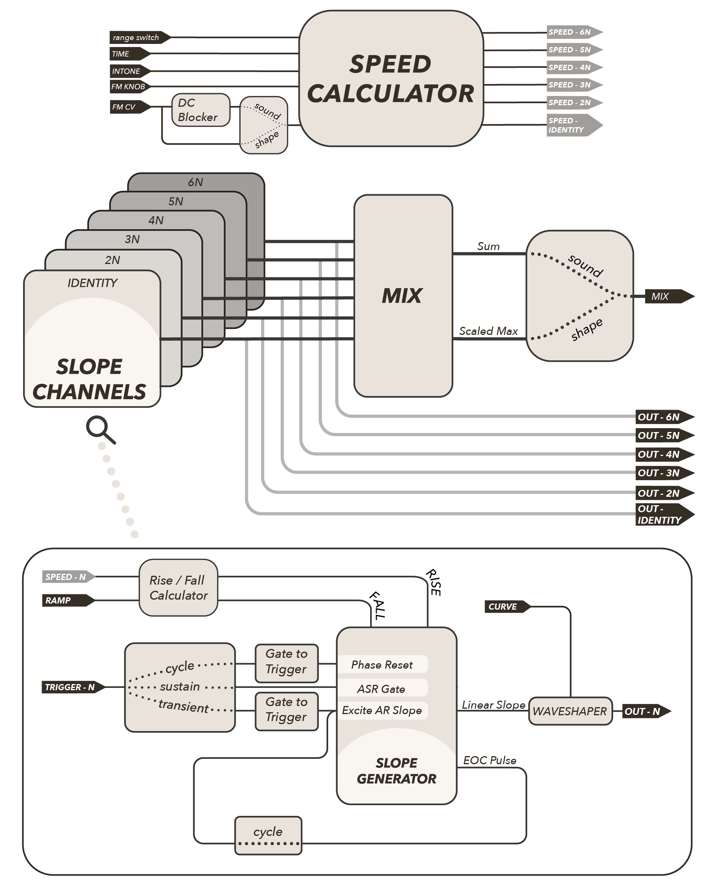

## Slope Timing

The speed of each slope generator is determined by a combination of *TIME* & *INTONE*.  [FM](#frequency-modulation) provides an additional layer of control, discussed separately.

### TIME & IDENTITY 

*TIME* determines the speed of the *IDENTITY* slope.  With *TIME* fully counterclockwise (CCW), the speed of *IDENTITY* is at its slowest.  Turning *TIME* clockwise (CW) increases the speed of the *IDENTITY* slope. 

The [*range* switch][9] sets the minimum and maximum speeds on either end of the *TIME* knob: 

- *shape*: minutes to milliseconds, from CCW to CW
- *sound*: milliseconds to microseconds (a.k.a. Hz to kHz), from CCW to CW

The value of the *TIME* CV input is added to the *TIME* knob.  The CV input is a highly accurate, exponential input: a 1V increase at the *TIME* input results in the speed (or frequency) of *IDENTITY* doubling.  As such, the *TIME* CV input is labeled "v/8," short for "1V/8ve" or "one-volt-per-octave."   In *shape* range, this input is useful for accurately changing note durations (e.g. transforming a quarter-note envelope into a dotted eighth note) and precise timing shifts in LFO rates.  In *sound* range, this input is used for (micro)tonal VCO sequencing or timbral control, depending on the position of the [*mode* switch][10].

### INTONE & the 'N's

*INTONE* sets the ratio of each of the *2N*-*6N* slope speeds to the *IDENTITY* speed, where each slope is affected proportionally to its index (2,3,...,6). *INTONE* is so named due to its relationship to [just intonation](https://en.wikipedia.org/wiki/Just_intonation): setting pitches based off of small-integer ratios.

With *INTONE* at noon, all speeds are identical.  

- As *INTONE* turns CW, the speed of each slope besides *IDENTITY* increases, with the size of the change proportional to the index of the output.  This means that *6N* will increases its speed the most, while *2N* will speed up the least.  Once *INTONE* is fully CW, the *2N* slope speed will be double *IDENTITY*'s speed, *3N* will be three times *IDENTITY*'s speed, and so on.
- As *INTONE* turns CCW from noon, the speed of each slope will instead decrease proportionally to its index, meaning *6N* will decrease its speed the most and *2N* decreases its speed the least.  *IDENTITY* remains unaffected.  Once *INTONE* is fully CCW, *2N* will be precisely 1/2 the speed of *IDENITY*, *3N* will be 1/3 the speed of *IDENITY*, and so on.

When the *INTONE* knob is at noon, sweeping the *INTONE* CV input from -5V to +5V sweeps the speeds from *1/N x IDENTITY* to *N x IDENTITY*.  *INTONE* CV is added to the position of the knob.  The knob has a special shaping to enable finer control around noon.  

## Slope Shaping

*RAMP* & *CURVE* set the shape of envelopes and LFOs or the waveform & timbre of VCOs.  When first experimenting with either *RAMP* or *CURVE*, keep the other at noon to gain better aural intuition for the effect of each control independently.

*RAMP* sets the balance between rise-time and fall-time in proportion to the duration of each slope without affecting the slope duration.  *CURVE* applies curvature to the rise and fall portions of each slope without affecting their durations.

In *shape range*, these two parameters control the shape of generated modulation. In *sound range*, they control the timbre of sound generated by JUST FRIENDS.

### RAMP

*RAMP* controls the balance of rise-time to fall-time as proportions of the total slope duration.  As *RAMP* increases, the ratio of rise-to-fall increases (rise becomes longer, fall becomes shorter).  Sweeping the knob from fully CCW to fully CW sweeps the slope shapes from instant attack/long release sawtooths to equal attack/release triangles to long attack/instant release ramps.  

When the *RAMP* knob is at noon, sweeping the *RAMP* CV input from -5V to +5V is equivalent to sweeping the knob from fully CCW to fully CW. *RAMP* CV is added to the *RAMP* knob.  

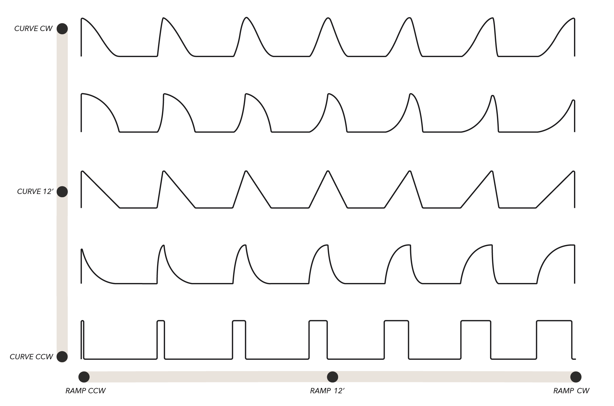{ width=75% }

### CURVE

*CURVE* affects the shape of slopes as they rise and fall without affecting the durations of either stage.  It takes the linear slopes determined by *TIME*, *INTONE* and *RAMP* and applies a lookup table to bend them into other shapes without affecting the timing.  Fine shapes are available with continuous blending between them.

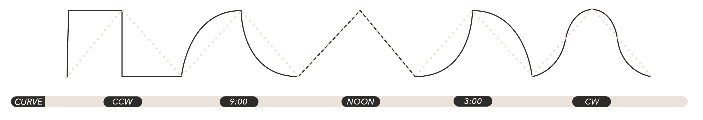

- With *CURVE* at noon, the slopes are perfectly linear.  This position is ideal for creating ramps, sawtooths, and triangles according to the position of the *RAMP* knob.
- Turning *CURVE* CW from noon deforms the slopes into exponential curves.  Exponential curves change slowly at the start of each phase and increase their rate of change as the phase progresses.
- When *CURVE* reaches fully CW, the slopes become sinusoidal (i.e. sine waves).
- Turning *CURVE* CCW from noon deforms the slopes the other way into logarithmic curves, which change quickly at the start of the rise or fall stage, and then decrease their rate of change as the phase progresses.
- Eventually, once *CURVE* reaches fully CCW, it makes rectangular shapes. The slope goes to its maximum immediately at the start of its rise phase and stays there until the end of its rise phase. Once the fall phase begins, the slope falls to its minimum immediately and stays there for the duration of its fall phase.  The pulse-width is determined by the *RAMP* control.  As a result, in *cycle* mode, with *CURVE* fully CCW, *RAMP* becomes an audio-rate pulse-width modulation input.

When the *CURVE* knob is at noon, sweeping the *CURVE* CV input from -5V to +5V is equivalent to sweeping the knob from fully CCW to fully CW.  *CURVE* CV is added to the *CURVE* knob.

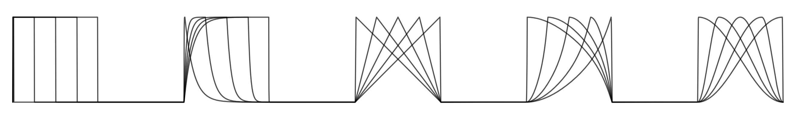

## The *range* switch: Timebase, Levels, *MIX*, FM

The *range* switch significantly affect the synthesis use cases by affecting the following parameters:

- Slope generator timebase (range of *TIME* knob)
- Unipolar/bipolar slope generator output
- *MIX* jack functionality
- FM AC/DC-coupling

The most important action of the *range* switch is setting the timebase of the slope generators, as this radically alters how each *mode* is used. The other changes set by the *range* switch are implemented in order to reflect the different use-cases for JUST FRIENDS as an audio-rate sound source vs. a control-rate modulation source.

The *range switch* does not change any of the functionality determined by the *mode* switch ([*transient*][11], [*sustain*][12], [*cycle*][13]), however it can be helpful to think of each pairing individually as the *meaning* of *mode* changes from control rate to audio rate.

### *shape*

- Slope generator timebase: minutes to milliseconds (control-rate)
- Slope generator output levels: 0-8V, ideal for envelopes and modulation capable of sweeping parameters over wide ranges, as well as generating triggers/gates capable of exciting any trigger/gate input, plucking lowpass gates, and pinging filters.
- *MIX* jack behavior:  Each slope's output value is divided by its index.  The *MIX* jack then outputs the largest of the resulting values (analog max or "OR").  *IDENTITY* is divided by 1 (unaffected), *2N* is divided by 2, *3N* divided by 3, and so on.  This provides a unique modulation source otherwise requiring a large patch.
- *FM INPUT* jack is DC-coupled, allowing for static linear shifts in speed.

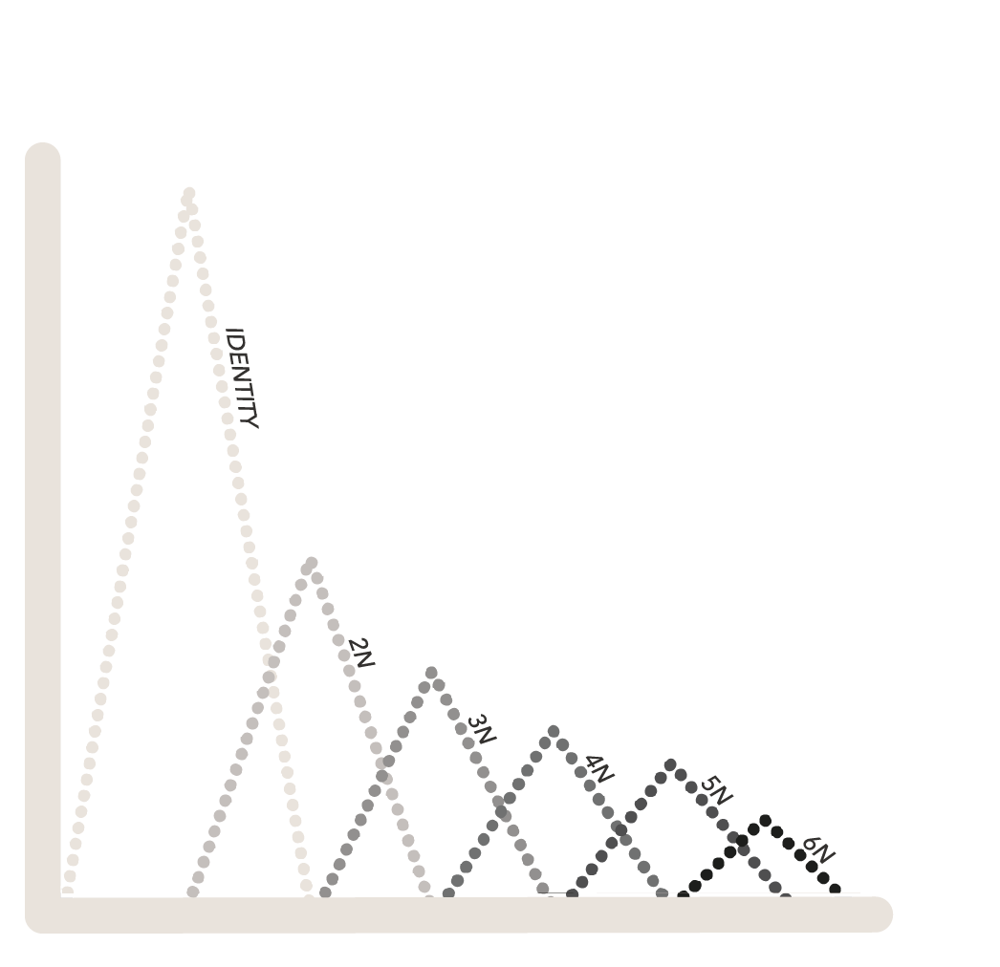{ width=50% }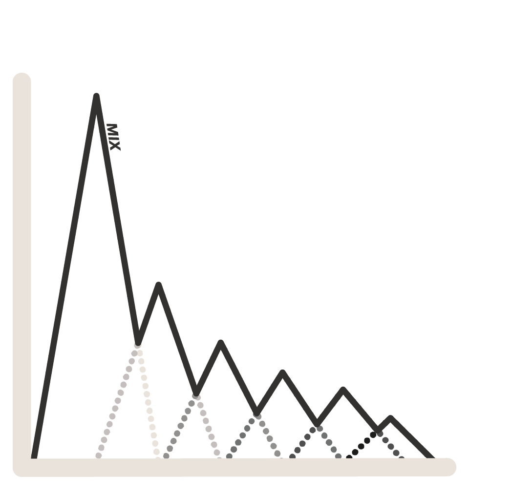{ width=50% }

### *sound*

- Slope generator timebase: milliseconds to microseconds, a.k.a. Hz to kHz (audio-rate)
- Slope generator output levels: -5V to +5V, creating typical Eurorack 10V peak-to-peak audio signals.
- *MIX* jack behavior: The *MIX* jack creates an equal mix of all the current slopes, limiting the final amplitude to ~15V peak-to-peak w/ tanh shaping.
- *FM INPUT* jack is AC-coupled so frequency modulation won't affect underlying pitch.

## The *mode* switch and *TRIGGER* Inputs

The *mode* switch determines how the *TRIGGER* inputs excite the corresponding slopes.  Each *mode* has very different synthesis use-cases depending on the timebase of the slopes determined by the [*range* switch][9].

The *TRIGGER* inputs for the *IDENTITY*-*6N* slopes are located directly above their corresponding output jacks.  Depending on the position of the *mode* switch, the *TRIGGER* inputs may be gate-sensitive.

The threshold for the inputs is around 1V.  LFOs, audio rate oscillators, and other modulation sources can be used as trigger/gate inputs as well as traditional trigger/gate sources.

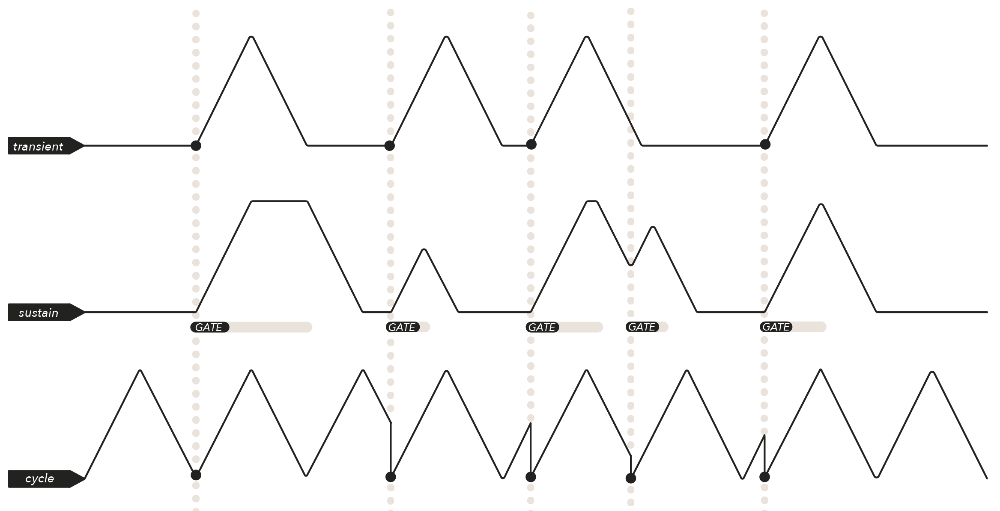

### *transient mode*: Triggered AR Slopes

Each slope generator becomes an attack-release (AR) generator.  A trigger to a receptive slope will initiate the attack phase, in which the slope slews to its maximum.  This is immediately followed by the release phase. 

This mode is not gate-sensitive.  Gates are converted to triggers on their rising edge.

Incoming triggers are ignored while a slope generator is active.  Once the slope generator reaches the end of the release phase, it becomes receptive to triggers again (finer retrigger control is available in *[SHIFT]*).

- In [*transient/shape*][14], the slopes become AR envelope generators excited by their corresponding *TRIGGER* inputs.
- In [*transient/sound*][17], the slopes become impulse-train VCOs.  An external audio-rate clock source (eg a MANGROVE VCO) must be patched to the *TRIGGER* inputs to drive the impulse-train VCOs.

### *sustain mode:* Gated ASR Slopes

Each slope generator becomes a gated attack-sustain-release (ASR) generator.  This mode is gate-sensitive; triggers are interpreted as short gates.  

When a gate input goes high, the corresponding slope slews upward towards its maximum value.  If the gate is long enough, the slope will reach its maximum and sustain there until the gate goes low.  

When the gate goes low, the slope will begin slewing towards its minimum value.  If the slope has not yet reached its maximum when the gate goes low, the slope will still start slewing towards its minimum regardless.  

If a new gate arrives before a slope reaches its minimum, the slope will immediately resume rising from its current value.  

- In [*sustain/shape*][15], the slopes become ASR envelopes.  Gates patched to the *TRIGGER* inputs excite the slopes.
- In [*sustain/sound*][18], the slopes become trapezoid impulse-train VCOs.  An external audio-rate clock source (like another VCO) must be patched to the *TRIGGER* inputs to drive the trapezoid impulse-trains.  These impulse-trains are "trapezoids" because they will track the pulse-width of the clock source for an additional method of timbral control.

### *cycle mode*: Looping Slopes w/ Phase Reset

Each slope generator becomes an oscillator by effectively using an end-of-cycle pulse to retrigger itself.  This forces the slopes to loop endlessly.

Each *TRIGGER* input will reset the oscillator to the start of its cycle (hard-sync).

This mode is not gate-sensitive.  Gates are converted to triggers on their rising edge.

- In [*cycle/shape*][16], the endlessly looping slopes are LFOs!  *CURVE* & *RAMP* control wave shape.  The *TRIGGER* inputs are useful for syncing LFOs to the same phase, spreading LFOs into quadrature structures, and creating polyrhythmic/phasing patterns.
- In [*cycle/sound*][19], the endlessly looping slopes become waveshaped VCOs.  The *TRIGGER* inputs are used to sync the VCOs to other oscillators for spectral effects.

### *TRIGGER* Input Normalling

Each trigger input is normalled into the trigger gate input to its left.  This means that a trigger patched to an input will cascade to the other unpatched inputs to its left until it reaches a patched trigger input.  Inserting another trigger/gate source (or dummy cable) into a trigger input will break the corresponding normal.

Examples:

- A trigger patched to *6N* (while no other trigger inputs are patched) will excite all 6 inputs.
- With one trigger patched to *6N* and another patched to *2N*, the *6N* trigger will cascade to *5N*, *4N*, and *3N*.  The *2N* trigger will excite *2N* and *IDENTITY*.

## Frequency Modulation

There are 3 primary methods of FM:

- Exponential FM, via the *TIME*(v/8) jack
- *INTONE* FM, via the *INTONE* jack
- Combo *INTONE* & linear through-zero FM, via the *FM INPUT* jack.

For the purposes of this discussion, it will be assumed that the slope generators are in *cycle/sound* in order to facilitate discussion of frequencies, rather than durations.  FM effects in all other modes should also be explored for their unique spectral and temporal effects.

### *TIME(v/8)* jack

Any signal applied to this jack, AC or DC, audio-rate or control-rate, will affect the frequency (or equivalently, duration) of all slopes exponentially: a +1V increase at this jack will result in the frequency of all slope generators doubling.  The oscillators maintain their harmonic relationships.

The range of the *TIME* jack is roughly -2V to +5v. Voltages outside this range will be clamped at the limits.

### *INTONE* jack

Any signal applied to this jack, AC or DC, audio-rate or control-rate, will affect the frequency (or, equivalently, duration) of each slope generator according to its index: *IDENTITY* is unaffected, *2N* is affected the least, and *6N* is affected the most.  This signal is added to the INTONE knob.

### FM knob & *FM INPUT* jack

The *FM INPUT* jack is the input for a frequency modulation source.   The FM knob controls depth (a.k.a. index) of modulation by the *FM INPUT* signal for each slope generator.

With the knob at noon, no FM is applied to any of the slopes (the *FM INPUT* jack is ignored).

Turning the FM knob clockwise increases the depth of the modulation linearly applied to all slopes equally.

Turning the knob counterclockwise from noon increases the depth of the modulation applied to each slope generator in the *INTONE* style, i.e. in proportion to each channel's index (*IDENTITY* is unaffected, *2N* the least affected, *6N* the most affected).

The FM knob thus controls whether the *FM INPUT* jack is linearly applied to the *INTONE* parameter (CCW) or linearly applied to the *TIME* parameter (CW), as well as the depth of the *FM INPUT* applied to either parameter.

When using audiorate FM and the *MIX* output jack, turning the FM knob towards *TIME* results in 'deeper' and more traditional sounding FM, while the *INTONE* direction will have more bass as the fundamental (*IDENTITY*) remains unaffected.  This can be useful for FM bass sounds which can often lack low-end.

### FM INPUT jack: *shape* range

The linear *FM INPUT* jack is DC-coupled in *shape* range.  It can be used with constant DC offsets for linear speed and duration shifts.  To ensure the accuracy of the *INTONE* knob, keep the gray FM knob set to noon when no FM input is being applied.

### FM INPUT jack: *sound* range

The *FM INPUT* jack is AC-coupled (i.e. a DC-blocker is applied to the input) in order to achieve high-quality, linear, through-zero frequency modulation.  The knob has no effect when the *FM INPUT* jack is disconnected.

## Making Modulation: Control-Rate Techniques

Use this map to find a control-rate technique that interests you!

| *mode*          | *technique*                                 |
| --------------- | ------------------------------------------- |
| ***transient*** | [Triggered AR Envelopes]                    |
|                 | [Trigger Skipping]                          |
|                 | [Clock Division]                            |
|                 | [Rhythm Modulator and Accent Generator]     |
|                 | [Precise Duration Sequencing]               |
|                 |                                             |
| ***sustain***   | [Gated ASR Envelopes]                       |
|                 | [Gate Delay]                                |
|                 | [Vactrol Memory]                            |
|                 | [Gate-to-CV-Sequence Converter]             |
|                 |                                             |
| ***cycle***     | [Temporally Related LFOs]                   |
|                 | [Synchronizing LFOs]                        |
|                 | [Quadrature/Phase-Shifted LFOs]             |
|                 | [Phasing LFOs and Polyrhythmic Patterns]    |
|                 | [Staircase Sequences and Chaotic Waveforms] |

### *transient/shape*: Triggered AR Envelopes

JUST FRIENDS turns the slopes into 6 attack-release (AR) envelope generators.  *CURVE* & *RAMP* control envelope shape, while *TIME* & *INTONE* control envelope duration.  Capable of extremely fast, percussive envelopes, subtle modulations that take minutes to complete, and everything in between, this mode allows for animating your patches across the micro- (individual events and hits), meso- (gestural and phrase) or macro- (movement and composition) time-scales.

- With all knobs at noon, patch a trigger (or gate) into *6N* to begin.  When a trigger arrives, all 6 envelope generators will start since each trigger input is normalled to the trigger input to its right.
- Now patch a second trigger source into *3N*, breaking the normalling of the *4N* trigger into the *3N* trigger input.  When the *6N* trigger goes high, slopes *6N*, *5N*, and *4N* will start, but not the others.  When the *3N* trigger goes high, the *3N*, *2N* and *IDENTITY* envelopes will rise.  This makes two sets of three identical AR envelope generators.  Now turn *INTONE* to create variation within each set of three envelopes.

### *transient/shape*: Trigger Skipping

When a slope generator is active, all incoming triggers will be ignored until after it completes its entire cycle (for specific control over the retrigger point, see [*SHIFT*](#shift-shape-transient-envelope-retrigger-control)).  This behavior can be utilized to create complex rhythmic modulations and clock divisions as well as generate accent patterns from a single trigger stream:

- Send a trigger stream that is faster than the envelope time.
- Use *INTONE* to set the receptive AR envelope generators to different durations. 
- Now, some envelope generators will still be in progress when a new trigger arrives, while others will have completed.  The envelopes that have completed will retrigger, while the envelopes that are still in progress will skip triggers.

### *transient/shape*: Clock Division,  Rhythm Modulator and Accent Generator

Because *INTONE* determines the length of envelopes, it also determines which envelopes will retrigger versus which envelopes will skip triggers.  If the input trigger stream is at a constant rate, adjusting *INTONE* will set different clock divisions for the associated outputs.  

- Start by patching a steady 16th-note trigger stream (aka 4 p.p.q.n.) to *6N* with nothing patched to the other *TRIGGER*s.  Set *TIME* so that the *IDENTITY* envelope is just shorter than the trigger stream period.
- Now, turn *INTONE* fully CCW, so that *2N* is twice as long as *IDENTITY*, *3N* is three times as long as *IDENTITY*, and so on.
- If the trigger stream is considered to be 16th-notes, then *2N* will output an envelope on the 8th-notes (every other input pulse), *3N* will output a trigger every dotted 8th note (every third input pulse), *4N* will output a trigger every quarter note (every fourth input pulse), *5N* will output a trigger every quarter note+16th note (every 5th trigger pulse), and *6N* will output a trigger every dotted quarter note (every 6th input pulse).

*INTONE* can also be used to derive triplet trigger streams from a faster clock.  

- Send in a very fast trigger stream to *6N*.
- Set *TIME* so that *IDENTITY* takes just under 13 trigger pulses to complete.
- Set *INTONE* fully CW, so that *2N* is twice as fast, *3N* is three times as fast, and so on.
- If *IDENTITY* is considered to be a half note, then *2N* is quarter note, *3N* is a triplet quarter note, *4N* is an 8th-note, and *6N* is a triplet 8th-note.  

Modulating *INTONE* becomes a way of changing the clock divisions for each output with CV.  This can be used to great effect to generate irregular rhythms from a single, periodic clock stream.  If *CURVE* is fully CCW, the output slopes will be rectangular, resulting in simple clock pulses derived from the input clock. 

The trigger-skipping behavior can also be paired with a rhythmic, non-uniform input trigger pattern to create interesting, unexpected accent patterns.  The output rhythm or accent pattern will depend on the position of *INTONE* and the *spacing* of the input triggers. Modulating *INTONE* transforms how each output rhythm is derived from the input rhythm.

If *TIME* and *INTONE* are set so that IDENTITY is a quarter note, *2N* is an eighth note, and *4N* is a 16th note, then *IDENTITY* will output a slope whenever two triggers are separated by at least a quarter note, *2N* will output an envelope whenever two triggers are separated by at least an eighth note, and *3N* will output a trigger whenever two triggers are separated by at least a 16th note.  *INTONE* will change the spacing between triggers needed for each envelope to become retriggerable.  This can be used especially effectively to create an accenting envelope at the start of a burst of triggers.

### *transient/shape*: Precise Duration Sequencing

Typically, "one-volt-per-octave" inputs are used to sequence oscillator pitch.  However, in *shape* range, even though the *TIME* CV input does not control pitch, it still is one-volt-per-octave!  This means that a 1V increase at the input will result in the *IDENTITY* envelope becoming exactly twice as fast.  

In *transient/shape*, this can be utilized to create rhythmically accurate transformations of note durations:

- Send 0V into *TIME* CV.
- Use the *TIME* knob to set *IDENTITY*'s duration to a whole note.
- +1V into *TIME* will set *IDENTITY* to a half note, +2V sets it to a quarter note, +3 to an 8th, +4 to a 16th, and so on.
- This will have a knock-on effect on the other slope durations.  For instance, if *INTONE* is set so that an output is a dotted 8th note, a +1V increase at *TIME* will transform it into dotted 16th.  Similarly, if *INTONE* is set so that a slope is a triplet 8th, then a +1V increase will transform it into a triplet 16th.  

### *sustain/shape*: Gated ASR Envelopes

JUST FRIENDS turns into 6 attack-sustain-release (ASR) envelope generators. *RAMP* and *CURVE* control the shape of the envelopes' A/R phases, while *TIME* and *INTONE* control the speed of the A/R phases.  

Patching gates to the *TRIGGER* inputs will cause the envelope generators to slew to their maximum and hold there while the gates are high, and then slew to the minimum when the gates go low.  If a gate changes state before the envelope reaches its minimum or maximum, it will simply change direction from its current location.  The envelopes can be thought of as slew-limiters that go between two states: high and low.  

Although the six ASRs can be used independently, using them together can allow for interesting macroscopic control of an entire patch.  For instance, patching a single gate to *6N* with no other *TRIGGER* inputs patched enables creating transitions across an entire patch that start simultaneously but take varying amounts of time to complete according to *INTONE*.  

### *sustain/shape:* Gate Delay

If  *RAMP* is set to fully CW and *CURVE* is set to about 3 o'clock, JUST FRIENDS can be used as a gate delay.  When an input gate goes high, the receptive slope will begin changing slowly at first since the *CURVE* is exponential and the rise-time is the entire duration of the slope.  When the slope does finally ramp up, it will do so quickly, and then hold at the maximum level, resulting in a delayed version of the input gate (though it will go low as soon as the input gate goes low).  

*TIME* will set the base delay-time for *IDENTITY*, while *INTONE* will set the delay times for *2N-6N*. 

With a single gate connected to consecutive *TRIGGER* inputs via normalling, this can be an effective tool for strumming multiple envelope generators or striking multiple LPGs in quick succession.  

### *sustain/shape*: Vactrol Memory

In *sustain/shape*, envelope speed can interact with *RAMP* to create a form of "memory" similar to the vactrol memory effect: this memory adjusts how long each gate interacts with the subsequent gates.  Changing *RAMP*, envelope speed, input gate lengths, and the rate of input gates will affect the form of gate memory.  If envelopes don't have enough time to reach their minimum between gates, or the maximum during a short gate, then the "memory" is the level of the slope when the input gate changes states. 

The effect is most notable with *RAMP* set CCW and using bursts of short gates arriving faster than the envelope time to excite a slope. When this happens, the envelopes don't have time to reach their minimum before a new gate arrives, resulting in each subsequent envelope initiating from a higher and higher level.  Gates must be spread out in order for the envelope to fall back to its low state. 

Turning *RAMP* CW will increase the rise-time so that it takes longer to get into the high state.  If the input gates have relatively short pulse-widths, a slope may not reach its sustain phase before the first trigger/gate goes low.  When a dense stream of gates occur though, each short gate or trigger will push the slope further toward its maximum.

This is very useful for creating a crescendo effect from a simple stream of triggers or short gates.  The denser the stream of gates, the greater the level of the envelope!  Rarefying the gate stream will result in the envelope settling back down to a lower level each time.

Turning *RAMP* further and further CW requires a denser - or longer - trigger stream to complete the crescendo.  Adjusting gate-width will also change how long it takes to complete the crescendo; longer gates will allow the slope generator to reach a higher level each trigger.

The longer the duration of the rise phase, the longer a slope generator will remember being in the low state.  Similarly, the longer the duration of the fall-phase, the longer the slope generator will remember being in the low state. *RAMP* can be thought of as controlling the balance between which state is remembered: high when *RAMP* is CCW, versus low when *RAMP* is CW.  

### *sustain/shape*: Gate-to-Sequence Converter

When *CURVE* is set fully CCW to square curvature, the *TRIGGER* inputs can be used to turn the *MIX* output into a "priority CV sequencer."  This can be used to derive a single CV sequence from a set of rhythmic gate patterns. 

"Priority" means that each *TRIGGER* input has a different priority: the lowest-index *TRIGGER* input that is held high will determine the CV value sent out of the *MIX* jack.  This is because the *MIX* output in *shape range* is created by dividing the current level of each slope by its index, and then outputting the maximum of the resulting 6 values.  When *CURVE* is fully CCW, the *MIX* output will be a staircase sequence since there will be no slew time whenever the gate with highest priority (lowest index) changes states.  

- If the *IDENTITY* slope is held high, then the output will be 8V, regardless of the other slopes are doing.
- If the *IDENTITY* slope is low and *2N* is held high, then the output will be 8V/2 = 4V, regardless of what *3N*-*6N* are doing.
- If the *IDENTITY* and *2N* slopes are low, and the *3N* slope is high, then the output will be 8V/3 = 2.66V, regardless of what *4N*-*6N* are doing... and so on.

As such, sending gates into the *TRIGGER* inputs will select one CV value out of 6 possibilities depending on the lowest-index *TRIGGER* that is held high!

If the *MIX* sequence is attenuated and sent through a quantizer, independent rhythms can be used to select different notes from a chord.   Try using sparser gate streams for the lower *TRIGGER* inputs and denser streams for the upper *TRIGGER* inputs.  If the rhythmic patterns have different lengths or are changing over time, the resulting quantized-*MIX* output will be an ever-evolving generative sequence!  Patching the sequence through attenuators/mixers/VCAs for further shaping will allow for another level of modulation and evolution of the CV sequence.

Playing with gate-widths can also change the sequence as some gates go low before other lower priority (higher-index) gates go low, resulting in note changes between clock pulses. 

Pairing a steady clock with a clock divider, linear-feedback shift register, or other clock modulator can be a great way of deriving multiple gate streams from a single input.  

Adjusting *CURVE* away from fully CCW will add some slew to the voltage transitions at the *MIX* output when the lowest-index slope is released or activated.  Rise and fall slew times are controlled by *TIME*, *INTONE* and *RAMP*.  

Driving the gate inputs with fast, periodic gate streams will turn the *MIX* out into a staircase waveform.  Try patching various outputs of a clock divider or multiplier with gate outputs into all 6 JF gate inputs.  Swapping clock streams from one input to another will change the wave shape.  Try using logic modules to combine gate streams for some of the inputs into new gate streams for other inputs - COLD MAC can achieve all standard logic operations like OR, AND, XOR, NOR and NAND.  Other bit generation and bit processing techniques are ripe for exploration!

### *cycle/shape*: Temporally-related LFOs

In *cycle/shape*, JF becomes six LFOs with controllable temporal relationships.

*TIME* determines the frequency of the *IDENTITY* LFO: low frequencies occur with *TIME* fully CCW, and high frequencies with *TIME* fully CW.  

*INTONE* defines the frequency relationships of LFOs *2N*-*6N* to *IDENTITY*, allowing the LFOs to spread from 1/N times the frequency of *IDENTITY* to N times the frequency of *IDENTITY* (where N is the *INDEX* of a given LFO).  *INTONE* can be used to create extended phasing patterns or precise temporal divisions.  

The slowest possible LFO will come from *6N* when *INTONE* and *TIME* are both fully CCW, accompanied by sending -2V into the *TIME* jack.  Also, FM can STOP the oscillator all together for infinite duration!

### *cycle/shape*: Synchronizing LFOs

To re-synchronize the start point of all 6 LFOs, send a trigger to the *6N* trigger input with nothing patched to the other trigger inputs.  When *INTONE* is at noon, this results in all LFOs becoming perfectly in sync with each other, rising and falling identically.  With *INTONE* away from noon, the trigger into 6N resets the phasing pattern to its start.  Flicking the *MODE* switch out of *cycle* and then back into *cycle* will also quickly reset the phase of all LFOs.

### *cycle/shape*: Quadrature/Phase-Shifted LFOs

 With *INTONE* at noon, all LFOs will have identical frequency, but not necessarily the same phase - they may be shifted in time, but oscillating at the same rate.  

Adjusting *INTONE* away from noon and then back to noon will result in the 6 LFOs becoming out of phase.  As *INTONE* moves away from noon, the LFOs speed up and slow down at different rates (defined by their *INDEX*).  As *INTONE* returns to noon, the oscillators return to the same frequency, but will not necessarily be at the same point in their cycles.  Because the frequencies are now identical, the oscillators will remain out of phase with each other by the same amount.  

Sending triggers to the different inputs will allow you to adjust the phase-shift of the LFOs by directly restarting them in time. 

### *cycle/shape*: Phasing LFOs and Polyrhythmic Patterns 

When *INTONE* is away from noon, the LFOs will create phasing patterns due to the different frequencies of each LFO.  When *CURVE* is fully counterclockwise (square waveshape), these LFOs become polyrhythmic trigger/gate/clock streams.  Gate/pulse-width is controlled via the *RAMP* knob.

When *INTONE* is fully clockwise, the phasing pattern will perfectly repeat every time *IDENTITY* completes one cycle, since the duration of each LFO evenly divides *IDENTITY*'s duration (their frequencies are integer multiples of *IDENTITY*'s).  This results in a typical "clock multiplier" pattern, where *IDENTITY* is the leader LFO: each other LFO repeats N times for every 1 cycle of *IDENTITY*.  

If *IDENTITY*'s duration is considered to be a quarter note, then *2N* is an 8th note, *3N* is a triplet 8th note, *4N* is a 16th note, and *6N* is a triplet 16th note.

If the LFOs are out of phase when *INTONE* reaches fully clockwise, the *2N*-*6N* LFOs will not be at the start of their cycles when *IDENTITY* reaches its start.  They will be shifted in time in relationship to *IDENTITY*.  This shift will remain identical for each repetition of *IDENTITY*.  The start points can be resynchronized via the trigger inputs.

When *INTONE* is fully counterclockwise, the phasing pattern will perfectly repeat every 60 cycles of *IDENTITY*, since 60 is the least common multiple of 1,2,3,4,5,6.  Think of this as a "clock divider", where *IDENTITY* is the leader clock.  Unlike most clock dividers though, JUST FRIENDS is capable of phased *modulation*, not just clocks!  Furthermore, the LFOs can be shifted in time by adjusting *INTONE* away from CCW and then quickly back, or by sending triggers to a subset of the *TRIGGER* inputs.  Sending a trigger to *6N* with nothing patched to the other inputs will reset all LFOs' phasing modulation into a traditional clock division timing.

When *INTONE* is away from noon but not at either extreme, much more drawn out phasing patterns will occur due to the non-integer timing ratios.  These can be made more rhythmic by sending in regular but slow pulses into *6N* (or into a combination of multiple trigger inputs), resetting the pattern on each pulse.

One useful technique is to patch the output of one of the slower LFOs/clock streams into the trigger inputs of the faster ones (taking advantage of normalization).  This will create a pattern that resets all the connected LFOs every time the slower LFO crosses the triggering threshold. Note the *CURVE* control will have a dramatic effect on the time taken to reach that threshold.

The *TIME* CV jack can be used to create tempo-accurate shifts in the phasing patterns (e.g. doubling or halving the period of repetition for the entire pattern).  A +1V increase at the *TIME* jack will double the frequency of the entire pattern. 

### *cycle/shape*: Staircase Sequences and Chaotic Waveforms

When *CURVE* is set fully CCW, (square waveshape) the *MIX* output becomes a stepped sequence.   This is because the *MIX* output in *shape* range is is created by dividing the current level of each slope by its index, and then outputting the maximum of the resulting 6 values.  With *CURVE* fully CCW, there will be no slew time whenever an LFO goes high or low, so the resulting *MIX* output is a staircase sequence. The level of the sequence is always determined by the active LFO with lowest index.

- If the *IDENTITY* slope is high, then the output will be 8V, regardless what the other slopes are doing.

- If the *IDENTITY* slope is low and *2N* is high, then the output will be 8V/2 = 4V, regardless of what *3N*-*6N* are doing.
- If the *IDENTITY* and *2N* slopes are low, and the *3N* slope is high, then the output will be 8V/3 = 2.66V, regardless of what *4N*-*6N* are doing.
- And so on...

When *INTONE* is set to noon, the LFOs have the same frequency but may be slightly out of phase, resulting in a staircase waveform at the same frequency as *IDENTITY*.

When *INTONE* is in an intermediate position, the phasing relationships between LFOs will create a constantly evolving staircase sequence.  Try patching this sequence to a pitch input (possibly through offsets/mixers/VCAs and a quantizer first) for generative sequences - or try using it as CV for another parameter on your synthesizer!  Resetting the faster LFOs with the gate from one of the slower LFOs will create a more clearly repeating pattern.  A periodic external clock source can also be used to reset LFOs and create a discernible pattern.

When *TIME* is relatively fast, this sequence becomes a staircase waveform generator.  Resetting a subset of the slope generators with a trigger will change the waveform.  The frequency of the waveform is determined by the repetition period of the whole pattern, so *INTONE* at fully CW will produce waveforms with the same frequency as *IDENTITY*.

*RAMP* will affect the duration of level shifts and overlap between each step.  *RAMP* near CCW means variable height, narrow pulses, while further CW makes *IDENTITY* dominate the output.

Turning *CURVE* slightly away from fully CCW will add some slewing. *INTONE* and *TIME* will also affect the rate of slewing.

When *CURVE* is adjusted further away from CCW, the output begins to become a more and more chaotic waveform with slewing, rather than hard transitions between levels.

## Making Sound: Audio-rate Techniques

Use this map to find a synthesis technique that interests you:

| *mode*      | *technique*                                  |
| ----------- | -------------------------------------------- |
| *transient* | [Impulse-Train VCOs]                         |
|             | [Pitch Division and Subharmonics Generator]  |
|             |                                              |
| *sustain*   | [Trapezoid VCOs and PWM Tracking]            |
|             |                                              |
| *cycle*     | [Waveshaped VCOs]                            |
|             | [Sync Sounds]                                |
|             | [Additive Synthesis and Harmonic Oscillator] |
|             | [Chord Generator]                            |

### *transient/sound*: Impulse-Train VCOs

JUST FRIENDS turns into 6 impulse-train VCOs requiring an external VCO to drive the *TRIGGER* inputs.  

- Every time the input clock source (any oscillator will work) goes high, it excites the slope, which goes from min to max to min.
- Once the slope reaches its minimum, it rests until the clock source goes high again.
- The slope generator ignores incoming clock pulses while in the rising and falling state.
- Since the slope generator is excited at the same frequency as the input oscillator, the output is a repetitive waveform at the same frequency as the input!
- The shape of the waveform is the shape of the slope followed by a resting phase.

Adjusting the slope speed with *TIME* & *INTONE* will adjust the impulse train's timbre rather than its pitch.  The pitch is determined by the external oscillator because it sets the rate at which the impulses are repeated.  

The duration of each impulse, set by *TIME* & *INTONE* determines how much of the period of oscillation is taken up by the impulse, affecting the waveshape that is repeated when driven by an audio-rate signal.  This is equivalent to the *FORMANT* control on MANGROVE, though the sonic result with JUST FRIENDS will have its own unique character due to the *CURVE* knob and the digital versus analog implementation of the two modules.

*RAMP* & *CURVE* provide additional timbral controls including pulse-width modulation via the *RAMP* control when *CURVE* is fully counterclockwise.

### *transient/sound*: Pitch Division and Subharmonics Generator

If the duration of an impulse exceeds the clock period, then the first retrigger will be ignored, resulting in two clock periods completing before the impulse gets retriggered.  This means that the impulse will only be excited once for every two input clocks pulses:  this creates a pitch division down to 1/2 the input clock frequency (dropping an octave).

Similarly, if the impulse duration exceeds two clock periods, than the pitch will divide down to 1/3rd the input clock frequency (three clock cycles must complete before the slope generator can be retriggered).

This series of pitch divisions defines an undertone series. As such, when patching an audio-rate signal to *6N* and leaving the other triggers unpatched, *INTONE* can be used to dial in different subharmonics of the source audio signal for each JF output.

Note that these divisions are possible with all settings of *RAMP* & *CURVE*, unlike on *MANGROVE* (which requires *RAMP* - aka *BARREL* be near its minimum).  This provides more direct timbral control, but makes multiphonics inaccessible.  

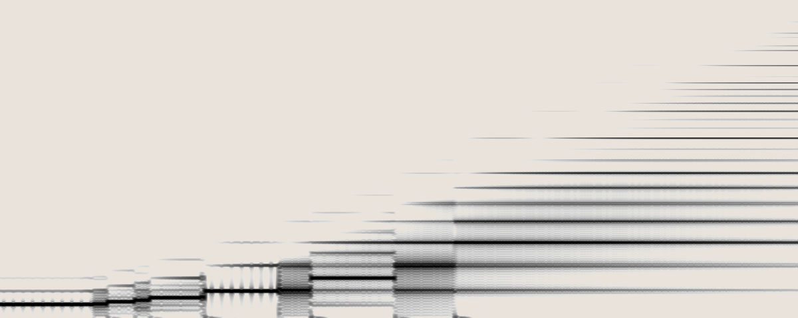

### *sustain/sound*: Trapezoid VCOs and PWM Tracking

Similar to [*transient/sound*](#transient-sound-externally-driven-impulse-train-vco), JUST FRIENDS turns into 6 VCOs driven by external audiorate clock sources.  However, because the inputs are now gate sensitive, new timbral possibilities open.

These impulse-trains are "trapezoids" because they will track the pulse-width of the clock source. The slopes will stay high as long as the input VCO remains above the threshold.  As such, the input VCO and output trapezoid VCO will have the same pulse-width.  Varying the pulse-width of the input VCO will also vary the timbre of JUST FRIENDS.  The response is highly interactive between *TIME*, *INTONE*, & the source PWM.  

MANGROVE is a great clock source for this purpose, with the *FORMANT* control modulating the width of the JUST FRIENDS trapezoid VCOs.

### *cycle/sound*: Waveshaped VCOs

In *cycle/sound*, JF becomes a set of 6 audiorate VCOs with sync inputs and waveshaping.

*RAMP* & *CURVE* affect timbre, while *TIME* & *INTONE* control pitch.  

This mode is great for polyphonic patches; additive synthesis with rich timbre; creating justly intoned chord structures; detuned beating patterns and supersaws; self-patched feedback FM & timbral modulation!

***TIME & INTONE***

*TIME* sets the fundamental frequency of *IDENTITY*.  The *TIME* CV jack can be used to (micro)tonally sequence *IDENTITY* with standard volt-per-octave (v/8) voltage sources, or it can be used at audio rate for exponential frequency modulation.

*INTONE* determines the frequency/pitch ratio of the other oscillators in relationship to *IDENTITY*.  At noon, all oscillators are at unison (equal frequency).  On either side of noon, oscillators become slightly detuned, allowing for [supersaws](https://en.wikipedia.org/wiki/Roland_JP-8000#Supersaw) and super-all-the-other-waveforms.  Fully clockwise results in a harmonic overtone series of frequencies: 2x, 3x, 4x, 5x, 6x, or, in terms of intervals, up an octave, up an octave and a fifth, up two octaves, up two octaves and a major third, up two octaves and a fifth.   *INTONE* fully clockwise results in an undertone series of frequencies: 1/2x, 1/3x, ..., 1/6x.

Other  intervals and frequency ratios are achievable at various intermediate positions of *INTONE*.

***RAMP & CURVE***

With *RAMP* at noon, the *CURVE* knob interpolates between squares, log-curves, triangles, exponential-curves and sine waves.  With *CURVE* fully counterclockwise, all oscillators are square waves, and the *RAMP* control becomes a pulse-width control.  With *CURVE* at noon, *RAMP* interpolates between saws, triangles, and ramps.

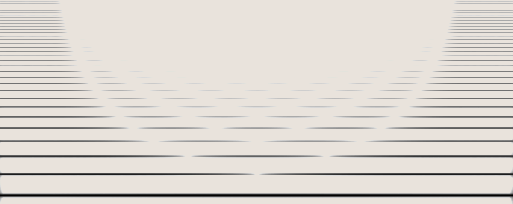

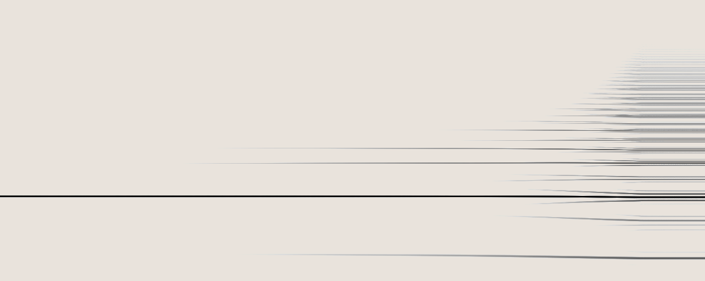

### *cycle/sound*: Sync Sounds

The trigger inputs act as oscillator reset inputs, creating classic hard-sync sounds you might get from a saw-core VCO.  Patch an oscillator into one of these inputs and monitor the corresponding output: sweep *TIME* to hear the timbral sync effect occurring. Sweeping the pitch of the external sync source oscillator will interact with the *TIME* control to set pitch & timbre.

Try patching *4N*'s output to *IDENTITY*'s *TRIGGER* input; sweep *INTONE* while listening to *IDENTITY*.  Next, try patching *IDENTITY*'s output to *4N*'s *TRIGGER* input (use a dummy cable into *3N* o block the triggers from cascading back down to *IDENTITY*).  Sweep *INTONE*, but listen to *4N* this time.  

### *cycle/sound*: Additive Synthesis and Harmonic Oscillator

When *INTONE* is fully CW, *CURVE* is fully CW, and *RAMP* is at noon, all the outputs will be sine waves in a harmonic series.  Try sending several outputs to different channels of a mixer; adjust the level of each input to create complex waveshapes beyond the typical sine/saw/expo/log waveshapes available via *RAMP* and *CURVE*. Adjusting *RAMP* and *CURVE* away from their respective positions will brighten the sound and make the individual tones in the series more audible as distinct pitches, rather than a single blended waveform.

When *INTONE* is turned CCW, the frequencies of the *2N-6N* outputs follow an undertone series for the *IDENTITY* oscillator.  With *CURVE* and *RAMP* set away from CW/noon respectively, mix these outputs with *IDENTITY* at low amplitudes to create thick sub-sounds that are spectrally richer than the typical square wave subharmonics available on many synthesizers.

### *cycle/sound*: Chord Generator

When *INTONE* is fully CW or fully CCW, the outputs can be selectively mixed to create chords.

Here are some common frequency ratios which are helpful (but not necessary!) to know:

| Ratio       | Interval       |
| ----------- | -------------- |
| 2:1 (2x)    | Octave         |
| 3:2 (1.5x)  | Perfect Fifth  |
| 4:3 (1.33x) | Perfect Fourth |
| 5:4 (1.25x) | Major Third    |
| 6:5 (1.2x)  | Minor Third    |

When using this table, it is useful to remember that dividing or multiplying the numerator or denominator of a ratio by two simply shifts an interval up or down by an octave: 5:4 is a major third, so 10:4 is an octave and major third, while 10:8 is identical to 5:4.

The following tables outline how *INTONE* can be used to generate triads across JUST FRIENDS' 6 voices. Note that in both tables, *3N*, *4N*, and *5N* always contain all three notes of the triad.  Carefully sequencing of *TIME* in conjunction with *INTONE* can thus allow you to create chord progressions using just these three outputs.

##### Major Chords: *INTONE* CW

The following table gives the intervals and ratios when *INTONE* is fully CW.  Since *IDENTITY* is the lowest frequency, we will consider that the root note, and tune it to C3. 

| Output     | *N* to *IDENTITY* | Interval above *IDENTITY* | Ratio to *N-1* | Interval above *N-1* | Note |
| ---------- | ----------------- | ------------------------- | -------------- | -------------------- | ---- |
| *IDENTITY* | 1:1               | N/A                       | N/A            | N/A                  | C3   |
| *2N*       | 2:1               | Octave                    | 2:1            | Octave               | C4   |
| *3N*       | 3:1               | Octave+5th                | 3:2            | 5th                  | G4   |
| *4N*       | 4:1               | 2 Octaves                 | 4:3            | 4th                  | C5   |
| *5N*       | 5:1               | 2 Octaves+Major 3rd       | 5:4            | Major 3rd            | E5   |
| *6N*       | 6:1               | Two Octaves+5th           | 6:5            | Minor 3rd            | G5   |

With *INTONE* CW and *IDENTITY* tuned to C, the collection of notes defines a major triad: C-E-G. The root note of the triad will depend on the position of the *TIME* knob. Various inversions and voicings of a major triad are available via different mixes of the 6 outputs. 

##### Minor Chords: *INTONE* CCW

The following table gives the intervals and ratios when *INTONE* is fully CCW. Since *6N* is the lowest frequency, we will consider that the root note, and measure intervals above *6N*.  For comparison with the previous table, we will keep identity tuned to C3.  

| Output     | *N* to *6N* | Interval above *6N* | Ratio to *N+1* | Interval above *N+1* | Note |
| ---------- | ----------- | ------------------- | -------------- | -------------------- | ---- |
| *IDENTITY* | 6:1 ~ 3:2   | 2 Octaves+5th       | 2:1            | Octave               | C3   |
| 2N         | 6:2 ~ 3:2   | Octave+5th          | 3:2            | 5th                  | C2   |
| 3N         | 6:3 ~ 2:1   | Octave              | 4:3            | 4th                  | F1   |
| 4N         | 6:4 ~ 3:2   | 5th                 | 5:4            | Major 3rd            | C1   |
| 5N         | 6:5         | Minor 3rd           | 6:5            | Minor 3rd            | Ab0  |
| 6N         | 1:1         | N/A                 | N/A            | N/A                  | F0   |

With *INTONE* CCW, the collection of notes defines a minor triad: F-Ab-C.   The root note of the triad will depend on the position of the *TIME* knob.  Various inversions and voicings of a minor triad are available via different mixes of the 6 outputs.  

## RUN Modes

The *RUN* jack presents 6 new modes for JUST FRIENDS, one for each of the 6 standard modes given by the *range* and *mode* switches.  Some of the modes are extensions of the standard functionality of the given switch pairings, while others are radical alterations.

Plugging a cable into the *RUN* jack activates the *RUN* mode associated with the position of the *range* and *mode* switches.

Connecting the other end of the *RUN* cable to a CV source will allow you to control the parameter assigned to the *RUN* jack depending on the selected mode.  The *RUN* modes can be used with a dummy cable plugged into the *RUN* jack input - i.e. the other end of the cable is not attached to a CV source. In this case, it is as if there is a 0V source patched into the *RUN* jack.

|             | *sound*                                                     | *shape*                                                      |
| ----------- | ----------------------------------------------------------- | ------------------------------------------------------------ |
| *transient* | [*SPILL*: Impulse-Trains, Subharmonics, and Sync Chaos][4]  | [*SHIFT*: AR Envelopes w/ Retrigger Control][1]              |
|             |                                                             |                                                              |
| *sustain*   | [*PLUME*: Lowpass-Gated VCOs & Polyphonic Synthesis][5]     | [*STRATA*: ARSR Envelopes w/ Sustain Level Control, Slew Limiting][2] |
|             |                                                             |                                                              |
| *cycle*     | [*FLOOM*: 2-Operator FM Synthesis & Noise Generator][6]     | [*VOLLEY*: Envelope and Gate Burst Generator][3]             |

### *SHIFT* (*transient/shape*): AR Envelopes w/ Retrigger Control

*SHIFT* extends the standard *transient/shape* AR envelope generator controls to include control over when slope generators become receptive to retriggers.

Typically in *transient/shape*, while a slope generator is active, it will ignore all incoming triggers.  It does not become receptive to incoming retriggers until the end of its cycle.  Entering *SHIFT* mode by plugging a cable into the *RUN* jack allows the slope generators to become receptive to retriggers before they reach the end of their cycles.  When a slope gets retriggered, it immediately resets to 0V and begins the rise phase (rather than turning around from its current position).  

- With -5V into the *RUN* jack, the slope generators are always receptive to retriggers.
- From -5V to 0V into the *RUN* jack, the retrigger point shifts towards the end-of-rise.  For instance, at -2.5V, the slope generators become receptive to retriggers midway through the rise phase.
- With 0V (or a dummy cable) into the *RUN* jack, the slope generators can be retriggered after the end of the rise phase.
- From 0V to +5V, the retrigger point shifts from end-of-rise towards end-of-cycle.
- With +5V, the retrigger point is end-of-cycle (equivalent to standard *transient/shape* retrigger behavior).  That is, a slope generator does not become receptive to retriggers until it becomes inactive again.

*SHIFT* can be used to extend the techniques described in [*transient/shape*: Rhythm Modulator and Accent Generator]()

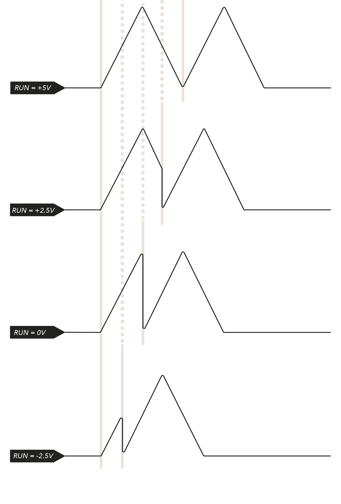

### *STRATA* (*sustain/shape*): ARSR Envelopes and Slew Limiting

*STRATA* extends the standard *sustain/shape* ASR envelope generator to become an attack-release-sustain-release (ARSR) envelope generator.  This additionally enables JUST FRIENDS to be used as a 6-output slew limiter.

##### ARSRs in *STRATA*

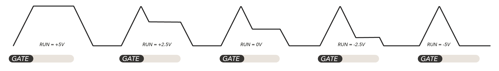

Typically in *sustain/shape,* when a gate arrives, slope generators will rise to their maximum, hold as long as the gate is high, and then fall when the gate goes low.  Entering *STRATA* mode by plugging a cable into the RUN jack changes this by segmenting the falling stage into two sub-segments: the initial release segment (release-1) and the final release segment (release-2).  These two stages are separated by the sustain stage.  This is very similar to the familiar ADSR shape, however the Decay & Release stages share their timing parameter.

As in *sustain/shape*, the rise and fall times are determined by the combination of *TIME*, *INTONE* & *RAMP*.  

The *RUN* voltage determines the sustain level: the greater the *RUN* voltage, the higher the sustain level.  Release-1 is the amount of time it takes for the falling stage to reach the sustain level from its maximum; release-2 is the amount of time for the falling slope to go from the sustain level to 0V.  The only difference from standard *sustain/shape* is a temporary pause at the sustain level.

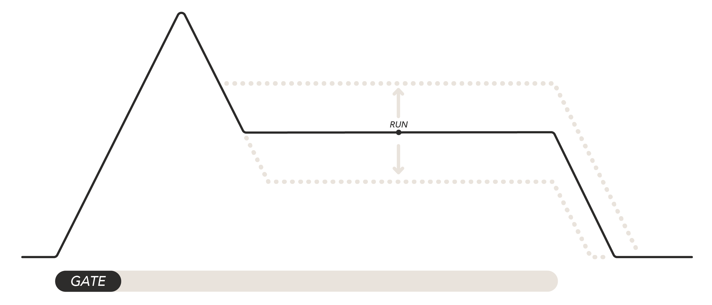

When a gate is sent to a slope generator, the slope begins sloping towards its maximum (attack).  When it reaches its maximum, it immediately begins falling to the sustain level set by the *RUN* voltage (release-1). When it reaches the sustain level, the slope holds (sustains) there until the input gate goes low.   When the gate goes low, the slope continues falling to its minimum (release-2).   If a gate is not held high long enough to reach the maximum or the sustain level, the slope will simply resume the falling phase from its current value when the gate goes low.  

The sustain level is set by the *RUN* voltage before the *CURVE*-waveshaper is applied.  As such, the *CURVE* control has a great affect on sustain level as it bends the linear ramps into exponential and logarithmic curves.  This online [demo](https://www.desmos.com/calculator/xlmeqwxdsn) should give you a good sense of the interaction between gate length, *RAMP*, *RUN* voltage, and *CURVE*.  The black ARSR envelope shown is the linear slope pre-*CURVE* waveshaper, while the blue one is post-*CURVE* waveshaping.  

##### Slew Limiting in *STRATA*

Because the sustain level in *STRATA* is determined by the *RUN* voltage, JUST FRIENDS can be configured to work as a slew limiter (voltage follower) by patching a positive voltage source to the *6N* trigger input with nothing patched into the other trigger inputs.  This positive voltage source holds all slope generators in their sustain phase.  All 6 outputs will be equally held at the same sustain level determined by the *RUN* voltage.  

The voltage to follow should be patched to the *RUN* input.  Changing the voltage at the *RUN* jack will cause the sustain level to change.  When it does, each slope generator will complete the portion of the slope between the old sustain level and the new sustain level.

Since each slope generator may have different speeds according to *INTONE*, the result is 6 slew limiters which track the same voltage (*RUN*) but with different time constants.  The time constants are determined by the combination of *TIME*, *INTONE*, and *RAMP*.  

*NB: Don't expect volt-per-octave tracking!  The voltage to follow is remapped from (-5V,5V) to (0V,8V) and is subjected to the transformation applied by the CURVE knob.*  

Having six slew limiters with different time-constants but the same input voltage can be useful in a variety of scenarios.  For instance, try patching a random sample+hold/staircase sequence through *RUN*.  Now, the 6 outputs will become versions of the input sequencing with varying degrees of smoothness: outputs with fast time-constants will closely track the sharp discontinuities in the input signal, while outputs with longer time-constants will be more sinusoidal, smoothed curves.  This can be useful when you want to use a single source to modulate many parameters but don't want all the parameter transitions to have the same character.

Another possibility would be to patch a few of the outputs through quantizers and then to volt-per-octave oscillator inputs.  As the input *RUN* voltage changes, each output will move through notes in the quantizer scales at different rates before arriving at the same final note. This can be useful for creating interesting, unexpected harmonies from within the same scale.  

### *VOLLEY* (*cycle/shape*): Modulation Bursts

*VOLLEY* converts JF into a triggerable envelope burst generator with control over the number of envelopes generated per trigger.

Typically in *cycle/shape*, the slope generators are freely running as LFOs.  Triggers reset the LFOs to the start of their phase.  In *VOLLEY* though, the slope generators are inactive by default.  When a slope receives a trigger, a fixed number of cycles are completed (rather than an infinite number), creating a burst of modulation/envelopes rather than a freely-running LFO.  Once the fixed number of cycles is completed, the slope generator becomes inactive again.  

When *CURVE* is set fully CCW, *VOLLEY* becomes a gate burst generator and can be used for creating fills or quick bursts of notes.

- As the *RUN* jack voltage increases, the number of cycles fired off will increase.
- With the *RUN* voltage below -4V, the slope generators will be choked off and all incoming triggers will be ignored.
- At -4V, 1 envelope will occur per trigger.
- At 0V (or with a dummy *RUN* cable), 6 repetitions will occur per trigger.
- At +5V, when a slope generator receives a trigger it will initiate 36 consecutive envelopes.

*NB: The number of bursts is latched when the trigger input goes high, so you can sequence the burst count using CV sent to the RUN jack.*

### *SPILL* (*transient/sound*): Impulse-Trains, Subharmonics, and Sync Chaos!

*SPILL* combines *cycle/sound* and *transient/sound* to allow for impulse-train VCOs, chaotic subharmonics  and sync sounds without an external oscillator - it gives you 6 MANGROVE-like oscillators without any patch cables!  The behavior can become quite chaotic and textural, rather than tonal. 

*IDENTITY* is a free running VCO as in standard *cycle/sound*.  *IDENTITY*'s end-of-cycle trigger pulse is used to excite each of the other *receptive* slopes, which are running as if they are in *transient/sound*: they rest at their minimum and wait for end-of-cycle triggers from *IDENTITY* to initiate an impulse.  The *RUN* jack further extends *transient/sound* by adding the ability for the slopes to be retriggered while still active.   

The *RUN* voltage is used to determine if an active slope is receptive to retriggering as in *SHIFT*: higher *RUN* voltages mean slopes do not become receptive to retriggering until later in their cycles.  When active slopes are retriggered, they turn around from their current location, rather than resetting to the start of their phase.

##### *INTONE* CW: Impulse-Trains

With *INTONE* in the CW half of the knob's range, the *2N-6N* slopes are shorter than *IDENTITY*.  As such, they will always complete one cycle before *IDENTITY* does.  The slopes then rest until *IDENTITY* excites them all again.  The *RUN* voltage has no effect since all the slopes are already resting when *IDENTITY* reaches its end-of-cycle.  Every slope retriggers every time *IDENTITY* sends its end-of-cycle pulse.  

*INTONE* sets the timbre of outputs *2N-6N*.  *INTONE* works equivalently to MANGROVE's *FORMANT* control: it sets the speed of the slopes, while *IDENTITY* acts as the clock source.  Turning *INTONE* CW from noon shifts the emphasis from the low-end to the high-end and adds harmonics as the pulse-width of each slope becomes narrower.  

Typically in *transient/sound*, *TIME* acts like MANGROVE's *FORMANT* in *constant formant* mode, since it only controls impulse speed while an external oscillator controls the decoupled clocking rate.  In *SPILL* though, *TIME* works like MANGROVE's *PITCH* control in *constant wave* mode: as *IDENTITY* clocks the impulse-trains at higher frequencies, the impulses become proportionally faster to preserve the harmonic structure.    *RAMP* and *CURVE* provide additional levels of timbral sculpting unavailable on *MANGROVE*.  

##### *INTONE* CCW: Subharmonics, Split-Tones and Sync Chaos!

When *INTONE* is in the CCW half of the knob's range, the *2N-6N* slopes are longer than *IDENTITY*.  They are all still active when *IDENTITY* sends its end-of-cycle trigger pulse.  The *RUN* voltage determines which slopes will actually retrigger versus which slopes will continue their current cycle.

When *RUN* is set to +5V, the retrigger point is after each slope's end-of-cycle: in other words, they cannot be retriggered when they are active, only when they are at rest (equivalent to standard *transient/sound* behavior).  Each slope will lock to different subharmonics depending on its index and the position of *INTONE*.  The *INTONE* knob sets how much longer the *2N-6N* slopes are in comparison to *IDENTITY*.  This will determine how many cycles of *IDENTITY* complete before each other slope completes a single cycle and becomes receptive to retriggering.  Each slope will only be excited once for every *k* cycles of *IDENTITY*, where *k* depends on the position of *INTONE* as well as the slope's index.  The slope will be at the *k*th subharmonic (i.e. *1/k x IDENTITY*'s frequency).  

As *RUN* decreases from +5V towards 0V, the retrigger point shifts from the end of the fall phase towards the start of the fall phase (aka end-of-rise).  At 0V, the retrigger point is the start of the fall phase.  Between 0V and +5V, all sorts of wildness can occur!  This state is highly interactive between the *RAMP*, *INTONE* and *RUN* controls.  Buzzy, rumbling split-tones can emerge, pitch divisions can happen, and all sorts of sync sounds in between!  

As *RUN* decreases from 0V to -5V, the retrigger point shifts from end-of-rise towards the start of the cycle. AT -5V, the slopes are always retriggerable.  Again, this state is highly interactive between the *RAMP*, *INTONE* and *RUN* controls. In addition to the previously described possibilities, glitchy, pulsing bursts of undertones enter and exit, creating unexpected rhythmic structures.  With *RAMP* turned fully CW, more traditional sync sounds reminiscent of sawtooth-core oscillators become possible.  

### *PLUME* (*sustain/sound*): Lowpass-Gated VCOs and Polyphonic Synthesis

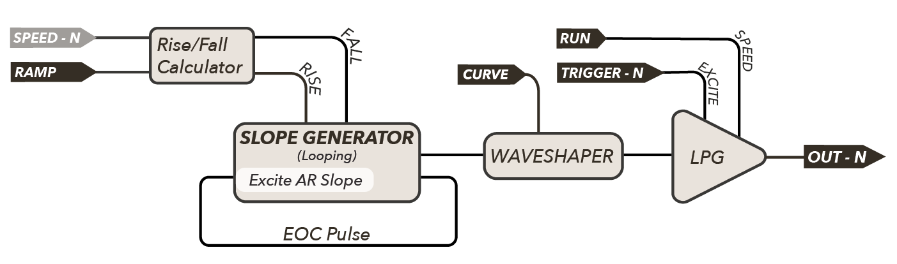

*PLUME* implements the free-running oscillators of *cycle/sound* rather than the externally driven impulse-trains of *sound/sustain*; however, it passes these free-running VCOs through pluckable lowpass gates (LPGs) before reaching the final outputs and the *MIX* jack.  

This mode is fantastic for polyphonic synthesis - all you need is a few trigger streams and you can immediately have beautiful overlapping polyphonic voicings - no external EGS, VCAs, LPGs or mixers necessary!

*TRIGGERs* will pluck the LPGs, but the trigger inputs are gate sensitive, allowing the LPGs to be held open for sustained notes.  The *TRIGGER* inputs act like keys on a piano: holding a *TRIGGER* input high with a gate will sustain the corresponding note.  Meanwhile, sending in short triggers will strike the notes, perfect for west-coast LPG plucks.  

The *RUN* voltage controls the vactrol response curve:

- With *RUN* at 0V, the LPGs respond similarly to the classic VTL5C3 vactrol with fast attack and moderate decay.
- Positive *RUN* voltages shorten the attack and decay.
- With negative *RUN* voltages, the *TRIGGER* inputs become more sensitive to the length of the input pulses as the attack and decay of LPG plucks lengthen.  Shorter plucks will give softer notes.

Modulating *RUN* becomes an envelope time control and presents the ability to give different plucked notes different lengths.

With *INTONE* set fully CW, each *TRIGGER* input will pluck or hold a different note from a major triad chord (across a few octaves).  Meanwhile, when *INTONE* is set fully CCW, each *TRIGGER* input will play a different note from a minor triad chord (across a few octaves).  

Use the same gate source sent to a subset of the *TRIGGER* inputs to play chords.  

If you have two JUST FRIENDS, configure one to be a trigger or gate delay in *transient/sustain* or *sustain/shape* and use it to strum the notes of the second JUST FRIENDS in *PLUME* (any other gate delay will work)!  Or, try using multiple outputs from the first JUST FRIENDS in *shape/cycle* to strike various notes of the other JUST FRIENDS in *PLUME*; this will create a generative sequence that stays within a harmonic set of notes!  

If you have a clock modulator which converts a single clock stream into multiple rhythm outputs (like a clock divider or pattern generator), try patching its various outputs to JUST FRIEND's inputs to create a sequence with overlapping notes whenever two of the rhythms go high simultaneously.  

This mode can do more than just polyphonic synthesis though! It can be great for creating percussive sounds as well.  Try patching an exponential envelope to *INTONE* in conjunction with plucking a *TRIGGER* - each output will have a varying amount of pitch sweep depth according to its index for varying levels of percussive-ness.  Try self patching a few of the outputs to *RAMP*, *CURVE*, and *FM*.  Now, in addition to the trigger which plucks your main slope, accent triggers can be sent simultaneously to the other *TRIGGER* inputs for different types of accents.  

### *FLOOM* (*cycle/sound*): 2-Operator FM VCOs and Noise Generator

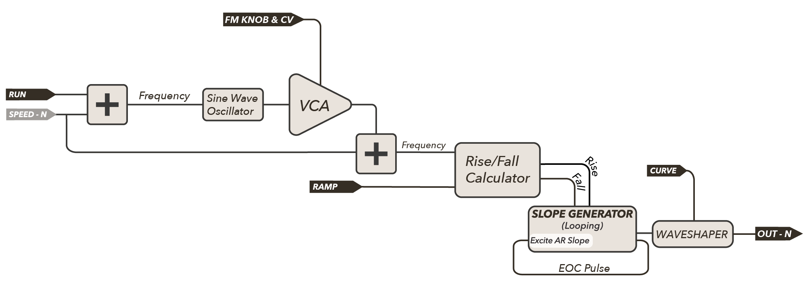

*FLOOM* modifies *cycle/sound* by adding an internal FM oscillator and changing the functionality of the *FM INPUT* jack.  Rather than patching an external oscillator to the *FM INPUT* jack, an internal sine wave oscillator is activated for each slope.  The *FM INPUT* jack becomes a CV control for FM depth.

There is one internal sinewave modulator for each of the 6 outputs. The frequency of each modulator is directly linked to its corresponding output (carrier) oscillator.  The output oscillator's frequency is determined by *TIME* & *INTONE*. 

The *RUN* voltage determines the ratio of each modulator to its corresponding carrier.  At -5V, the modulator is half the frequency of the carrier.  Increasing the *RUN* voltage increases the ratio.  At 0V, the modulator is the same frequency as the carrier. At +5V the modulator is double the frequency of the carrier.

The FM knob sets the depth of FM modulation by each internal modulator equally in the clockwise half, and proportionally to the output index (*IDENTITY* unaffected, *2N* least affected, *6N* most affected) in the counter-clockwise half.  Positioning the knob in the CCW half can be useful for leaving the fundamental (*IDENTITY*) unaffected where traditional FM might thin out the low end.

The *FM INPUT* jack is no longer a frequency modulator input; instead, it becomes an FM depth input, allowing for CV over the depth of frequency modulation, in conjunction with the FM knob.  Negative *FM INPUT* voltages invert the modulators before they are applied to the carrier, which can have dramatic effects when *RAMP* is away from noon.

FM bass lines can be immediately created without the need for an external modulator or a VCA to process the modulator.  Try patching *IDENTITY* through a VCA and VCF for a standard subtractive voice.  Use the same envelope to open both; additionally, patch the envelope to the *FM INPUT*.  Use the *RUN* voltage to set the FM ratio and dial in your FM tone.  Sequence *IDENTITY* with *TIME*, and you can have an instantly thick, heavy FM bass line! 

Try patching an exponential envelope into *INTONE* or *RUN* in addition to the *FM INPUT* jack for more percussive hits from *2N*-*6N*.

Patch a CV sequence into the *FM INPUT* to accent different notes in a rhythmic pattern with varying amounts of FM.  Pair this with a separate sequence of a different length into *RUN* for an evolving set of FM timbres.  

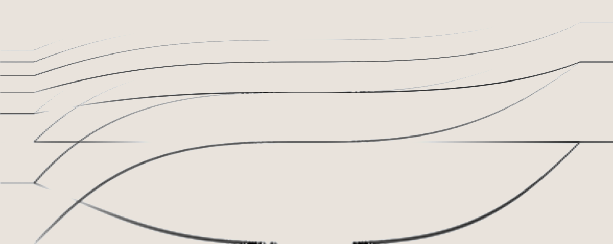

##### Noise Generation in *FLOOM*

It is also possible to generate noise in *FLOOM*.  Set *RUN* between -5V and 0V, and turn the *FM* knob to max, and set *RAMP* fully CCW or CW.  The *MIX* jack will now be outputting broadband noise!  *CURVE*, *INTONE*, and *RAMP* will adjust the character and color of the noise.  The individual outputs will also be outputting noise, though the fundamental tone will come through a bit clearer.  This can be useful for creating drum tones that change from pitched to noise!

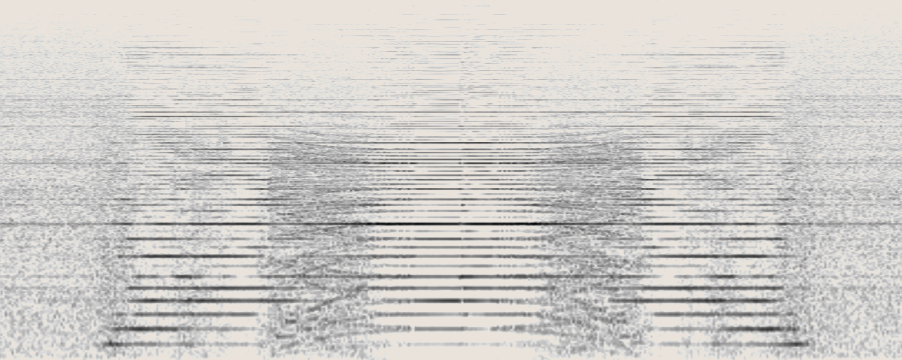

## Firmware Update

### How it works

The update procedure is done by playing a sound-file into the RUN jack of Just Friends. You'll need to use an audio playback device (like a computer or smart phone) to send the appropriate bits. With a special combination of settings, Just Friends will startup in *bootloader* mode and be waiting for you to upload the knowledge.

*We use a modified version of Émilie Gillet's stm-audio-bootloader on Just Friends*

### Download

First you'll need to download the [latest firmware](https://www.whimsicalraps.com/pages/jf-latest-version). Make sure it's on the device you'll use for playback!

### Get Connected

1. Turn off your synthesizer.
2. Set all knobs fully counter-clockwise
3. Set switches to *sound* & *cycle*
4. Connect a patch cable between the *RUN* jack & your playback device

### Prepare your playback

1. Set your sample-rate output to 48kHz (automatic on smart phones)
2. Turn up the volume! 3/4 to maximum should do it
3. Turn off notifications / sound effects (Do not disturb / Airplane mode is best)

### Let's Go!

1. Turn on your synthesizer
2. 6N's light should be slowly pulsing
3. Start playback of the audio file, IDENTITY will light, showing signal is being received
4. 6N's light will move to 5N and dance with 4N for then next 90 seconds
5. 3N will light temporarily and then Just Friends will restart anew!
6. *Disconnect the cable from your playback device first, then from the RUN jack!*

 All done!

### Firmware Update Troubleshooting

Sometimes things just don't work out. Other times you can't take no for an answer. If the above instructions don't seem to be working correctly see if one of the below ideas might be your solution.

#### 3N is lit as soon as you turn the synth on

This is probably a grounding issue. Connect / disconnect your playback sources power supply and then try again.

#### 6N stays lit after audio starts

Sounds like the audio is either too loud, or too quiet.

If the IDENTITY light stays off, no signal is being understood by the module. Try increasing the volume on your playback device. If that doesn't work, check your patch cable is correctly connected, or perhaps turn off the synth & retry with a different cable.

If the IDENTITY light does come on, your audio is probably too loud. Just Friends is expecting a line-level signal, not a 10Vp-p Eurorack signal. If you're using a Eurorack preamp module for line-level signals, you'll need to turn the volume down below 1/4, maybe even less.

#### 3N lights as soon as playback begins

This is likely a playback problem. Make sure your device is set to 48kHz playback sample rate. If you're using an audio DAW you probably have to do this in your DAW's settings. If the problem persists try a different playback device perhaps.

### Update begins ok but then 3N lights solidly

The audio has likely been interrupted. Perhaps you received a text message & it's sound alert corrupted the stream? Turn on Airplane mode and try again. If it happens at the same point in the file, redownload the file - it might be corrupted!

## Calibration and Factory Reset

*You shouldn't need this, but just in case! Furthermore, if things go awry you can perform a 'factory reset' to return to the pretty-damn-accurate default settings (see below below).*

### Calibration Procedure

Calibration mode is launched at startup similarly to the bootloader, but with all knobs fully CW (maximum pots, *sound*, *cycle*, RUN jack inserted). Calibration settings are saved on-chip, so you'll only have to do this once.

1. Turn off your synthesizer & set controls: all pots fully CW, *sound*, *cycle*, cable in RUN
2. Turn on the power. You should only see IDENTITY lit, signaling calibration mode
3. Connect your tuning voltage source to TIME. Set it to 0V output
4. Switch to *shape* mode. 2N will light
5. Set your voltage source to 2V
6. Switch to *sustain* mode. 3N will light
7. Switch back to *cycle* mode. 4N will light after a small delay while settings are saved
8. Switch to *sound* mode. Just Friends will restart with your new settings.

Now each time you run JF it will use your custom calibrated values. Of course you can set different voltage offsets & tuning for truly weird behaviour. If JF is too fast, you could calibrate it to 1V & 3V to shift the pitch range down by an octave with no cable attached. Or calibrate to 2.4V for buchla standard 1.2V/octave. You probably just want to do it as outlined above though..

*nb: The calibration settings will be retained even when re-flashing the firmware, so no need to re-do it each time you update.*

*nb: If you make a mistake with the switches in calibration mode it will just exit and use the existing setup. You can rerun the procedure as many times as you need.*

### Factory Reset

If you need to return to the factory tuning settings, follow the below steps:

1. Turn off your synth & set the calibration mode settings (All knobs fully CW, *sound*, *cycle*, cable in RUN)
2. Turn on & you'll be in calibration mode. IDENTITY will be lit
3. Turn all knobs fully CCW
4. Switch to *shape*. The module will pause for a brief moment while it overwrites the custom tuning, then restart as normal.

That's it!

## Warranty

No matter if you just bought your first module, or found a grimey old relic, we're committed to keeping it running in top form.

Formally, Whimsical Raps warrants each product to be free of defects in materials or construction for a period of one year from the date of original purchase (proof of purchase required). Malfunction caused by abuse of the product, or any other cause that we determine to be the user's fault, will not be covered by this warranty.

Formalities aside, if you've got an issue we absolutely want to help sort it out. Send us an [email](mailto:service@whimsicalraps.com) and let us know how we can help. Our service fees are only our direct costs, and we typically ask you to pay shipping one-way. Here's to keeping synths out of landfill!

