# 	THREE SISTERS: A Technical Map

THREE SISTERS links three filters for building spectral spaces.  They are tied together by macroscopic control over their cutoff frequencies, filter responses, and resonance.  The three filters can be configured to be lowpass, crossover, and highpass filters (*crossover* mode) or three bandpass filters (*formant* mode).  Signals can be patched into individual filters and to all three simultaneously.  Each filter's output can be individually tapped, and a mix of all three can be taken. This flexible input and output routing allows the module to process multiple signals in parallel and combine them into a single spectrally-sculpted mix, split a single signal into separate bands for independent processing, or any combination thereof.

## Table of Contents

1. [Specifications](#specifications)
2. [Overview](#overview)
3. [Block Diagrams](#block-diagrams)
4. [LOW Filter Block](#low-filter-block)
5. [HIGH Filter Block](#high-filter-block)
6. [CENTRE Filter Block](#centre-filter-block)
7. [CROSSOVER and FORMANT modes](#crossover-and-formant-modes)
8. [FREQ and SPAN: Cutoff Control](#freq-and-span-cutoff-control)
9. [QUALITY: Resonance and Self-Oscillation](#quality-resonance-and-self-oscillation)
10. [QUALITY: Dry/Wet Mixing, and Notch Filters](#quality-drywet-mixing-and-notch-filters)
11. [Spectral Mixing and Gating](#spectral-mixing-and-gating)
12. [Spectrum and Dynamics](#spectrum-and-dynamics)
13. [Audio-visualization](#audio-visualization)
14. [Formant and Vowel Synthesis](#formant-and-vowel-synthesis)
15. [2-Operator FM Synthesis](#two-operator-fm-synthesis)
16. [Filter Pinging](#filter-pinging)
17. [Calibration](#calibration)
18. [Warranty](#warranty)

## Specifications

- 10HP
- 30mm depth
- 100mA @ +12v
- 93mA @ -12v

## Overview

At THREE SISTERS' core are three filter blocks named *LOW*, *CENTRE*, and *HIGH*.

Signals can be patched directly into each filter block via the associated jack: *LOW(IN)*, *HIGH(IN)*, or *CENTRE(IN)*.  Additionally, a signal can be patched into all three filter blocks simultaneously via the *ALL(IN)* jack.

Each filter block is made up of two state-variable filters cascaded in series.  These state-variable filters (SVF) are each second order, two-pole filters with one signal input and three outputs: lowpass, bandpass, and highpass.  The *crossover/formant switch* controls how the two SVFs in each pair are combined to determine a final filter response for that pair.  Cascading two SVFs allows for a great deal of flexibility as well as steep filter rolloffs.  

In *crossover* mode, the *LOW*, *CENTRE*, and *HIGH* filters are lowpass (24dB/octave), crossover (12dB/octave), and highpass (24dB/octave) filters, respectively.  The "crossover" type is a lowpass and a highpass patched in series, providing a response like a bandpass with a variable-width passband (from the cutoff of the highpass up to the cutoff of the lowpass).  The *CENTRE* "crossover" filter passes the frequencies between the cutoffs for the other two filter blocks.  

In *formant* mode, the three filters are each four-pole bandpass filters (12dB/octave).  

*FREQ* and *SPAN* control the cutoff frequencies for the three filter blocks in a linked fashion. 

The clockwise half of the *QUALITY* knob controls resonance and can push the filters into self-oscillation.

The counterclockwise half of the *QUALITY* knob controls the level of 'anti-resonance'. Here, the level of the opposing filter response for each block is mixed back in with the original filter: e.g. turning *QUALITY* counter-clockwise mixes the frequencies **above** *LOW's* cutoff back in. This creates a "dry/wet" filter control which blends between the filtered and unfiltered sound, but also makes notch-rejection filter responses possible.

The outputs of the filter blocks can be taken individually via the associated jacks: *LOW(OUT)*, *HIGH(OUT)*, or *CENTRE(OUT)*.  Additionally, an equal mix of all three signals can be taken via the *ALL(OUT)* jack.

## Block Diagrams

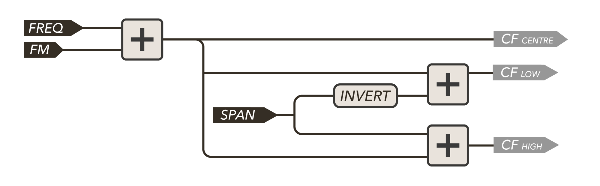

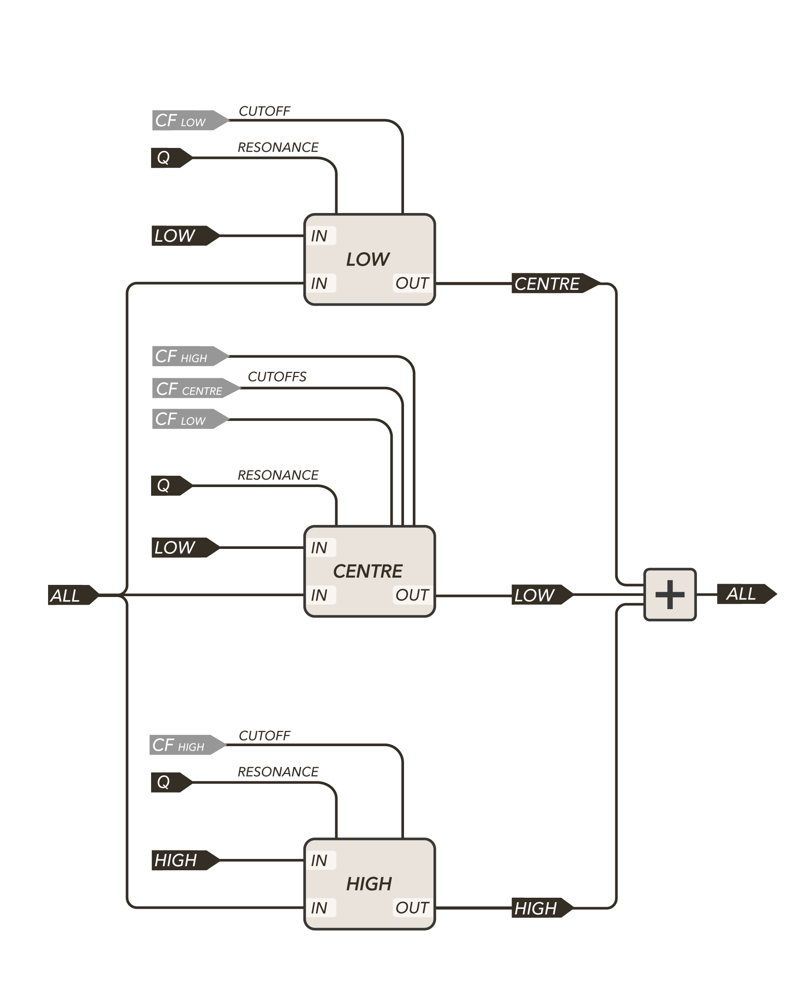

## LOW Filter Block

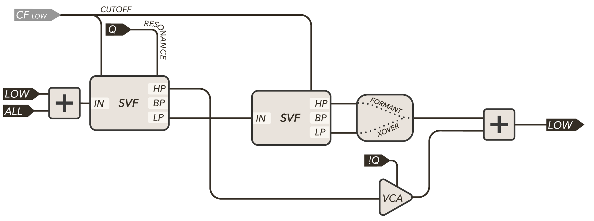

The *LOW* filter block feeds the first SVF's lowpass output into the second SVF.  The cutoff frequencies of both SVFs in the *LOW* filter block are always equal.  This cutoff frequency is determined by subtracting the *SPAN* voltage from the *FREQ* voltage (see [FREQ and SPAN](#freq-and-span-cutoff-control)). 

In *crossover* mode, the second SVF's lowpass response is the main output of the *LOW(OUT)* block.  As such, before reaching the final *LOW(OUT)* mixing block, the input signal passes through two lowpass filters in series, each at the same cutoff frequency.  In other words, the input to the *LOW* block passes through a fourth-order lowpass filter with a 24dB/octave slope.

In *formant* mode, the second SVF's highpass filter is the main output of the *LOW(OUT)* block.  The input signal passes through a lowpass filter then a highpass filter in series, each at the same cutoff frequency.  This is equivalent to saying the input signal passes through a bandpass filter with a 12dB/octave slope.

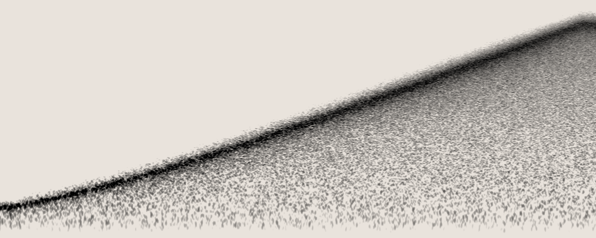

## HIGH Filter Block

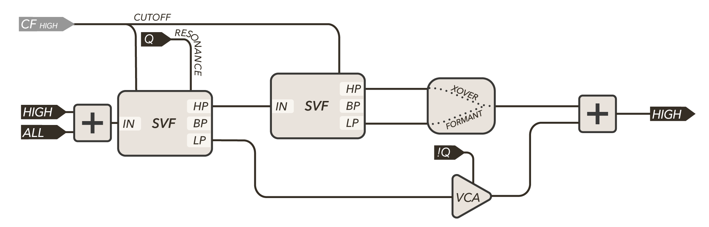

The *HIGH* filter block is the inverse of the *LOW* block.  The first filter block is always a highpass, and the second block switches between lowpass & highpass depending on the mode.  The cutoff frequencies of both SVFs in the *HIGH* filter block are always equal.  This cutoff frequency is determined by adding the *SPAN* voltage to the *FREQ* voltage (see [FREQ and SPAN](#freq-and-span-cutoff-control)). 

In *crossover* mode, the second SVF's highpass output is taken as the *HIGH(OUT)* output.  As such, before reaching the final *HIGH(OUT)* mixing block, the input signal passes through two highpass filters in series, each at the same cutoff frequency.  This acts as a fourth-order highpass filter with a 24dB/octave slope.

In *formant* mode, the second SVF's lowpass filter is tapped as the *HIGH(OUT)* output.  The input signal is highpass filtered then lowpass filtered in series, at the same cutoff frequency.  This creates a bandpass filter with a 12dB/octave slope.

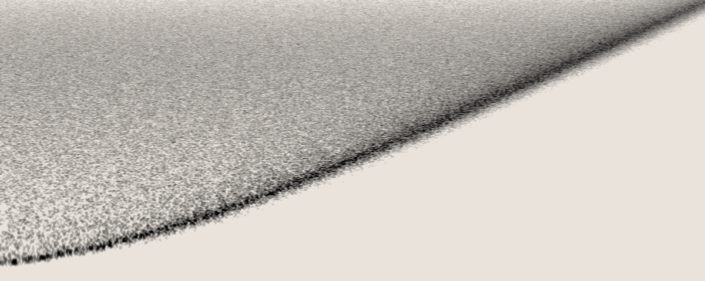

## CENTRE Filter Block

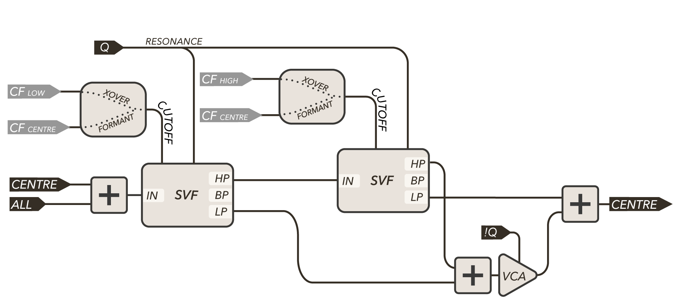

The *CENTRE* filter block has a static routing. The input is first highpass filtered by the first SVF, then lowpass filtered by the second.  Unlike the *LOW* and *HIGH* filter blocks, the cutoff frequencies of the two SVFs are not always the same.

In *crossover* mode, the first SVF's cutoff frequency (highpass mode) is equal to the *LOW* block's cutoff frequency, and the second SVF's cutoff frequency (lowpass mode) is equal to the *HIGH* block's cutoff frequency (see [FREQ and Span](#freq-and-span-cutoff-control)).  The result is a "crossover" filter with two 12dB/octave rolloffs: frequencies between the two cutoffs (in the crossover region) are passed unaffected, while frequencies outside the boundaries are filtered out.

In *formant* mode, both SVFs' cutoff frequencies are identical.  This cutoff frequency is determined solely by the *FREQ* voltage (see [FREQ and Span](#freq-and-span-cutoff-control)).  The input signal passes through a highpass filter followed by a lowpass filter in series, each at the same cutoff frequency.  This is another bandpass filter with a 12dB/octave slope.

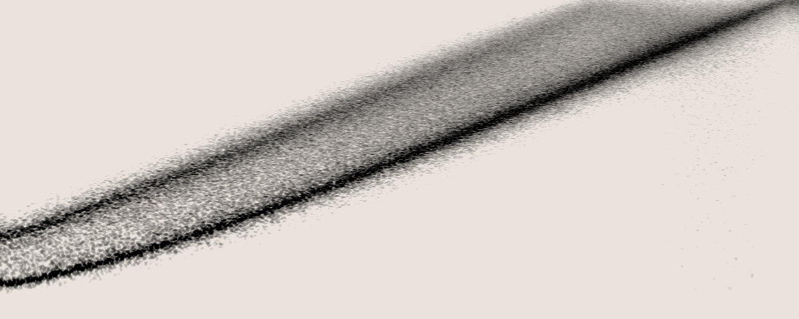

## *crossover* and *formant* modes

Try using this [demo](https://www.desmos.com/calculator/tcqovatmsa) to explore the relationship between *crossover* and *formant* by toggling the slider labelled "*mode*".  Play with the *FREQ* and *SPAN* controls as well.  It may help to use the sliders labelled "*separate*" and "*shaded*" to see the individual frequency responses. 

In *crossover* mode, the frequency range is divided into three regions using two cutoff frequencies.  The *LOW* block passes the lowest region, the *CENTRE* block passes the region between the two cutoffs, and the *HIGH* block passes the highest region. The three filters allow different frequency regions to be routed and processed separately, or can be used to give three different signals their own space in a single mix.  To achieve this, the *LOW* block is a lowpass filter, the *HIGH* block is a highpass filter, and the *CENTRE* block is made of a lowpass & a highpass filter in series. *CENTRE* passes the band of frequencies between the *HIGH* cutoff and the *LOW* cutoff while rejecting the frequencies outside of the two cutoffs.

In *formant* mode, THREE SISTERS passes three narrow bands of the spectrum, one for each filter, operating as bandpass filters.  This mode can be used to emphasize specific regions of the spectrum for a single sound source, or process three sounds into their own frequency band.

Steeper rolloffs can be achieved by patching the filter blocks in series. For example, make a 24dB/octave crossover filter by patching a signal to *HIGH(IN)*, patching *HIGH(OUT)* to *LOW(IN)*, and taking the output from *LOW(OUT)* while in *crossover* mode, with *SPAN* in the CCW direction.

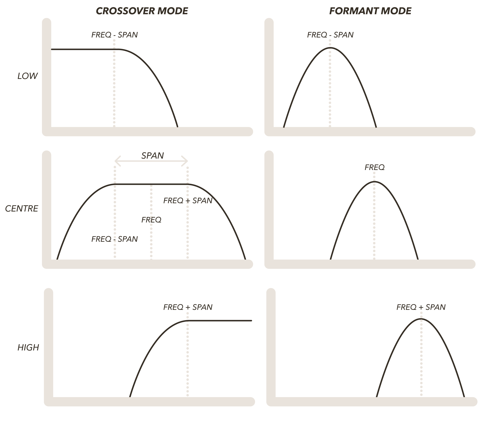

## FREQ and SPAN: Cutoff Control

Cutoff frequencies for the three filter blocks are determined by a combination of the *FREQ* and *SPAN* controls.  This creates a a macroscopic control applied to all three filter blocks simultaneously.  

Adjusting *FREQ* will push the cutoff frequencies of all three filter blocks in the same direction.

Adjusting *SPAN* will push and pull the *LOW* and *HIGH* cutoffs in opposite directions around a centre-point determined by *FREQ*.  

*CENTRE* responds to *SPAN* differently depending on the *mode* selection.  *CENTRE*'s pass band is widened and narrowed by *SPAN* in *crossover* mode.  The passband's centre-point is determined *FREQ*.  *CENTRE*'s bandpass filter is unaffected by *SPAN* in *FORMANT* mode; the bandpass' cutoff is determined solely by *FREQ*.  

The *FREQ* and *SPAN* CV jacks are added to the corresponding knobs.  

Try using this [demo](https://www.desmos.com/calculator/tcqovatmsa) to explore the relationship between *crossover*, *formant*, *FREQ* and *SPAN*. It may help to use the sliders labelled "*separate*" and "*shaded*" to see the individual frequency responses.

The *FREQ* CV input is a volt-per-octave input (indicated on the panel by "v/8").  A 1V increase at this input will result in a doubling of all cutoff frequencies.  The *LOW* filter block is calibrated to accurately track volt-per-octave inputs over ~5 octaves.

The FM (frequency modulation) CV jack sends the signal through the grey attenuverter knob before adding the signal to *FREQ*.  Like all CV inputs on THREE SISTERS, FM accepts both control-rate and audio-rate modulation. 

### LOW Cutoff 

The cutoff frequency of the *LOW* block is controlled by: 

As *FREQ* increases, the cutoff frequency of the *LOW* block increases.  As *SPAN* increases, the cutoff of the *LOW* block decreases.

### HIGH Cutoff

The cutoff frequency of the *HIGH* block is controlled by:

As *FREQ* increases, the cutoff frequency of the *HIGH* block increases.  As *SPAN* increases, the cutoff of the *HIGH* block also increases.

### CENTRE Cutoff

In *crossover* mode, frequencies between the *LOW* cutoff and the *HIGH* cutoff are passed by the *CENTRE* block, while frequencies outside of this range are rejected.  When the "upper" cutoff passes below the "lower" cutoff (ie. when *SPAN* is CCW of 10:00), the signal is increasingly attenuated.  This allows *SPAN* to 'close' the *CENTRE* passband like a VCA.

In *formant* mode, the cutoff of the *CENTRE* block bandpass filter is simply:

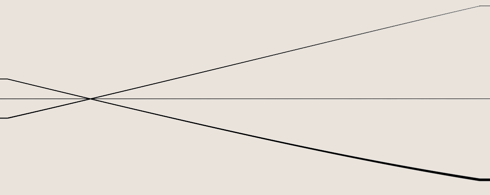

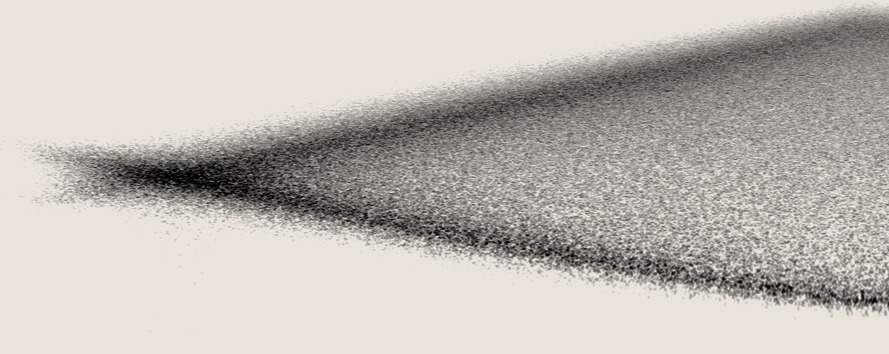

These spectrograms illustrate sweeping *SPAN* from *CCW* to *CW* in *formant* mode (top) and *crossover* mode (bottom).  The top image shows the cutoff frequencies of the three filter blocks via self-oscillating sinewaves (*QUALITY* at maximum) in *formant* mode.  The bottom image shows the width of the *CENTRE* passband increasing in *crossover* mode as the *CENTRE* block processes white noise. 

## QUALITY: Resonance and Self-Oscillation

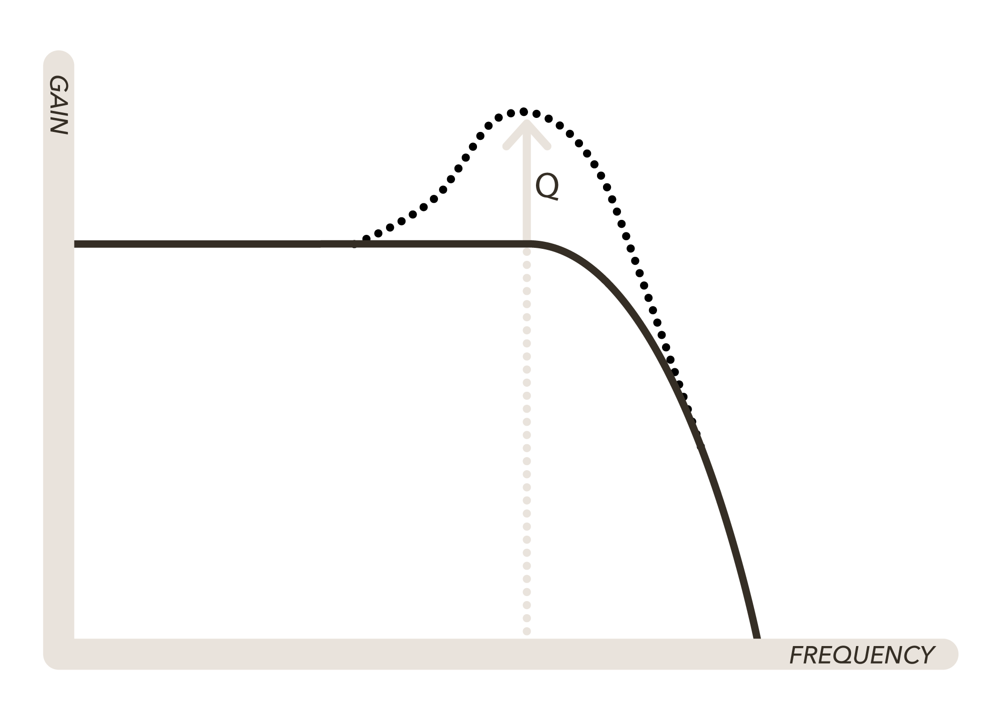

The *QUALITY* knob sets the resonance of the filter blocks.  [*Resonance*](https://www.soundonsound.com/techniques/responses-resonance#para4), or *Q* (Quality Factor), is the extent to which filters amplify signals at the cutoff frequency beyond unity. This has the effect of emphasizing the harmonic content at and around the cutoff frequency.

- With *QUALITY* at noon, resonance is at its minimum.  

- Turning *QUALITY* clockwise increases resonance.  

- When *QUALITY* reaches approximately 3 o'clock, the filter blocks will go into *self-oscillation* and produce sine waves at the cutoff frequencies, without any input. 

The value of *QUALITY* CV is added to the knob.  When the knob is at noon, sweeping the *QUALITY* CV input from -5V to +5V is equivalent to sweeping the knob from fully CCW to fully CW.

## QUALITY: Dry/Wet Mixing and Notch Filters

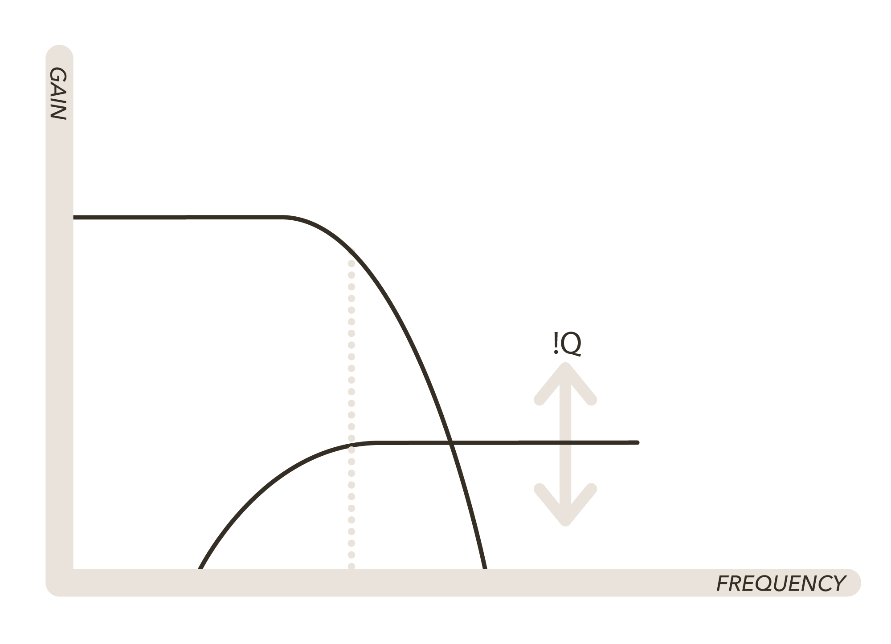

The *QUALITY* knob can also be used to create *notch-rejection* filter responses and blend between the filtered and unfiltered input.  To achieve this, the outputs of each filter block are each sent to a mixing block.  The first SVF in each filter block also sends its unused complementary output to the corresponding mixing block through a VCA controlled by the CCW portion of *QUALITY*: 

- The *LOW* filter block output is mixed with the highpass output of the first SVF.
- The *HIGH* filter block output is mixed with the lowpass output of the first SVF.
- The *CENTRE* filter block output is mixed with the lowpass output of the first SVF, and the highpass output of the second SVF.

Turning *QUALITY* CCW from noon begins opening the *!Q* VCAs, increasing the amount of complementary signal mixed in with each filter block's output.  

Due to the nature of the SVF, the main output & complementary output are always 180 degrees out of phase, or simply 'inverted' relative to each other. In the pass bands this has no impact on the sonic quality. Around the cutoff frequency however, the two signals will cancel each other out, resulting in a 'notch' filter response.

The CCW half of the *QUALITY* knob acts as a "dry/wet" filter control.  This control blends between the filtered and unfiltered sound by re-introducing frequencies rejected by the primary filter block.  As *QUALITY* approaches the CCW limit, the behaviour is similar to a low-shelf filter, but with some cancellation of frequencies around the cutoff.  

- With *QUALITY* at noon (or further clockwise), none of the rejected frequencies are mixed back in.
- Turning *QUALITY* counterclockwise increases the amplitude of the inverted, rejected frequencies, to be mixed back in.

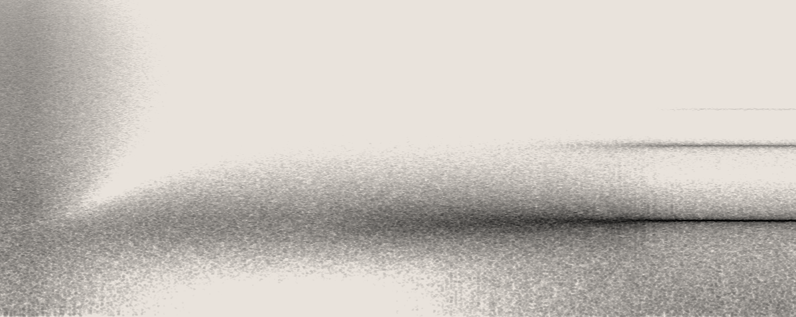

This spectrogram illustrates sweeping *QUALITY* from fully CCW to fully CW as *CENTRE* processes white noise.  Fully CCW, the entire spectrum of white noise is passed.  As *QUALITY* approaches noon, the complementary frequencies are attenuated.  At noon, only the *CENTRE* passband is passed.  As *QUALITY* approaches 3:00, the cutoff frequency is emphasized, and eventually the filter goes into self-oscillation.

## Passive Output Mixing

The *ALL(OUT)* mix can distort when three very loud input signals are used or when all three filters are in self-oscillation.  To avoid this, you can passively mix these signals by directly connecting the three output jacks using stackable cables, or a passive mult.  Many manufacturers discourage this output-to-output connection, but we've extensively tested it with Mannequins modules with no issues, and officially support the practice.  This technique is also useful If you only wish to combine two of the three outputs (e.g. connecting *LOW(OUT)* and *HIGH(OUT)* with a stackable) while using the third output independently.  This will reduce the level of the signal as more outputs are connected together.  

*NB: The distortion is caused by a limitation of Eurorack's power supply system.  Eurorack only supports 24V peak-to-peak signals, but 3 sine-waves at 10V peak-to-peak will surpass this limit when the peaks align, causing clipping to occur*. 

## Spectral Mixing and Gating

In *crossover* mode, THREE SISTERS can be used as a unique mixing tool: rather than controlling gain for each of the inputs, THREE SISTERS carves out spectral space for each signal.  *FREQ* and *SPAN* become macro-controls for determining the space allotted to each input.  

### Mixing

Patching three distinct sound sources to *LOW(IN)*, *CENTRE(IN)* and *HIGH(IN)* results in each input having its own spectral space in the mixed output at *ALL(OUT)*.  The low end will come from the signal patched to *LOW(IN)*.  The mids come from *CENTRE(IN)*, and the high end comes from the signal patched to *HIGH(IN)*.  Start with *QUALITY* at noon.  Patch your three signals to the corresponding inputs and tap your output from *ALL(OUT)*.

Increasing *FREQ* will give more space to the *LOW* input signal and take space away from the *HIGH* signal: more and more of the *LOW* signal is passed and more and more of the *HIGH* signal gets filtered out.  *CENTRE* will shift the range of its passband up while leaving the width of its passband unaffected.  With *CENTRE(IN)* unpatched and *SPAN* around 10 o'clock to noon, *FREQ* controls spectral crossfading between the *LOW* and *HIGH* signals only.  

Increasing *SPAN* will take space away from both *LOW* and *HIGH* as their cutoff frequencies decrease and increase respectively, filtering out more and more of both of their input signals.  Simultaneously, *CENTRE* will increase the width of its passband, allowing more and more of the *CENTRE(IN)* signal to pass through to the output.  The *CENTRE* signal starts to dominate while the *LOW* and *HIGH* filters recede.  Try this with the same signal patched to both *LOW(IN)* and *HIGH(IN)* and a different signal patched to *CENTRE(IN)*.  

Decreasing *QUALITY* from noon toward its minimum will re-introduce all signals at equal levels into your mix.  Conversely, keeping *QUALITY* at its minimum will pass all signals by default (with some subtle notch-filtering, controllable by *SPAN* and *FREQ*), and then increasing it toward noon will result in the spectrally-sculpted mix. 

Patching a signal to *ALL(IN)* will result in a signal that is always present in the mix, but with subtle spectral differences to the original due to the various notching created by the signal passing through the distinct filter blocks in parallel.   

### Gating

With *LOW(IN)* and *HIGH(IN)* unpatched, patching a signal to *CENTRE(IN)* allows for a unique form of gating different from LPGs or VCAs controlled by *SPAN* in *crossover* mode.  With *SPAN* at minimum, the passband of the crossover filter is minimized, but as *SPAN* increases, the passband widens, allowing for more of the *CENTRE(IN)* signal to pass through to *CENTRE(OUT)*.  Try controlling *SPAN* using bipolar modulation with the knob set to noon, or with unipolar positive modulation when the knob is fully CCW. *CENTRE* can be used similarly to a VCA or LPG with its own spectral coloring.

The following spectrogram illustrates *CENTRE* processing white noise in *crossover* mode.  The width of *CENTRE*'s *crossover* passband is controlled by *SPAN*.  The *SPAN* knob is set fully CCW to completely close the *CENTRE* band.  Unipolar CV is used to ramp *SPAN* upward,  opening up the width of the crossover block and allowing the noise to pass through.  

Instead of using CV to modulate *SPAN*, patch *ALL(OUT)* to an envelope follower and attenuvert/offset the envelope before patching it to *SPAN* to create a spectral compressor.  COLD MAC's *FOLLOW* circuit can be used for this purpose.  You can also try a variant of this by multing a copy of the input signal to the envelope follower instead of the output!

## Spectrum & Dynamics

When paired with envelope followers and VCAs, *crossover* mode can be used as the core of a multi-band compressor by splitting a signal into different frequency bands.  Each frequency band can be patched through a compressor; without a compressor, each band can be multed to an envelope follower and a VCA; each envelope follower output can be used to open or close the VCAs.  Mixing the VCA outputs will recover the multi-band compressed signal.

Paired with just a single COLD MAC, THREE SISTERS can act as a side-chain EQ while COLD MAC acts as a compressor.    

- Patch your signal to compress to *ALL(IN)*. Set *QUALITY* to noon.
- *FREQ* and *SPAN* control the location and width of your bands: lows, mids, and highs.
- Choose a band for your compressor to respond to, and patch the corresponding output to COLD MAC's *SLOPE* input.
- Patch your signal to compress to COLD MAC's *LEFT* input; if you want to use the same input signal as *THREE SISTERS*, you can take it from *ALL(OUT)*.  Patch a dummy cable to *RIGHT*.  
- Patch COLD MAC's *FOLLOW* output to *SURVEY* (or patch it to *OR1* and use a DC offset to *OR2* for threshold control). Make sure *FADE* is unpatched.
- Use the *LEFT(OUT)* jack for compression and the *RIGHT(OUT)* jack for expansion.  *SURVEY* controls makeup gain.  
- Switch THREE SISTERS to *formant* mode to narrow the side-chain EQ in on a specific frequency.  

## Audio-visualization

With an analog video synthesizer, THREE SISTERS can be used for audio-visualization of your patches.  The technique is similar to what is outlined in the previous section on multiband compression.  Unlike the multiband compressor, the output of THREE SISTERS is not being used in the audio chain, so using *formant* mode bandpass filters is a viable choice for narrowing the bands in on certain frequencies which you want your video synthesizer to respond to.   Increasing *QUALITY* past noon will help in narrowing the bands in on particular frequencies.  For instance if you want your kick and hihat to each trigger different events or control different parameters in your video synthesizer, you would patch your kick to *LOW(IN)* and your hihat to *HIGH(IN)*, while using *FREQ* & *SPAN* in *formant* mode to dial in their frequencies.

- Patch your audio signal to visualize to *ALL(IN)*. 
- *FREQ* and *SPAN* will control the location and spacing of the bands to respond to. 
- Patch the output of each filter block to its own envelope follower.
- Patch the envelope outputs to whatever video synthesis parameters you wish to control!  You may wish to patch the envelopes through further processing utilities for additional control.

## Formant and Vowel Synthesis

A sound-processing object's *formants* can be thought of as bands of resonant frequencies, or parts of the frequency spectrum that are always emphasized.  For instance, the human voice has formants determined by the diameter and length of cavities in the vocal tract, a room has formants as revealed beautifully in Alvin Lucier's "I Am Sitting in a Room", and acoustic instruments like bassoons and saxophones have their own formants as well!  In the context of modular synthesis and electronic music, formants can be used to provide a spectral context to a sound source and to define regions of the frequency range where that sound "lives"  and pops out.  This can help prevent overlap between voices, and harmonic conflicts as they fight for the same bands of the spectrum.

THREE SISTERS can be used to impose a formant structure onto a sound source by patching the sound into *ALL(IN)*, taking the output from *ALL(OUT)*, and setting the module to *formant* mode.  THREE SISTERS acts as three bandpass filters processing the same sound source in parallel; the processed bands are then mixed together, returning the input signal in its new spectral context.  *FREQ* and *SPAN* control the location and spacing of the formants, allowing you to dial in the spectral regions to be emphasized.   Adjusting *QUALITY* will control the size of the formants, narrowing them as *QUALITY* turns clockwise away from noon.  Turning *QUALITY* counter-clockwise from noon will bring up the frequency content outside of the formants, to create a blended response.

Using an oscillator as a sound source allows primitive vowel synthesis; try gating the oscillator before the filter, or after the filter.  *FREQ* and *SPAN* will allow you to dial in different vowels, since each vowel can be modeled as an oscillator with a specific set of formants.  Read more about vowel synthesis [here](https://www.soundonsound.com/techniques/formant-synthesis)!

## Two Operator FM Synthesis

Self-patching THREE SISTERS allows for 2-operator FM synthesis.  When in *formant* mode with *QUALITY* at max and no inputs, each output produces a sine wave at the associated filter block's cutoff frequency.  Since the cutoff frequency of the *CENTRE* bandpass filter is unaffected by *SPAN* in *formant* mode, patching *CENTRE(OUT)* to *SPAN* will use the *CENTRE* sine wave as the modulating operator.  Both *LOW* and *HIGH* act as carrier operators in parallel.  Listen to *LOW(OUT)* or *HIGH(OUT)* for the resulting FM tones.  Try patching them in stereo!

Adjusting *SPAN* will control the FM ratio (i.e. frequency ratio of carrier and operator).  

To control the FM index, or amount of the FM applied by the modulator to the carriers, patch *CENTRE(OUT)* through a VCA before patching it to *SPAN*.

Since *SPAN* uses exponential frequency modulation, tones will not be entirely "musical" at all times.  You can however sequence the sounds with the *V/8* jack and they should remain largely constant over the pitch range.  

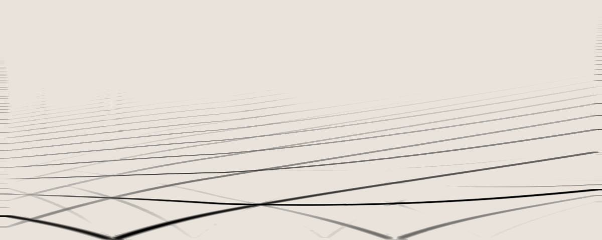

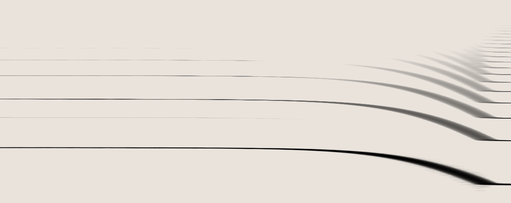

## Filter Pinging

In *formant* mode THREE SISTERS can be used to generate percussive sounds using only triggers as inputs.  With *QUALITY* just below the point of self-oscillation (2:00 to 3:00), send a trigger, gate, or fast envelope into an audio input to "ping" the filter.  The trigger excites the filter, causing it to ring at the cutoff frequency before fading out.  Playing with the pulse-width and shape of these transients will affect the attack and decay time of the tones.  Modulate *FREQ* and *SPAN* to control tuning of the different 'drums.'  You can also try *crossover* mode, where *CENTRE* will have a 2-note tone.

## Calibration

The steps below will guide you through the calibration process for THREE SISTERS (or any other analog oscillator).

#### YOU WILL NEED:

- A tool to measure the frequency of the oscillator (a tuner or oscilloscope)
- An accurate voltage reference (if possible, use the module that will drive the *FREQ* input of your oscillator most often)
- A small flathead screwdriver.

#### OVERVIEW

The goal is to turn a trimpot accessed through the back of the module such that the frequency of the oscillator when 2V is sent to the v/octave input is exactly four times the frequency when 0V is sent in to the oscillators v/octave input. In other words, to make sure that the oscillator is exactly two octaves above the 0V frequency when 2V is sent in. It does not matter what you choose to tune your oscillator to for the 0V frequency, as long as you make sure to set the 2V frequency to be four times the 0V one.

#### PROCEDURE

1. Turn your system on and wait at least 10 minutes for the module to warm up.
2. Send the output of your oscillator to the input of your tuning device (turn the *QUALITY* of Three Sisters to max and use the *LOW* output).
3. Select a base frequency which will correspond to 0V. The choice is arbitrary. If you choose 100Hz for 0V, then the goal is to get 2V into the oscillator generating a 400Hz oscillation. If you prefer to use a chromatic scale, then choosing C2 for 0V would mean that your goal is to get 2V to generate C4.
4. Send 0V from your voltage source into the v/octave input of your oscillator (*FREQ* input for THREE SISTERS). Don't just remove the cable for 0V, actually send 0v from your source to the oscillator!
5. With 0V going into your oscillator, now use the frequency control knobs to tune it to your base frequency; in this case, tune it to 100Hz.
6. Now send 2V in to your oscillator.
7. Check the frequency of the oscillation. If it is precisely 4 times your base frequency (in this case, 400Hz), then you are done. If not, proceed to step 8.
8. If it is flat (e.g. below 400 Hz), turn the trimpot on the rear of the module a few degrees CCW. If it is sharp, turn the trimpot a few degrees CW (these directions are for THREE SISTERS; the polarity may be reversed for other oscillators). *NB: You are not trying to tune it to 400Hz! You are instead changing the scaling of the input voltage range, will need to repeat the process*!
9. Repeat Steps 4-9.

Keep in mind you'll likely need to repeat steps 4-9, ten or more times to have the module well tuned.

## Warranty

No matter if you just bought your first module, or found a grimey old relic, we're committed to keeping it running in top form.

Formally, Whimsical Raps warrants each product to be free of defects in materials or construction for a period of one year from the date of original purchase (proof of purchase required). Malfunction caused by abuse of the product, or any other cause that we determine to be the user's fault, will not be covered by this warranty.

Formalities aside, if you've got an issue we absolutely want to help sort it out. Send us an [email](mailto:service@whimsicalraps.com) and let us know how we can help. Our service fees are only our direct costs, and we typically ask you to pay shipping one-way. Here's to keeping synths out of landfill!
